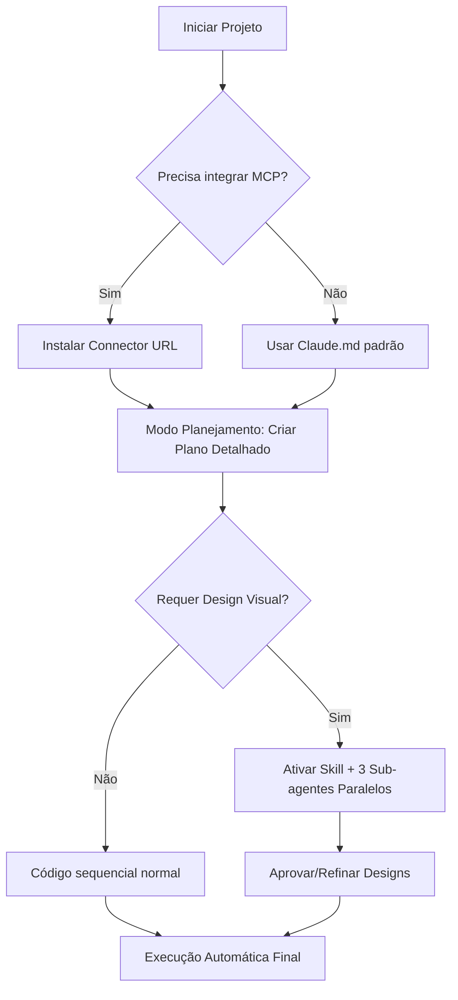

---
{"dg-publish":true,"permalink":"/23-inteligencia-artificial/ferramentas-de-ia/claude-code/","title":"ClaudeCode","metatags":{"description":"agente que pode executar tarefas complexas de programação e automação de ponta a ponta"},"noteIcon":2,"updated":"2026-07-02T11:04:00.333-03:00","dg-note-properties":{"title":"ClaudeCode","topics":["[[Inteligencia Artificial]]"]}}
---

# Claude Code Guia Avançado: Dominando Agentes Multiplicadores

#Inteligencia-artificial #claudecode 

> [!summary] O Claude Code não é apenas mais um chatbot de perguntas e respostas, criado pela Anthropic, ele é uma aplicação que roda dentro do seu terminal, permitindo que a IA controle o seu computador, execute comandos, analise arquivos, rode testes e até tire prints da tela. É, essencialmente, um agente que pode executar tarefas complexas de programação e automação de ponta a ponta.

> [!tip] Aprenda a transformar o Claude Code de uma ferramenta útil para um **multiplicador de produtividade** usando Model Context Protocol (MCP), Skills personalizadas e Sub-agentes em paralelo.

## Visão Geral Avançada

O Claude Code vai muito além da programação tradicional. Ao combinar **MCPs** ([[23-Inteligencia-Artificial/Model Context Protocol\|Model Context Protocol]]), **[[23-Inteligencia-Artificial/Skills\|Skills]] customizadas** e **Sub-agentes**, você cria uma infraestrutura de [[23-Inteligencia-Artificial/agentes/agentes de ia\|agentes de ia]] que pode:
- Conectar-se a ferramentas externas sem limites
- Especializar-se em tarefas específicas com prompts reutilizáveis
- Executar múltiplos projetos simultaneamente em paralelo

## Antes de Começar (Pré-requisitos Avançados)

- Ter conta Pro da Anthropic para MCPs e recursos completos
- Conhecimento intermediário do Claude Code básico
- Familiaridade com terminal e estrutura de projetos
- Acesso a ferramentas externas que deseja integrar (Google Drive, Notion, Figma, etc.)

## Parte 1: Model Context Protocol (MCP) - Expandindo o Universo da IA

### O que é MCP?

O **[[23-Inteligencia-Artificial/Model Context Protocol\|Model Context Protocol]]** permite conectar o Claude Code a qualquer ferramenta externa. Enquanto o Claude básico opera no terminal do seu computador, os MCPs expandem seus "olhos e mãos" para ferramentas nativas de outras plataformas:
- 📧 Gmail/Google Calendar
- 🎨 Figma (design)
- ✍️ Notion (documentação)
- ☁️ Google Drive/OneDrive
- 🔗 Microsoft Teams/Office 365

>[!important] Sem MCPs, o Claude Code fica limitado a arquivos locais. Com MCPs ativos, ele vira um agente autônomo capaz de acessar e modificar seus dados em plataformas externas.

### Como Configurar um MCP (Passo a Passo)

#### Passo 1: Obter o Connector URL da Ferramenta Externa

```markdown
# Exemplo para Asimov Academy Sketchpad:
Copie o connector URL fornecido pela ferramenta de integração
```

**Exemplos práticos:**
- **Figma:** Conecte-se para ler/arquivar designs com prompts como *"Me mostre as capas dos projetos anteriores"*
- **Google Drive:** Acesse documentos e planilhas diretamente no código do agente
- **Notion/Bases:** Crie ou edite páginas/documents sem sair do terminal

#### Passo 2: Instalar o MCP via Comando do Claude Code

```bash
# No modo planejamento (recomendado para novos projetos):
/barra model "Sonnet" @ferramentas.md "Instale o Sketchpad MCP usando este connector:" <URL_DO_MCP>

# Ou no modo automático (para usuários experientes):
/accepts auto mode 1
```

**Comando `@` é essencial:** Sempre especifique qual ferramenta deseja instalar:
- `@ferramentas.md` para listar todos os MCPs disponíveis
- `<connector_url>` para especificar a conexão exata

#### Passo 3: Usar o MCP no Projeto Real

```bash
# Exemplo completo com Sketchpad + Dashboard de vendas:
/barra model "Opus" @sketchpad.mcp "@passadeira.md \nAnalise os dados da pasta DT7 e crie um mocap do dashboard usando Asimov Academy Sketchpad."
```

**Fluxo recomendado:**
1. **Modo Planejamento:** Pedir para o Claude criar o plano + usar MCP de desenho (Sketchpad)
2. **Revisão humana:** Aprovar o design antes da implementação final
3. **Execução automática:** Usar `/accepts auto mode 2` para gerar sem aprovação repetida

## Parte 2: Skills - Especialização do Agente

### O que são Skills?

**Skills** são arquivos Markdown personalizados que funcionam como "plugins" de comportamento para o Claude Code. Eles contêm prompts especializados e instruções reutilizáveis que carregam apenas quando necessário para a tarefa específica.

>[!info] **Analogia:** Pense em Skills como specializações profissionais - um médico tem skills diferentes de um advogado, assim você pode fazer seu agente se comportar como especialista front-end ou designer UI/UX.

### Estrutura de Arquivo Skill Recomendada

````markdown
---
skill: "frontend-design-expert"
trigger-context: ["design", "dashboard", "layout", "ui"]
description: >-
  Especialista em design frontend para criar interfaces modernas e funcionais
  
permissions_required: ['editor', 'auto_mode']
dependencies: []
version: '2.0'

---

# Frontend Design Expert Skill

## Instruções Principais

Quando esta skill estiver ativa, o Claude Code deve:
- Priorizar designs com animações sutis e micro-interações
- Utilizar paletas de cores baseadas em design systems fornecidos
- Criar layouts responsivos primeiro (mobile-first)
- Incluir sistemas de filtros organizados por categoria

## Prompts Específicos Recomendados

### Para criação de dashboards:
"Analise o design system e dados, crie 3 variações de layout diferentes focando em:"
- [ ] Clareza de informação crítica
- [ ] Estética visual impactante  
- [ ] Navegação intuitiva entre seções

### Para interfaces complexas:
"Criação da UI seguindo princípios do Design System fornecido:"
1. Define sistema tipográfico e paleta base
2. Cria componentes reutilizáveis (cards, botões, grids)
3. Implementa interações hábeis com transições CSS/JS

## Exemplos de Uso Prático

### Cenário 1: Dashboard de Vendas Completo
```bash
/barra model "Opus" @skills.md \nUtilize sua skill front-end para criar variações criativas do dashboard baseado no design system. Suba 3 subagents em paralelo para gerar layouts diferentes."
```

### Cenário 2: Aplicativo com Identidade Visual Única
"Crie uma aplicação que combine elementos do sistema de design fornecido, garantindo consistência visual mas permitindo criatividade nas soluções propostas."

## Regras de Ouro desta Skill

1. **Sempre** revisar o Design System antes de criar novos componentes
2. Priorizar **acessibilidade e usabilidade** sobre estética pura
3. Incluir **documentação inline** explicando decisões de design importantes
4. Sugerir variações quando houver múltiplas abordagens válidas

## Tópicos Relacionados

- [[Claude Code Guia Avançado - MCPs, Skills e Sub-Agents]] (MCP setup)
- [[23-Inteligencia-Artificial/Agentes-de-Ia/Antigravity.md]] (Fluxo de trabalho avançado)
````

### Onde Salvar Skills?

Dois locais principais:
1. **`.claude/skills`** - Globais para todas as sessões do usuário
2. **`projeto/.claude/skills/`** - Específicos por projeto (recomendado para experimentação)

```bash
# Instalando uma Skill existente da comunidade:
/barra model "Haiku" @awesome-claude-skills.md \nInstalar skill front-end design v2.3 do repositório público

# Ou criar sua própria manualmente:
mkdir -p .claude/skills
nano frontend-design-expert.mdc  # Crie seu arquivo customizado
```

## Parte 3: Sub-Agentes - Multiplicando a Produtividade

### O que são Sub-Agents?

**Sub-agentes** permitem que o Claude Code instancie múltiplas versões de si mesmo para trabalhar **em paralelo**. Em vez de uma única IA fazendo tudo sequencialmente, você pode ter 3-10 agentes trabalhando simultaneamente em diferentes tarefas relacionadas.

>[!important] O que antes levava horas (ou semanas) hoje roda em minutos com paralelismo massivo - como se contratasse um time inteiro dentro do terminal.

### Por que usar Sub-Agents?

| Cenário | Sem Sub-agentes | Com 3x Sub-agentes |
|---------|-----------------|-------------------|
| Criar dashboard | ~4 horas sequenciais | ~15 min em paralelo |
| Revisão de código complexo | Review iterativo lento | Análise simultânea por especialistas |
| Brainstorming criativo | Ideias lineares limitadas | 3+ direções exploradas ao mesmo tempo |

### Passo a Passo para Criar Sub-Agentes Paralelos

#### Passo 1: Preparar o Contexto Base Comum

Crie um arquivo de contexto compartilhado que todos os sub-agentes receberão:

```markdown
# Dashboard Design Challenge - Briefing Common

**Objetivo:** Criar variações inovadoras do dashboard de vendas baseado no design system fornecido.

**Requisitos obrigatórios para TODOS os agentes:**
- Respeitar estritamente o sistema de cores e tipografia definido
- Manter consistência com os dados da DT7 (pasta anexada)
- Focar em UI única, não funcional diferente dos outros

**Critérios de sucesso:**
1. Originalidade visual > familiaridade
2. Clareza hierárquica entre métricas principais/secundárias  
3. Navegação intuitiva e descoberta natural da informação
4. Design que transcende templates genéricos comuns
```

#### Passo 2: Instalar Skill de Frontend (Pré-requisito)

Antes dos sub-agentes, instale a skill especializada:

```bash
/barra model "Sonnet" @skills.md \nInstalacao da frontend-design-expert skill para todos os subagents.
```

#### Passo 3: Iniciar Sub-Agents em Paralelo (Exemplo Prático)

**Prompt completo:**

```bash
/barra model "Opus" -m auto mode 2 @skills.md \nUtilizando sua nova habilidade, quero que suba três instances paralelas de si mesmo para criar novas variações do nosso dashboard. Instrua-os a serem bem criativos em suas propostas e todos devem carregar esta skill no contexto individual.

**Briefing comum:**
- Analise o design system fornecido
- Use os dados da DT7 como base factual
- Crie 3 identidades visuais completamente diferentes uma da outra
```

#### Passo 4: Gerenciar Sub-Agents em Tempo Real

Durante a execução, você verá múltiplos agentes trabalhando simultaneamente. Para controlar o fluxo:

**Opções de comando:**

| Comando | Quando usar | Exemplo prático |
|---------|-------------|-----------------|
| `/barra model "Haiku"` | Sub-agente está lento ou travando | Reduzir carga com modelo mais leve |
| `@variacao.md` | Refinar direção específica de 1 sub-agent | Focar em um designer específico |
| `/clear session` | Resetar todos os paralelos | Começar novo batch completo |

#### Passo 5: Coletivar e Analisar Resultados

Após ~3-5 minutos (dependendo da complexidade), colete as variações geradas. No exemplo prático, o resultado foi **três dashboards com identidades completamente distintas**:
1. Dashboard minimalista focado em clareza de dados críticos
2. Variante técnica escura com layout expandido para visualização detalhada  
3. Estilo jornalístico com tipografia forte e hierarquia editorial

## Parte 4: Fluxo de Trabalho Recomendado (Workflow)

### Para Projetos Novos do Zero



### Checklist de Configuração Inicial

- [ ] Conta Pro da Anthropic ativa e verificada
- [ ] Claude.md configurado com preferências globais (se necessário)
- [ ] MCPs necessários instalados e testados (`/barra model "Opus" @mcp-list.mdc`)
- [ ] Skills profissionais baixadas para `.claude/skills` ou projeto específico
- [ ] Modo de operação escolhido: Planejamento → Aprovação → Auto (recomendado)

## Solução de Problemas Comuns

### Sub-Agente não está seguindo a Skill instalada?

**Causa provável:** Contexto da skill não carregou corretamente\
**Solução rápida:**

```bash
/barra model "Sonnet" @skills.md \nReinicializar sub-agent com skill re-carregado. Forçar reload de contexto individual para cada instance parrel.
```

### MCP está dando erro de conexão?

**Causa provável:** Connector URL expirou ou requer autenticação adicional\
**Solução rápida:**
- Verificar status na lista oficial: `https://docs.anthropic.com/en/claude-code/mcp`
- Reautenticar no próprio Claude Code com `/barra model "Haiku" @config.mdc re-login-required=true`

### Contexto ficando gigante e lento?

**Sintoma:** Tempo de resposta aumenta >30%, tokens usados por interação crescem exponencialmente\
**Solução rápida:**

```bash
/barra compact \nResume conversa, mantendo apenas informações críticas para próxima iteração.
```

## Próximos Passos Avançados

- [[Claude Code Guia Básico - Do Zero ao Expert\|Claude Code Guia Básico - Do Zero ao Expert]] (Conceitos fundamentais)
- [[23-Inteligencia-Artificial/Fluxo-de-Trabalho/Antigravity.md\|23-Inteligencia-Artificial/Fluxo-de-Trabalho/Antigravity.md]] (Antegravity protocol em ação real)
- [[34-Linguagens-de-Programacao/Tecnologias-Frontend/Frameworks.js\|34-Linguagens-de-Programacao/Tecnologias-Frontend/Frameworks.js]] (Stack recomendado para dashboards complexos)

## Tópicos Relacionados

- **MCP Ecosystem:** Explorar <https://docs.anthropic.com/en/claude-code/mcp/connectors>
- **Community Skills Repository:** awesome-claude-skills no GitHub  
- **Sub-Agent Patterns:** Padrões de paralelismo para complexidade escalável em produção real
- Este guia é baseado na demonstração prática da [Claude Code MasterClass - Do ZERO ao EXPERT em 30 minutos](https://www.youtube.com/watch?v=CDrPw6vvxwc)
- [O Guia Completo do Claude em 2026: Os 5 Níveis de Uso (Iniciante ao Avançado) - YouTube](https://www.youtube.com/watch?v=R8zzSZTXzb4)
