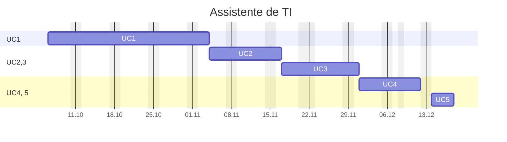

---
{"dg-publish":true,"permalink":"/42-turmas-senac-anteriores/assistente-de-ti/assistente-de-ti/","title":"Assistente de TI","metatags":{"description":"Curso Assistente de tecnologias da informação"},"tags":["Aulas","Assistente-de-TI","Senac","curso"],"noteIcon":"default","updated":"2026-03-17T19:06:43.092-03:00","dg-note-properties":{"class":"aula","title":"Assistente de TI","tags":["Aulas","Assistente-de-TI","Senac","curso"]}}
---

## Curso Assistente de TI

> [!info]- Identificação do curso
> 
>  Título do Curso: Assistente de tecnologias da informação  
> Eixo tecnológico: Informação e Comunicação Segmento: Tecnologia da Informação  
> Carga horária: 200 horas
> Período: 06/10/2025 à 18/12/2025

> [!example]- Unidades Curriculares
> 
> |  📅 Unidades Curriculares                                                               | Carga horária |
> | ----------------------------------------------------------------------------------- | ------------- |
> | UC1: Operar sistemas operacionais cliente, aplicativos de escritório e periféricos. | 72            |
> | UC2: Instalar e configurar componentes de hardware                                  | 36            |
> | UC3: Instalar e configurar sistemas operacionais cliente, softwares e periféricos   | 36            |
> | UC4: Configurar e operar rede local de computadores.                                | 36            |
> | UC 5: Projeto Integrador - Assistente de Tecnologias da Informação                  | 20            |

## UC1 - Operador de computadores

> [!success]- 🖥️ Habilidades
> 1. Gerencia arquivos conforme recursos do sistema operacional cliente.
> 2. Utiliza ferramentas de pesquisa, agenda e mensagens de acordo com os serviços de internet.
> 3. Elabora e edita textos e apresentações eletrônicas, conforme recursos dos aplicativos de escritório.
> 4. Elabora e edita dados numéricos e gráficos de acordo com os recursos do editor de planilhas eletrônicas.
> 5. Armazena e compartilha dados de acordo com os requisitos da solução.

### Cronograma da UC1

>[!done]- Cronograma da Unidade Curricular 1
>
>>[!note]- Aula 1.1 - introdução ao Windows
>>  - [x] Aula 1.1 - 2025.10.06 - Windows -  Introdução
>> - 🎓 [Abertura do curso](https://docs.google.com/presentation/d/12myN-OpLqppVuXahxOGlCTRJcd84ftr_/edit?usp=sharing&ouid=106055613390581376281&rtpof=true&sd=true)
>> - ✨ [Aula 1 - Apresentação](https://drive.google.com/file/d/1-6RPU-erktgeD7HxvyWlQguM4dIXTYuH/view?usp=sharing)
>>>[!todo] 🖥️ Atividade: 
>>> - Criar um relatório sobre:
>>>  - A versão do Sistema Operacional e do Office;
>>> - Digitação com acentuação na página 53 da [📑Apostila][apostila]
>
>>[!note]- Aula 1.2 - conhecendo a área de trabalho
>>  - [x] Aula 1.2 - 2025.10.07 - Windows - Conhecendo a área de trabalho
>> - [História e Evolução dos Computadores](https://www.todamateria.com.br/historia-e-evolucao-dos-computadores/)
>>>[!todo] 🖥️ Atividade: 
>>>  - A quantidade de memória e armazenamento do Desktop;
>>> - Organização de ícones e arquivos na Área de Trabalho, na páginas 29 a 35 da [📑Apostila][apostila]
>>> - Criando desenhos no Paint e Paint 3d conforme pg. 57 da [📑Apostila][apostila];
>
>>[!note]- Aula 1.3 - configurando as telas do Windows
>>  - [x] Aula 1.3 - 2025.10.08 - Windows - Configuração das telas
>> - [[42-Turmas-Senac-Anteriores/Assistente-de-TI/Estacao-de-trabalho\|Estação de Trabalho em Tecnologia da Informação]]
>> - [Personalizar a IU do dispositivo Windows](https://learn.microsoft.com/pt-br/windows-hardware/customize/)
>>  - acesso e tela de bloqueio;
>>  - organização de arquivos;
>>   - opções de energia;
>>>[!todo] 🖥️ Atividades:
>>> - Organização de arquivos e pastas, na páginas 29 a 35 da [📑Apostila][apostila]
>>> - Configurar o desligamento automático para 30 minutos;
>>> - Mudar a imagem das telas de bloqueio e desktop do Windows;
>>> - Identificar como instalar e modificar temas do Windows;
>>> - Criar arquivos ocultos e [como deixar uma pasta invisível](https://dti.unilab.edu.br/blog/2014/08/13/como-deixar-uma-pasta-invisivel/)
>
>>[!note]- Aula 1.4 - organizando arquivos e pastas, ferramentas do Sistema
>>  - [x] Aula 1.4 - 2025.10.09 - Windows - ferramentas, arquivos e pastas
>>   - [[42-Turmas-Senac-Anteriores/Assistente-de-TI/Guia do Windows\|Guia do Windows]]
>>   - [[42-Turmas-Senac-Anteriores/Assistente-de-TI/5 segredos do Windows\|5 segredos do Windows]]
>>   - Configurando o menu Iniciar, organizando atalhos em pastas;
>>   - interface e manuseio de janelas, área de trabalho,
>>   - manipulação de arquivos e pastas,
>>   - recurso de área de transferência, seleção, copiar, recortar e colar;
>>   - painel de controle.
>>>[!todo] 🖥️ Atividade:
>>> - Mudar a imagem de sua conta de usuário do Windows;
>>> - Selecionando textos conforme pg. 56 da [📑Apostila][apostila];
>
>>[!note]- Aula 1.5 - programas acessórios do Windows
>>  - [x] Aula 1.5 - 2025.10.10 - Windows - programas acessórios
>>   - Conhecendo os acessórios do Windows: bloco de notas, calculadora Paint e Wordpad, digitação com acentos e atalhos de teclado
>>   - acessórios do SO: bloco de notas, [[42-Turmas-Senac-Anteriores/Assistente-de-TI/Calculadora do Windows\|Calculadora do Windows]], WordPad;
>>   - [Explorar as ferramentas de suporte e diagnóstico](https://learn.microsoft.com/pt-br/training/modules/explore-support-diagnostic-tools/?source=recommendations)
>>   - [Sysinternals - Sysinternals \| Microsoft Learn](https://learn.microsoft.com/pt-br/sysinternals/)
>>>[!todo] 🖥️ Atividade:
>>> - Criando textos e formatando no WordPad;
>>> - Criando desenhos no Paint e Paint 3d conforme pg. 57 da [📑Apostila][apostila];
>
>>[!note]- Aula 1.6 - Word - elementos, formatação e parágrafos
>>  - [x] Aula 1.6 - 2025.10.13 - Editor de texto [Word](https://support.microsoft.com/pt-br/word): área de trabalho;
>>   - [📑Apostila][apostila] a partir da pg. 73: Processador de Textos Word: Elementos da tela; Manipulação com arquivo de texto; Recursos de seleção de texto; 
>>>[!todo] 🖥️ Atividade:
>>> - Conhecendo a interface do Word: Criando texto sobre o Blu-Ray contendo formatação e parágrafos;
>>> - Conhecendo estilos de texto no Word Criando os textos Iracema e o poema Cecília;
>
>>[!note]- Aula 1.7 - Word - formatação de textos (fonte e parágrafo), ortografia e gramática.
>>  - [x] Aula 1.7 - 2025.10.14 - Editor de texto [Word](https://support.microsoft.com/pt-br/word): área de trabalho;
>>   - Editor de texto [Word](https://support.microsoft.com/pt-br/word): formatação de textos (fonte e parágrafo), 
>>   - [📑Apostila][apostila] a partir da pg. 83: Processador de Textos Word: Manipulação com arquivo de texto e formatação e estilos de fonte e parágrafos; Copiar, recortar e colar texto; estilos de texto, reverter texto, histórico de desfaz e refaz ações;
>>>[!todo] 🖥️ Atividade:
>>> - Criando um portifólio no [Google Sites](https://sites.google.com/new/).
>>>  - Compartilhamento de arquivos no [Drive](https://drive.google.com/) e [Google Sites](https://sites.google.com/view/informaticasenac/assistente-de-ti-2024)
>>> - Conhecendo estilos de texto no Word Criando os textos Responsabilidade Social e Teoria da música;
>
>>[!note]- Aula 1.8 - Word - ortografia e gramática, correção, tabulação, cabeçalho
>>  - [x] Aula 1.8 - 2025.10.15- [📑Apostila][apostila] a partir da pg. 88: Processador de Textos Word: ortografia e gramática, layout de visualização
>>
>>>[!todo] 🖥️ Atividade:
>>> - No Word Criando os textos Teoria da música, Menu com tabulação, Sumário manual.
>>> - No Word Criando o texto Soneto de Fidelidade, sumários e capas em trabalho.
>
>>[!note]- Aula 1.9 - Word - elementos, marcadores, símbolos e ilustrações, design de bordas e imagens
>>  - [x] Aula 1.9 - 2025.10.16 - Word - [📑Apostila][apostila] a partir da pg. 97: Processador de Textos Word: cabeçalho e rodapé, objetos e imagens, bordas de parágrafo e de páginas, design de documentos.
>>
>>>[!todo] 🖥️ Atividades:
>>>  - [📑Apostila][apostila] a partir da pg. 118: Boletim escolar, recibo comercial, textos formatados e cardápio.
>>> - No Word Criando os certificados e papel de carta estilizados.
>>> - No Word Criando os textos com símbolos e  organizando imagens no texto "Samba de Noel Rosa".
>>> - Criando Infografo;
>
>>[!note]- Aula 1.10 - [📑Apostila][apostila] Processador de Textos Word:  inserindo símbolos, figuras, tabelas e objetos.
>> - [x]  Aula 1.10 - 2025.10.17 - Word - elementos da página, cabeçalho e rodapé, tabelas e listas.
>> - [📑Apostila][apostila] a partir da pg. 105: Processador de Textos Word: Operações com figuras, símbolos e ilustrações; Inserir e formatar Tabelas; Revisor ortográfico; Configuração de página e de impressão; tabelas e listas, impressão. formatação de textos (fonte e parágrafo), ortografia e gramática, cabeçalho e rodapé, objetos e imagens, tabelas e listas, impressão.
>> - [Atualizações do Windows 11 25H2](https://www.youtube.com/watch?v=QCHn_1WDSX0)
>>>[!todo] 🖥️ Atividades:
>>> - Criando a tabela boletim;
>>> - Criando o relatório de vendas com tabulação;
>>> - Criando o recibo comercial.
>
>>[!note]- Aula 1.11 - Introdução a planilhas com o Excel
>> - [x]  Aula 1.11 - 2025.10.20 - [📑Apostila][apostila] a partir da pg. 121, editor de planilhas Excel: 
>> - Conceito de Planilha eletrônica;
>> - Principais elementos do espaço de trabalho (Pasta, planilha, célula, barras, menus);
>> - Navegação; Edição de dados nas células;
>> - Seleção de célula, intervalo(s), coluna(s), linha(s), toda planilha;
>>
>>>[!todo] 🖥️ Atividades no Excel:
>>> - Criando e formatando a planilha de orçamento doméstico.
>>> - Criando a planilha Feira do mês com cálculos de total.
>
>>[!note]- Aula 1.12 - Operações aritméticas com Excel:
>> - [x]  Aula 1.12 - 2025.10.21 - [📑Apostila][apostila] a partir da pg. 137, Editor de planilhas Excel:
>> - Operações com colunas e linhas;
>> - Operações com planilhas: copiar, selecionar, mover, ocultar, múltiplas seleções;
>>>[!todo] 🖥️ Atividades no Excel:
>>> - Criando e formatando a planilha de cálculos percentuais.
>>> - Adicionando funções à planilha de cálculos percentuais.
>
>>[!note]- Aula 1,13 - Funções com Excel:
>> - [x]  Aula 1.13 - 2025.10.22 - [📑Apostila][apostila] a partir da pg. 141, Editor de planilhas Excel:
>> - Operações com funções aritméticas: soma, máximo, mínimo, média,`procv`, `proch`;
>> - Formatação condicional para destacar informações com cores.
>>>[!todo] 🖥️ Atividades no Excel:
>>> - Criando a planilha de boletim escolar com formatação condicional, adicionando funções e destacando notas vermelha.
>>> - Adicionando funções de cálculos de média e resultados com condicionais à planilha de boletim escolar pg. 169.
>>> - Pesquisa dinâmica de nomes, notas e resultados no boletim.
>
>>[!note]- Aula 1.14 - Segurança e proteção em planilhas no Excel:
>> - [x]  Aula 1.14 - 2025.10.23  - [📑Apostila][apostila] a partir da pg. 143, Editor de planilhas Excel:
>> - Configuração de proteção: proteger células específicas, planilhas e arquivos.
>> - [Matrícula de cursos Online - DIO](https://dio.me/sign-up?ref=XXNHOX4TYB) - [Curso Santander Excel com inteligencia artificial 2º semestre](https://web.dio.me/track/santander-excel-com-inteligencia-artificial-2-semestre)
>> - Validação de dados: garantir entrada de dados a partir de uma lista determinada.
>>>[!todo] 🖥️ Atividades no Excel:
>>> - Criando um formulário para seleção de emprego com células protegidas e validação de dados.
>
>>[!note]- Aula 1.15 - Gráficos em planilhas do Excel:
>> - [x]  Aula 1.15 - 2025.10.24 - [📑Apostila][apostila] a partir da pg. 155, Editor de planilhas Excel:
>> - Configuração de páginas e impressão.
>> - Configurando o cabeçalho e rodapé.
>> - Criação e formatação de Gráficos;
>> - Classificação personalizada de dados;
>> - Referência absoluta e relativa.
>>>[!todo] 🖥️ Atividades no Excel:
>>> - Adicionando gráficos à planilha de boletim escolar (pg. 156).
>>> - Criando planilhas com gráficos: PIB Brasil, Pesquisa Eleitoral (pg. 161).
>>> - Classificando a planilha de funcionários por empresa, departamento e cargo (pg. 163).
>
>>[!note]- Aula 1.16 - Excel: Automações com macros e tabela dinâmica
>> - [x]  Aula 1.16 - 2025.10.27 - [📑Apostila][apostila] a partir da pg. 165, Editor de planilhas Excel: Referência absoluta e relativa;
>> - Automações com macros
>> - Segmentação de dados e tabelas dinâmicas.
>> - [COMO CRIAR BOTÕES COM UM VALOR NO EXCEL - YouTube](https://www.youtube.com/watch?v=56tKSerXKWs)
>>>[!todo] 🖥️ Atividades no Excel:
>>> - Criando uma planilha de tabuada aritmética (pg. 168).
>>> - Criando planilhas com funções condicionais: cálculo de salário pelo INSS (pg. 170).
>>> - Criando planilha com reajuste percentual usando referência absoluta (pg. 173).
>
>>[!note]- Aula 1.17 - Relatórios e dashboards com Excel
>> - [x]  Aula 1.17 - 2025.10.28 - Relatórios e dashboards
>> - Gráficos com tabela dinâmica.
>>>[!todo] 🖥️ Atividades no Excel:
>>> - Criando planilhas com cotação de preços com cálculo de preço médio, máximo e mínimo (pg. 172).
>>> - Criando planilha com reajuste percentual usando referência absoluta (pg. 173).
>>> - Criando planilha com cálculo de índice de massa corpórea usando referência absoluta (pg. 174).
>
>>[!note]- Aula 1.18 - Organizando base de dados com Excel
>> - [x]  Aula 1.18 - 2025.10.29 - Bases de dados e relatórios com Excel
>> - Base de dados em CSV.
>>>[!todo] 🖥️ Atividades no Excel:
>>> - Importar dados em formato CSV e organizar e formata-los em tabelas do Excel.
>>> - [Base-de-dados1.csv](https://drive.google.com/file/d/116BITe6oCPIHJoRCpBF3aALAkDbFjjNx/view?usp=sharing)
>>> - [TBase-de-dados2.csv](https://drive.google.com/file/d/1iwOaOf3E7GXknZmlQVpEZpbmn3njzjIg/view?usp=sharing)
>
>>[!note]- Aula 1.19 - Exercícios com tabela dinâmica com Excel
>> - [x]  Aula 1.19 - 2025.10.30 -Tabela dinâmica avançada
>> - Base de dados em CSV.
>>>[!todo] 🖥️ Atividades no Excel:
>>>- [Montar uma Tabela dinâmica, Cap. 7, Excel avançado - Editora Senac](https://bibliotecadigitalsenac.com.br/#/content/uid/1d4fc6f8-16d8-ee11-85fa-00224821b803/detail)
>
>>[!note]- Aula 1.20 - Introdução ao Power Point
>> - [x]  Aula 1.20 - 2025.10.31 - Power Point
>> - [📸Livro da Biblioteca Virtual SENAC do Power Point][powerpoint] cap. 1 e 2:
>> - Conhecendo a interface do Power Point - [[42-Turmas-Senac-Anteriores/Informatica basica/PowerPoint/PowerPoint2019-cap1\|PowerPoint2019-cap1]];
>> - Criando slides, adicionando e formatando elementos, como tabelas, formas e gráficos - [[42-Turmas-Senac-Anteriores/Informatica basica/PowerPoint/PowerPoint2019-cap2\|PowerPoint2019-cap2]].
>>>[!todo] 🖥️ Atividades no PowerPoint:
>>> - Criando slides sobre um relatório de vendas.
>>> - Criando slides de controle de vídeos com tabelas e gráficos.
>
>>[!note]- Aula 1.21 - Estilos em Slides no Power Point
>> - [x]  Aula 1.21 - 2025.11.03 - Power Point com transições e animações.
>> - [📸Livro da Biblioteca Virtual SENAC do Power Point][powerpoint] cap. 3 e 4:
>> - Criando slides com transições e animações - [[42-Turmas-Senac-Anteriores/Informatica basica/PowerPoint/PowerPoint2019-cap3\|PowerPoint2019-cap3]].
>> - Criando infografos com [Canva](https://www.canva.com/templates)
>>>[!todo] 🖥️ Atividades no PowerPoint:
>>> - Aplicando efeitos em vários modelos de slides.

[apostila]: https://drive.google.com/file/d/1HNT1is949xITALuJXT1dwaLCbYexrIGT/view?usp=sharing
[powerpoint]: https://bibliotecadigitalsenac.com.br/#/content/uid/d37df569-17d8-ee11-85fa-00224821b803/detail

## UC2 - Instalar e configurar componentes de hardware

> [!success]- 🖥️ Habilidades
> 1. Diferenciar componentes de hardware.
> 2. Manusear equipamentos e ferramentas.
> 3. Operar ferramentas de diagnóstico de hardware.
> 4. Elaborar documentos técnicos.
> 5. Interpretar documentos e manuais técnicos.
> 6. Organizar materiais, ferramentas, instrumentos, documentos e local de trabalho.

### Cronograma da UC2

>[!done]- Cronograma da Unidade Curricular 2
>
>>[!note]- Aula 2.1 - Instalações elétricas e proteção 
>> - [x] Aula 2.1 - 2025.11.04 - Eletricidade e equipamentos elétricos
>> - [Simulações Interativas: Corrente e circuito elétrico](https://drive.google.com/file/d/1_9aMRbhF_d9Tkiut1v0uqKVRgWPQQq8d/view?usp=sharing)
>> - [atividade PHET - Circuitos Elétricos 1.pptx - Apresentações Google](https://docs.google.com/presentation/d/1ydRZFuRjyW3epVuboxguCDOrx0moi99n/edit?usp=sharing)
>> - [Eletricidade Basica Aula.ppt - Apresentações Google](https://docs.google.com/presentation/d/e/2PACX-1vRQbF_HeUA62xVYROHayMUQwq81dXZdn9RbHwihait41yerHY0-FvtlPygsC28ldg/pub?start=true&loop=false&delayms=3000)
>> - [Eletricidade e proteção.pptx - Apresentações Google](https://docs.google.com/presentation/d/e/2PACX-1vQFiCPOw6kBrVUnlE3EfaoBHl0ys2DxUm9yZqTRPylsZcmDqTYdmM3gBxSrr4GJeQ/pub?start=true&loop=false&delayms=3000)
>> - [Fonte de alimentação.pptx - Apresentações Google](https://docs.google.com/presentation/d/e/2PACX-1vTf_VeIsIGUfBaXbLHUKRx1mCv95CGcWe-739PpXIgxOHJr_KwUtLI6kXaOoVnvsw/pub?start=true&loop=false&delayms=3000)
>> - [Eletricidade Básica - YouTube](https://www.youtube.com/playlist?list=PLr-Pz5YOnmxBm4_G2V6uArAEOFuFcXGsk)
>> - [Fontes - Escola de Hardware - Episódio 7 - YouTube](https://www.youtube.com/watch?v=J4HpGfUiaag)
>> - [[42-Turmas-Senac-Anteriores/Assistente-de-TI/Cálculos elétricos\|Cálculos elétricos]]
>> - Componentes do Hardware: [Fontes de alimentação ATX: principais características](https://www.infowester.com/fontesatx.php)
>>>[!todo] 🖥️ Atividade: 
>> - Simular:  [Circuitos AC](https://phet.colorado.edu/pt/simulations/circuit-construction-kit-ac) - [Corrente e circuito elétrico](https://phet.colorado.edu/pt/activities/6728) - [Circuitos Elétricos (Básico)](https://phet.colorado.edu/pt/activities/4911)
>>> - Criar uma planilha de orçamento de fontes de computadores usando [PSU Calculator da Cooler Master](https://www.coolermaster.com/pt-br/power-supply-calculator/).
>
>>[!note]- Aula 2.2 - Proteção elétrica
>>- [x] Aula 2.2 - 2025.11.05 - Equipamentos de proteção elétrica
>> - [Equipamentos de proteção elétrica.pptx - Apresentações Google](https://docs.google.com/presentation/d/e/2PACX-1vT-plmkdESOqUamkDtCt8T-DMxoIwGYqH4n1OO6MrR8r-eBzs48fB34ODm1MgFKuw/pub?start=true&loop=false&delayms=3000)
>> - [Equipamentos de proteção elétrica](https://jocile.github.io/aulas/posts/equipamentos-de-protecao-eletrica/)
>> - Introdução ao funcionamento da rede elétrica: [Conceitos de Eletricidade](https://jocile.github.io/aulas/posts/conceitos-de-eletricidade/)
>> - [IDR (DR) ATUA OU NÃO - YouTube](https://www.youtube.com/watch?v=5uEzzo-Gh1c)
>> - [Nikola Tesla foi impedido de contar esse segredo para a humanidade - YouTube](https://www.youtube.com/watch?v=Uvz-v9E-96o)
>> - [FILTRO DE LINHA ou NOBREAK, QUAL O MELHOR PARA O SEU PC GAMER? Vem Conferir! - YouTube](https://www.youtube.com/watch?v=J6YbIZ3E_Hw)
>>>[!todo] 🖥️ Atividade: 
>>> - [[42-Turmas-Senac-Anteriores/Assistente-de-TI/Calculando a fonte\|Calculando a fonte]]
>>> - Criar uma planilha de orçamento de equipamentos de proteção elétrica para um laboratório de informática com 10 computadores
>>> - Modelo de [Quadro de carga.xlsx - Planilhas Google](https://docs.google.com/spreadsheets/d/1Fs64Smsy17290OcUo5058E8NQORIPps0/edit?usp=sharing&ouid=106055613390581376281&rtpof=true&sd=true)
>>> - Modelo de [planilha para levantamento de carga instalada.xls](https://www.fecoergs.com.br/anexos/anexo_1_planilha_para_levantamento_de_carga_instalada_e_calculo_do_tipo_de_fornecimento.xls)
>>> - [enel.com.br - Descrição de carga.pdf](https://www.enel.com.br/content/dam/enel-br/documentos/megamenu/informativos/imobili%C3%A1rias/Descri%C3%A7%C3%A3o%20de%20carga.pdf)
>
>>[!note]- Aula 2.3 - Componentes de Hardware - placa mãe
>>- [x] Aula 2.3 - 2025.11.06 - Componentes de Hardware
>>- [Partes do Computador.ppt - Apresentações Google](https://docs.google.com/presentation/d/e/2PACX-1vScIJZntmXRw-YLkSd6oQ45r2avd_Vp9mt44B3YDZ_58rSzgs_wJHTVerjmdEVuUg/pub?start=true&loop=false&delayms=3000)
>> - [Apresentação sobre gabinetes e conexões](https://docs.google.com/presentation/d/e/2PACX-1vTsgRf0APpdSQcmGqju49KaVhLoVFxjhYNUWWvYUu-dI0r96NkSn2GyLEaPrzsLXA/pub?start=true&loop=false&delayms=3000)
>> - Componentes do Hardware de uma [[42-Turmas-Senac-Anteriores/Assistente-de-TI/Estacao-de-trabalho\|Estacao-de-trabalho]]: placa-mãe, processador, memória RAM, cooler, fonte de alimentação, gabinetes e placas de expansão- [Todas as Peças de Computador Explicadas em 8 Minutos - YouTube](https://www.youtube.com/watch?v=pFTgWgb5wiM)
>> - Conhecendo os [[42-Turmas-Senac-Anteriores/Assistente-de-TI/Chipsets de Placas-Mae\|Chipsets de Placas-Mae]]
>> - Guia para a escolha da [[42-Turmas-Senac-Anteriores/Assistente-de-TI/Placa-Mae\|Placa-Mae]]
>> - [[42-Turmas-Senac-Anteriores/Assistente-de-TI/Concurso da UFC 2025\|Concurso da UFC 2025]]
>>>[!todo] 🖥️ Atividade: 
>>> - Criar uma planilha de inventário de peças de um computador.
>>> - [Calculadora de Autonomia Nobreaks Intelbras](https://calculadora-nobreaks.intelbras.com.br/)
>>> - [Modelo de lista peças do computador](https://docs.google.com/spreadsheets/d/1Fs64Smsy17290OcUo5058E8NQORIPps0/edit?usp=sharing&ouid=106055613390581376281&rtpof=true&sd=true)
>
>>[!note]- Aula 2.4 - Componentes de Hardware - ferramentas e EPI
>>- [x] Aula 2.4 - 2025.11.07 - Ferramentas e EPI para manutenção
>> - [Memória.pptx - Apresentações Google](https://docs.google.com/presentation/d/e/2PACX-1vSPuWVYJSM7wXvxL9d2MRZht-k3Iz2UUrBqIG2_4KBqzTfnptAs3Tky7-OggDYwfA/pub?start=true&loop=false&delayms=3000)
>> - [Placa-mãe.pptx - Apresentações Google](https://docs.google.com/presentation/d/e/2PACX-1vTWKEtYI6PLBfg-Ey4NJpspgUqX4SHbcLOUVeKZfFDo9-oXtsXzMN-PX0i4qOJWyw/pub?start=true&loop=false&delayms=3000)
>> - [Instalação de Hardware.pdf](https://drive.google.com/file/d/1eHpXpqeI8s4uvExVrM9IHNdlLYtHag8z/view?usp=sharing)
>>>[!todo] 🖥️ Atividade:
>>> - Criar uma planilha com uma lista de ferramentas com item, preço e link;
>>> - [Modelo de lista peças do computador](https://docs.google.com/spreadsheets/d/1Fs64Smsy17290OcUo5058E8NQORIPps0/edit?usp=sharing&ouid=106055613390581376281&rtpof=true&sd=true)
>>> - Desmontagem e montagem assistida de um computador.
>
>>[!note]- Aula 2.05 - Componentes de Hardware - processadores e memória
>>- [x] Aula 2.5 - 2025.11.10 - [[42-Turmas-Senac-Anteriores/Assistente-de-TI/Processadores\|Processadores]]
>> - Componentes do Hardware: [Processadores.pptx - Apresentações Google](https://docs.google.com/presentation/d/e/2PACX-1vRx8cvvDeinPIWpHX22yGBxuhvSEDix4lth4Ru9U9dJZVVPUI7VRIGdFLwttrzhKw/pub?start=true&loop=false&delayms=3000)
>> - [Guia de Processadores 2025 - Primeiro Semestre - Adrenaline](https://www.adrenaline.com.br/artigos/guia-de-processadores-atualizado-primeiro-semestre-2025-1/)
>>>[!todo] 🖥️ Atividade:
>>> - Realizar a montagem de um computador usando [[42-Turmas-Senac-Anteriores/Assistente-de-TI/Simulador-de-montagem\|Simulador-de-montagem]].
>>> - Criar um relatório no Word descrevendo a configuração das peças utilizadas.
>
>>[!note]- Aula 2.06 - Componentes de Hardware - memória e armazenamento
>>- [x] Aula 2.6 - 2025.11.11 - [[42-Turmas-Senac-Anteriores/Assistente-de-TI/Memória RAM\|Memória RAM]]
>> - [Todas as Memórias DDR Explicadas em 8 Minutos - YouTube](https://www.youtube.com/watch?v=6ZotxnvGNTQ)
>> - Problemas do Hardware: [[42-Turmas-Senac-Anteriores/Assistente-de-TI/Resolucao-de-problemas\|Resolucao-de-problemas]]
>> - [Problemas no pc.pptx - Apresentações Google](https://docs.google.com/presentation/d/e/2PACX-1vTLFM-wvV_MYSuyQDNaZFaHAr-Nl58wzKxQSm5wv04rE_9mvCdI8eyWLr-SAN88wA/pub?start=true&loop=false&delayms=3000)
>> - [Diagnosticando Defeitos.pptx - Apresentações Google](https://docs.google.com/presentation/d/e/2PACX-1vQHGR3mqvjiU3pQ95GaFxNCkKtw-FF7cQ-mxaL3UI4uuZGl-mSY7QFTpVccK5Latg/pub?start=true&loop=false&delayms=3000)
>>>[!todo] 🖥️ Atividade:
>>> - [PRALET de Instalação de Hardware.docx](https://docs.google.com/document/d/e/2PACX-1vRsI5aKkqN3PlhJkaR9AOAS54HreKqYXWBtrIjnxjFV2NGC4-V0-lj2rengIdsIbg/pub)
>>> - Realizar a solução de problemas de um computador usando: [Intel - Simulador de Defeitos](https://archive.org/details/intel_simuladordefeitos)
>>> - Criar um relatório no Word descrevendo os problema resolvidos.
>
>>[!note]- Aula 2.07 - Componentes de Hardware - GPU
>>- [x] Aula 2.7 - 2025.11.12 - [[42-Turmas-Senac-Anteriores/Assistente-de-TI/Placa de video\|Placa de video]]
>>- [O que é placa de vídeo e como funciona? - Adrenaline](https://www.adrenaline.com.br/hardware/o-que-e-placa-de-video/)
>>- [Guia de Placas de Vídeo 2025 - segundo semestre - Adrenaline](https://www.adrenaline.com.br/hardware/guia-de-placas-de-video-2025-segundo-semestre/)
>>>[!todo] 🖥️ Atividade:
>>> - [[42-Turmas-Senac-Anteriores/Assistente-de-TI/Prática Orçamento para Compra de Peças do Computador\|Prática Orçamento para Compra de Peças do Computador]]
>
>>[!note]- Aula 2.08 - Relatórios técnicos
>>- [x] Aula 2.8 - 2025.11.13 - Avaliação com relatórios técnicos
>>- Pesquisa de orçamento de peças com: [PC Build Wizard](https://pcbuildwizard.com/), [MEUPC.NET](https://meupc.net/),
>>- [Tudo sobre HD, SSD E NVME - YouTube](https://www.youtube.com/watch?v=UtNsLJ0ffGw)
>>- [Todas as Peças de Computador Explicadas em 8 Minutos - YouTube](https://www.youtube.com/watch?v=pFTgWgb5wiM)
>>>[!todo] 🖥️ Atividade:
>>> - [Questionário sobre as peças do computador](https://forms.gle/nYuKC46Jr59SfELD6)
>>> - [[42-Turmas-Senac-Anteriores/Assistente-de-TI/Prática Orçamento para Compra de Peças do Computador\|Prática Orçamento para Compra de Peças do Computador]]
>>> - Criação de planilha interativa de orçamentos de peças.
>
>>[!note]- Aula 2.09 - Relatórios técnicos
>>- [x] Aula 2.9 - 2025.11.14 - Avaliação com relatórios técnicos
>>- Montagem de configuração de Computador com: [Pichau](https://www.pichau.com.br/monte-seu-pc), [KaBuM!](https://www.kabum.com.br/monte-seu-pc), [Terabyte](https://www.terabyteshop.com.br/pc-gamer/full-custom)
>>>[!todo] 🖥️ Atividade:
>>> - [[42-Turmas-Senac-Anteriores/Assistente-de-TI/Prática Orçamento para Compra de Peças do Computador\|Prática Orçamento para Compra de Peças do Computador]]
>>> - Criação de planilha interativa de orçamentos de peças.

## UC3 - Instalar e configurar sistemas operacionais cliente e softwares

> [!success]- 🖥️ Habilidades
> 1. Elaborar cronograma de planejamento do processo de instalação e configuração.
> 2. Identificar compatibilidade entre o hardware e o software.
> 3. Identificar necessidades de atualização de softwares.
> 4. Interpretar documentos e manuais técnicos.
> 5. Desinstalar softwares.
> 6. Utilizar termos técnicos nas rotinas de trabalho.
> 7. Administrar tempo e atividades de trabalho.
> 8. Pesquisar e organizar dados e informações.
> 9. Realizar backup e restaurar dados.

### Cronograma da UC3

>[!done]- Cronograma da Unidade Curricular 3
>
>>[!note]- Aula 3.1 - Instalando o Sistema Operacional Windows
>>- [x] Aula 3.1 - 2025.11.17 - [[42-Turmas-Senac-Anteriores/Assistente-de-TI/Instalando-o-windows\|Instalando-o-windows]]
>> - [Instalando Windows - Apresentações Google](https://docs.google.com/presentation/d/e/2PACX-1vTVB8pCdIE-NgehNyVa04vIXzceb8NG2oOTqDyfM6r0MK15l7E4UcmAECWWsWJRnw/pub?start=true&loop=false&delayms=3000)
>>>[!todo] 🖥️ Atividade: 
>>> - Criar uma máquina virtual com [Oracle VirtualBox](https://www.virtualbox.org/wiki/Downloads) e instalar o Windows.
>
>>[!note]- Aula 3.2 - Otimizando o Sistema Operacional Windows
>>- [x] Aula 3.2 - 2025.11.18 - [[42-Turmas-Senac-Anteriores/Assistente-de-TI/Otimizacao do Windows\|Otimizacao do Windows]]
>> - [Instalando Windows - Apresentações Google](https://docs.google.com/presentation/d/e/2PACX-1vTVB8pCdIE-NgehNyVa04vIXzceb8NG2oOTqDyfM6r0MK15l7E4UcmAECWWsWJRnw/pub?start=true&loop=false&delayms=3000)
>>>[!todo] 🖥️ Atividade: 
>>> - Utilizar uma máquina virtual com [Oracle VirtualBox](https://www.virtualbox.org/wiki/Downloads) e otimizar o Windows.
>
>>[!note]- Aula 3.3 - Personalizando Windows para empresa
>>- [x] Aula 3.3 - 2025.11.19 - Personalizando Windows para empresa
>> - [2 opções do Windows OBRIGATÓRIAS que voce deveria ativar PRA ONTEM! - YouTube](https://www.youtube.com/watch?v=yVa-oQL7620)
>> - [Recuperação Rápida do Computador - Microsoft Learn](https://learn.microsoft.com/pt-br/windows/configuration/quick-machine-recovery/?tabs=intune)
>>>[!todo] 🖥️ Atividade:
>>> - Criar uma máquina virtual com [Oracle VirtualBox](https://www.virtualbox.org/wiki/Downloads) e instalar o Windows 11 e personalizar para empresa, mudando a tela de bloqueio, tela de fundo: [System Product Name](https://winaero.com/how-to-change-system-product-name-in-windows-11/), [OEM Info](https://winaero.com/how-to-add-oem-info-in-windows-11/), [Fundos do Ambiente de Trabalho e do Ecrã de Bloqueio](https://learn.microsoft.com/pt-br/windows/configuration/background/?tabs=intune&pivots=windows-11), [Customizar a logo do boot](https://www.youtube.com/watch?v=zrw_zzIygEs)
>
>>[!info] FERIADO - 20.11 - Dia da Consciência Negra 
>
>>[!note]- Aula 3.4 - Instalando aplicativos e pacote Office
>>- [x] Aula 3.4 - 2025.11.21 - Instalando aplicativos e pacote Office
>> - [Pacote office 2024 ultima versão atualizada oficial baixar e instalar - YouTube](https://www.youtube.com/watch?v=cLrheCNZjrc)
>> - [Winscript: Ferramenta para otimizar o Windows - debloat, privacy, performance & app installing scripts.](https://github.com/flick9000/winscript)
>>>[!todo] 🖥️ Atividade:
>>> - Criar uma máquina virtual com [Oracle VirtualBox](https://www.virtualbox.org/wiki/Downloads) e instalar o Windows 11, realizar o debloat e instalar pacote Office, navegador Chrome, descompactador Winrar.
>
>>[!note]- Aula 3.5 - Manutenção do Windows
>>- [x] Aula 3.5 - 2025.11.24 - [[42-Turmas-Senac-Anteriores/Assistente-de-TI/Manutencao do Windows\|Manutencao do Windows]]
>>
>>>[!todo] 🖥️ Atividade:
>>> - Utilizar uma máquina virtual com o Windows 11, realizar o debloat e manutenção preventiva: criar um ponto de restauração, limpeza de arquivos temporários, acessar o modo de recuperação e realizar procedimentos de restauração.
>
>>[!note]- Aula 3.6 - Manutenção do Windows, backup e proteção
>>- [x] Aula 3.6 - 2025.11.25 - [[42-Turmas-Senac-Anteriores/Assistente-de-TI/Manutencao do Windows\|Manutencao do Windows]], backup e proteção
>>
>>>[!todo] 🖥️ Atividade:
>>> - Utilizar uma máquina virtual com o Windows 11, realizar a manutenção preventiva: configurar o backup e partição para dados.
>
>>[!note]- Aula 3.7 - Instalação do Linux
>>- [x] Aula 3.7 - 2025.11.26 - Introdução e instalação do Linux
>>
>>>[!todo] 🖥️ Atividade:
>>> - Criação de máquina virtual com instalação de várias versões do [Ubuntu](https://ubuntu.com/desktop/flavors)
>
>>[!note]- Aula 3.8 - Instalação do Linux
>>- [x] Aula 3.8 - 2025.11.27 - Versões e distribuições do Linux.
>>- [DistroWatch.com. Use Linux, BSD.](https://distrowatch.com/)
>>
>>>[!todo] 🖥️ Atividade:
>>> - Criação de máquina virtual com instalação de várias versões do [Ubuntu](https://ubuntu.com/desktop/flavors)
>
>>[!note]- Aula 3.9 - Comandos do Linux
>>- [x] Aula 3.9 - 2025.11.28 - Utilizando [Comandos no terminal do linux \| Jocile](https://jocile.github.io/aulas/posts/Comandos-no-terminal-linux/).
>>
>>>[!todo] 🖥️ Atividade:
>>> - Utilizar o terminal de comandos de uma máquina virtual com instalação de várias versões do [Ubuntu](https://ubuntu.com/desktop/flavors)

## UC4 - Instalar e configurar rede local de computadores

> [!success]- 🖥️ Habilidades
> 1. Identificar falhas e ameaças na rede.
> 2. Utilizar ferramentas para conexões e testes.
> 3. Organizar o ambiente de trabalho.

### Cronograma da UC4

>[!done] Cronograma da Unidade Curricular 4
>
>>[!note]- Aula 4.1 - Conceitos básicos de redes
>> - [x] Aula 4.1 - 2025.12.01 - Conceitos básicos de redes: componentes e tipos de conexões de redes.
>> - Endereçamento [[42-Turmas-Senac-Anteriores/Assistente-de-TI/IPV4\|IPV4]]
>> - [Cisco Networking Academy](https://www.netacad.com/pt/catalogs/learn/networking)
>>
>>>[!todo] 🖥️ Atividade: 
>>> - Instalar o [[42-Turmas-Senac-Anteriores/Assistente-de-TI/Simulador-de-redes\|Simulador-de-redes]] e criar uma rede local entre 3 computadores.
>
>>[!note]- Aula 4.2 - Equipamentos de rede
>> - [x] Aula 4.2 - 2025.12.02 - Configuração de equipamentos para a montagem de uma rede local.
>> - [Topologia e arquitetura de redes](https://jocile.github.io/aulas/posts/topologia-e-arquitetura-de-redes/)
>> - [Componentes principais de uma rede](https://jocile.github.io/aulas/posts/componentes-de-redes/)
>> - [Características principais da rede](https://jocile.github.io/aulas/posts/caracteristicas-da-rede/)
>> - [Curso conceitos básicos de redes Cisco](https://www.netacad.com/courses/networking-basics?courseLang=pt-BR&instance_id=6ffce963-916e-4e7e-92e1-c0258fb94931)
>> - [Panorama do tráfego da internet no Brasil](https://redeipe.rnp.br/panorama)
>>
>>>[!todo] 🖥️ Atividade: 
>>> - Instalar o [[42-Turmas-Senac-Anteriores/Assistente-de-TI/Simulador-de-redes\|Simulador-de-redes]] e criar uma rede local configurando o endereçamento IP dos computadores e um roteador.
>
>>[!note]- Aula 4.3 Configurando roteadores
>> - [x] Aula 4.3 - 2025.12.03 - Configuração de equipamentos para a montagem de uma rede local: roteadores.
>> - [As camadas OSI e seus protocolos \| Jocile](https://jocile.github.io/aulas/posts/camadas-osi-e-protocolos/)
>> - [O funcionamento da Internet - YouTube](https://www.youtube.com/watch?v=RAbDF2yDDAU)
>>
>>>[!todo] 🖥️ Atividade: 
>>> - [Prática Montando uma rede local](https://jocile.github.io/aulas/posts/pratica-montando-uma-rede-local/)
>>> - Parte 1: Conectar os Dispositivos
>>> - Parte 2: Configurar o roteador sem fio
>>> - Parte 3: Configurar o endereçamento IP e testar a conectividade
>
>>[!note]- Aula 4.4 - Segurança de rede
>> - [x] Aula 4.4 - 2025.12.04 - Configuração de equipamentos para a montagem de uma rede local com segurança: roteadores WiFi.
>>
>>>[!todo] 🖥️ Atividade: 
>>> - [Prática Montando uma rede local WiFi](https://jocile.github.io/aulas/posts/pratica-montando-uma-rede-local-wifi/)
>>> - Parte 1: Conectar os Dispositivos
>>> - Parte 2: Configurar o roteador sem fio
>>> - Parte 3: Configurar o endereçamento IP e testar a conectividade
>
>>[!note] Aula 4.5 - Endereçamento de Redes
>> - [x] Aula 4.5 - 2025.12.055 - Endereçamento de equipamentos para a uma rede local: [Funcionamento do IP v4 e v6 \| Jocile](https://jocile.github.io/aulas/posts/funcionamento-do-ip-v4-e-v6/).
>>
>>>[!todo] 🖥️ Atividade: 
>>> - [Prática Montando uma rede local com servidor de DHCP](https://jocile.github.io/aulas/posts/pratica-montando-uma-rede-local-com-dhcp/)
>>> - Parte 1: Conectar os Dispositivos
>>> - Parte 2: Configurar o roteador sem fio
>>> - Parte 3: Configurar o endereçamento IP e testar a conectividade

## UC5 - Projeto Integrador

### Cronograma da UC5

>[!done] Cronograma da Unidade Curricular 5
>
>>[!note] Aulas em 04/06 a 06/06
>> Planejamento de equipes para o [[42-Turmas-Senac-Anteriores/Assistente-de-TI/Projeto-integrador-assistente-de-ti\|Projeto-integrador-assistente-de-ti]]
>
>>[!note] Aulas em 09/06 a 10/06
>> Apresentação dos projetos de equipes

> [!important]- 📚Material didático
> 
> - [📑Apostila Informática Básica - Intensivo Windows.pdf - Google Drive][apostila]
> - [❓Central de ajuda da Microsoft](https://support.microsoft.com/pt-br/all-products) | [📶 Treinamento](https://support.microsoft.com/pt-br/training) | [🎓 Learn](https://learn.microsoft.com/pt-br/training/)
> - [➕ Create - Modelos gratuitos para mídia social, documentos e designs](https://create.microsoft.com/pt-br)
> - [🌐Conectividade de redes - Biblioteca digital](https://bibliotecadigitalsenac.com.br/?from=busca%3FcontentInfo%3D2932%26term%3Dredes#/legacy/epub/2932)
> - [📶INFRAESTRUTURA DE REDES | Jocile](https://jocile.github.io/aulas/categories/infraestrutura-de-redes/)
> - [Manutenção - YouTube](https://www.youtube.com/playlist?list=PLfGUiQzB80EA9rW1e3EDeG3pON_pnr6hD)
>>>[!todo] [Biblioteca Digital SENAC](https://bibliotecadigitalsenac.com.br): 
>>> - [💻 Windows 10](https://bibliotecadigitalsenac.com.br/#/content/uid/0d8d48a0-17d8-ee11-85fa-00224821b803/detail) 
>>> - [📄 Word](https://bibliotecadigitalsenac.com.br/#/content/uid/168d48a0-17d8-ee11-85fa-00224821b803/detail) | [📄 atividades Word](https://www.editorasenacsp.com.br/informatica/word2019/atividades.zip)
>>> - [📈 Excel](https://bibliotecadigitalsenac.com.br/#/content/uid/144fc6f8-16d8-ee11-85fa-00224821b803/detail) | [📄 atividades Excel](https://www.editorasenacsp.com.br/informatica/excel2019/planilhas.zip)
>>> - [📸Power Point][powerpoint] | [📄 atividades PowerPoint](https://www.editorasenacsp.com.br/informatica/powerpoint2019/atividades.zip)

[apostila]: https://drive.google.com/file/d/1HNT1is949xITALuJXT1dwaLCbYexrIGT/view?usp=sharing
[powerpoint]: https://bibliotecadigitalsenac.com.br/#/content/uid/d37df569-17d8-ee11-85fa-00224821b803/detail
