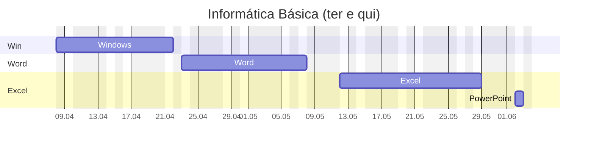

---
{"dg-publish":true,"permalink":"/42-turmas-senac-anteriores/informatica-basica/informatica-basica/","title":"Informática básica","metatags":{"description":"Curso Informática básica"},"tags":["Aulas","Informatica-basica","Senac","curso"],"noteIcon":2,"updated":"2026-04-23T18:29:25.882-03:00","dg-note-properties":{"class":"aula","title":"Informática básica","tags":["Aulas","Informatica-basica","Senac","curso"]}}
---

## Curso Informática básica

> [!info]- Identificação do curso
> 
> |     |     |
> | ---: | --- |
> | Título do Curso:| Informática Básica  
> | Eixo tecnológico:| Informação e Comunicação
> | Segmento:| Tecnologia da Informação  
> | Carga horária:| 66 horas em 17 aulas
> | Período:| 08/04/25 a 10/06/25
> | Horário:| as terças e quintas das 18:30 às 21:30
> | Unidade Curricular:| Operar sistemas operacionais cliente, aplicativos de escritório e periféricos.
> | Link:| [INFORMÁTICA BÁSICA - SOBRAL - MANHÃ - 2025.12.59 - Cursos Senac Ceará](https://cursos.ce.senac.br/produto/informatica-basica-sobral-manha-2025-12-59/)

> [!success]- 🖥️ Habilidades
> 1. Gerencia arquivos conforme recursos do sistema operacional cliente.
> 2. Utiliza ferramentas de pesquisa, agenda e mensagens de acordo com os serviços de internet.
> 3. Elabora e edita textos e apresentações eletrônicas, conforme recursos dos aplicativos de escritório.
> 4. Elabora e edita dados numéricos e gráficos de acordo com os recursos do editor de planilhas eletrônicas.
> 5. Armazena e compartilha dados de acordo com os requisitos da solução.

## Cronograma da Unidade Curricular

>[!done]- Cronograma das aulas (clique aqui)
>
>>[!note]- Aula em 08/04 (clique aqui)
>> - [HISTORIA : A EVOLUÇÃO DOS COMPUTADORES](https://docs.google.com/presentation/d/1MXW5D73CtuZMqP8obVX5tBnPm_1mUksb/edit?slide=id.p1#slide=id.p1)
>> - [HISTORIA : A EVOLUÇÃO DOS COMPUTADORES - YouTube](https://www.youtube.com/watch?v=mFdUqqwzbVs)
>> - [História e Evolução dos Computadores](https://www.todamateria.com.br/historia-e-evolucao-dos-computadores/)
>>>[!todo] 🖥️ Atividades: 
>>> - Acesso e tela de bloqueio;
>>> - Digitação com acentuação na página 53 da [📑Apostila][apostila]
>
>>[!note]- Aula em 10/04 (clique aqui)
>> - [Partes do computador](https://docs.google.com/presentation/d/1Ohfb9t_ZR_qWBVGtOg3tQJ28Y4mGXufM/edit?usp=sharing&ouid=106055613390581376281&rtpof=true&sd=true)
>> - [[30-Recursos/Hardware/Estacao-de-trabalho\|Estação de Trabalho em Tecnologia da Informação]]
>> - [📑Apostila][apostila] página 61 explorando arquivos e pastas no Windows.
>>>[!todo] 🖥️ Atividades: 
>>> - Criar pasta com seu nome para salvar as atividades conforme a página 64 da [📑Apostila][apostila],
>>> - Copiar e mover arquivos para a pasta criada;
>
>>[!note]- Aula em 15/04
>> - Configuração de interface de telas da área de trabalho do Windows, seguindo o roteiro a partir da página 36 da [📑Apostila][apostila]:
>> - Mudar a imagem das telas de bloqueio e desktop do Windows;
>> - Identificar como instalar e modificar temas do Windows;
>> - Conhecendo os acessórios do Windows: bloco de notas, [[30-Recursos/Windows/Calculadora do Windows\|Calculadora do Windows]], Paint e Wordpad, digitação com acentos e atalhos de teclado;
>>>[!todo] 🖥️ Atividade:
>>> - Criando textos e formatando no WordPad;
>>> - Criando desenhos no Paint e Paint 3d conforme pg. 57 da [📑Apostila][apostila];
>
>>[!note]- Aula em 22/04
>>   - Conhecendo os acessórios do Windows: Criando textos e formatando no WordPad;
>>   - interface e manuseio de janelas, área de trabalho,
>>   - recurso de área de transferência,
>>>[!todo] 🖥️ Atividade:
>>> - Selecionando textos, copiando e colando textos e imagens entre aplicativos, conforme pg. 56 da [📑Apostila][apostila];
>
>>[!note]- Aula em 24/04
>>   - Editor de texto [Word](https://support.microsoft.com/pt-br/word): área de trabalho;
>>   - [📑Apostila][apostila] a partir da pg. 73: Processador de Textos Word: Elementos da tela; Manipulação com arquivo de texto; Recursos de seleção de texto; 
>>>[!todo] 🖥️ Atividade:
>>> - Conhecendo a interface do Word: Criando texto sobre o Blu-Ray contendo formatação e parágrafos;
>>> - Conhecendo estilos de texto no Word Criando o texto Iracema;
>
>>[!note]- Aula em 29/04
>>   - [📑Apostila][apostila] a partir da pg. 83: Processador de Textos Word: Manipulação com arquivo de texto e formatação e estilos de fonte e parágrafos; Copiar, recortar e colar texto; Ferramenta Zoom; estilos de texto. 
>>>[!todo] 🖥️ Atividades:
>>> - Conhecendo estilos de texto no Word Criando os textos Iracema, poema Cecília, Responsabilidade Social e Teoria da música;
>
>>[!attention] 01/05: FERIADO: Dia do Trabalho
>
>>[!note]- Aula em 06/05
>>   - [📑Apostila][apostila] a partir da pg. 90: Processador de Textos Word: Formatação e estilos de fonte e parágrafos; criação de bordas, inserindo formas, visualização de impressão, de tópicos e de leitura.
>>>[!todo] 🖥️ Atividades:
>>> - Criando os textos responsabilidade social e correção ortográfica com o texto teoria da música;
>
>>[!note]- Aula em 08/05
>>   - [📑Apostila][apostila] a partir da pg. 94: Processador de Textos Word: Formatação com tabulações, inserindo bordas es sombreamento.
>>>[!todo] 🖥️ Atividades:
>>> - Criando cardápios com tabulação, papel de cartas e certificados;
>
>>[!note]- Aula em 13/05
>>   - [📑Apostila][apostila] a partir da pg. 99: Processador de Textos Word: Bordas, plano de fundo, sombreamento e moldura na página e no texto; Cabeçalho e rodapé; Quebra de página; Localizar e substituir palavras; Numeração de páginas; Listas numeradas e com marcadores.
>>>[!todo] 🖥️ Atividades:
>>> - No Word Criando os certificados e papel de cartas estilizados.
>
>>[!note]- Aula em 15/05
>>   - [📑Apostila][apostila] a partir da pg. 105: Processador de Textos Word: Operações com figuras, símbolos e ilustrações; Inserir e formatar Tabelas; Revisor ortográfico; Configuração de página e de impressão; tabelas e listas, impressão. formatação de textos (fonte e parágrafo), ortografia e gramática, cabeçalho e rodapé, objetos e imagens, tabelas e listas, impressão.
>>>[!todo] 🖥️ Atividades:
>>> - No Word Criando o texto Soneto de Fidelidade, sumários e capas em trabalho. 
>
>>[!note]- Aula em 20/05
>> - Word: Exercícios com formas, imagens, tabelas e listas, configuração da página e da impressão
>>>[!todo] 🖥️ Atividades:
>>   - [📑Apostila][apostila] a partir da pg. 118: Boletim escolar, recibo comercial, textos formatados e cardápio.
>
>>[!note]- Aula em 22/05
>> - [📑Apostila][apostila] a partir da pg. 121, editor de planilhas Excel: 
>>    - Conceito de Planilha eletrônica;
>>    - Principais elementos do espaço de trabalho (Pasta, planilha, célula, barras, menus);
>>    - Navegação; Edição de dados nas células;
>>    - Seleção de célula, intervalo(s), coluna(s), linha(s), toda planilha;
>>
>>>[!todo] 🖥️ Atividades no Excel:
>>> - Criando e formatando a planilha de orçamento doméstico.
>>> - Criando a planilha Feira do mês com cálculos de total.
>
>>[!note]- Aula em 27/05
>> - [📑Apostila][apostila] a partir da pg. 135, Editor de planilhas Excel:
>> - Operações com colunas e linhas;
>> - Operações com planilhas: copiar, selecionar, mover, ocultar, múltiplas seleções;
>>>[!todo] 🖥️ Atividades no Excel:
>>> - Criando e formatando a planilha de cálculos percentuais.
>>> - Criando a planilha de boletim escolar com formatação condicional.
>
>>[!note]- Aula em 03/06
>> - [📑Apostila][apostila] a partir da pg. 140, Editor de planilhas Excel:
>> - Funções básicas no Excel: soma, média, máximo, mínimo;
>> - Configuração de proteção: proteger células específicas, planilhas e arquivos.
>> - Validação de dados: garantir entrada de dados a partir de uma lista determinada.
>> - Configuração de páginas e impressão.
>> - Configurando o cabeçalho e rodapé.
>>>[!todo] 🖥️ Atividades no Excel:
>>> - Criando um formulário para seleção de emprego com células protegidas e validação de dados.
>>> - Adicionando funções à planilha de boletim escolar.
>
>>[!note]- Aula em 05/06
>> - [📑Apostila][apostila] a partir da pg. 155, Editor de planilhas Excel:
>> - Criação e formatação de Gráficos;
>> - Classificação personalizada de dados;
>> - Referência absoluta e relativa.
>>>[!todo] 🖥️ Atividades no Excel:
>>> - Adicionando gráficos à planilha de boletim escolar (pg. 156).
>>> - Criando planilhas com gráficos: PIB Brasil, Pesquisa Eleitoral (pg. 161).
>>> - Classificando a planilha de funcionários por empresa, departamento e cargo (pg. 163).
>>> - Criando uma planilha de tabuada aritmética (pg. 168).
>
>>[!note]- Aula em 10/06
>> - [📑Apostila][apostila] a partir da pg. 169, Editor de planilhas Excel:
>> - Funções condicionais: "se"
>> - Funções de estatística: máximo, mínimo e média.
>>>[!todo] 🖥️ Atividades no Excel:
>>> - Criando planilhas com funções condicionais: cálculo de salário pelo INSS (pg. 170).
>>> - Criando planilhas com cotação de preços com cálculo de preço médio, máximo e mínimo (pg. 172).
>>> - Criando planilha com reajuste percentual usando referência absoluta (pg. 173).
>>> - Criando planilha com cálculo de índice de massa corpórea usando referência absoluta (pg. 174).
>
>>[!note]- Aula em 12/06
>> - [📸Livro da Biblioteca Virtual SENAC do Power Point][powerpoint] cap. 1 a 3:
>> - Conhecendo a interface do Power Point;
>> - Criando slides, adicionando e formatando elementos, como tabelas, formas e gráficos.
>>>[!todo] 🖥️ Atividades no PowerPoint:
>>> - Criando slides sobre um relatório de vendas.
>>> - Criando slides de controle de vídeos com tabelas e gráficos.

> [!important]- 📚Material didático
> 
> - [📑Apostila Informática Básica - Intensivo Windows.pdf - Google Drive][apostila]
> - [❓Central de ajuda da Microsoft](https://support.microsoft.com/pt-br/all-products) | [📶 Treinamento](https://support.microsoft.com/pt-br/training) | [🎓 Learn](https://learn.microsoft.com/pt-br/training/)
> - [➕ Create - Modelos gratuitos para mídia social, documentos e designs](https://create.microsoft.com/pt-br)
>>>[!todo] [Biblioteca Digital SENAC](https://bibliotecadigitalsenac.com.br): 
>>> - [💻 Windows 10](https://bibliotecadigitalsenac.com.br/#/?contentInfo=2795) 
>>> - [📄 Word](https://bibliotecadigitalsenac.com.br/#/?contentInfo=2309) | [📄 atividades Word](https://www.editorasenacsp.com.br/informatica/word2019/atividades.zip)
>>> - [📈 Excel](https://bibliotecadigitalsenac.com.br/#/busca?contentInfo=3130&term=excel) | [📄 atividades Excel](https://www.editorasenacsp.com.br/informatica/excel2019/planilhas.zip)
>>> - [📸Power Point](https://bibliotecadigitalsenac.com.br/?from=busca%3FcontentInfo%3D2304%26term%3Dpowerpoint&page=12&section=0#/legacy/2304) | [📄 atividades PowerPoint](https://www.editorasenacsp.com.br/informatica/powerpoint2019/atividades.zip)

[apostila]: https://drive.google.com/file/d/1HNT1is949xITALuJXT1dwaLCbYexrIGT/view?usp=sharing
[powerpoint]: https://bibliotecadigitalsenac.com.br/#/content/uid/d37df569-17d8-ee11-85fa-00224821b803/detail
