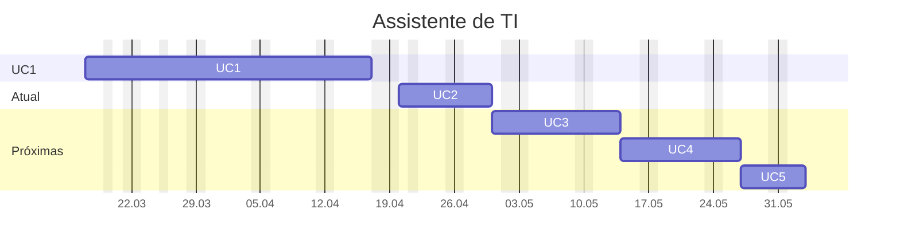

---
{"dg-publish":true,"permalink":"/assistente-de-ti/","title":"Assistente de TI","metatags":{"description":"Curso Assistente de tecnologias da informação"},"tags":["Aulas","Assistente-de-TI","Senac","curso"],"noteIcon":2,"updated":"2025-04-29T10:26:28.832-03:00"}
---

## Curso Assistente de TI

> [!info]- Identificação do curso
> 
>  Título do Curso: Assistente de tecnologias da informação  
> Eixo tecnológico: Informação e Comunicação Segmento: Tecnologia da Informação  
> Carga horária: 200 horas
> Período: 17/03/2025 à 30/05/2025

> [!example]- Unidades Curriculares
> 
> |  📅 Unidades Curriculares                                                               | Carga horária |
> | ----------------------------------------------------------------------------------- | ------------- |
> | UC1: Operar sistemas operacionais cliente, aplicativos de escritório e periféricos. | 72            |
> | UC2: Instalar e configurar componentes de hardware                                  | 36            |
> | UC3: Instalar e configurar sistemas operacionais cliente, softwares e periféricos   | 36            |
> | UC4: Configurar e operar rede local de computadores.                                | 36            |
> | UC 5: Projeto Integrador - Assistente de Tecnologias da Informação                  | 20            |

## UC1 - Operador de computadores

> [!success]- 🖥️ Habilidades
> 1. Gerencia arquivos conforme recursos do sistema operacional cliente.
> 2. Utiliza ferramentas de pesquisa, agenda e mensagens de acordo com os serviços de internet.
> 3. Elabora e edita textos e apresentações eletrônicas, conforme recursos dos aplicativos de escritório.
> 4. Elabora e edita dados numéricos e gráficos de acordo com os recursos do editor de planilhas eletrônicas.
> 5. Armazena e compartilha dados de acordo com os requisitos da solução.

### Cronograma da UC1

>[!done]- Cronograma da Unidade Curricular 1 (clique aqui)
>
>>[!note]- Aula em 17/03
>> - 🎓 [Abertura do curso](https://docs.google.com/presentation/d/12myN-OpLqppVuXahxOGlCTRJcd84ftr_/edit?usp=sharing&ouid=106055613390581376281&rtpof=true&sd=true)
>> - ✨ [Aula 1 - Apresentação](https://drive.google.com/file/d/1-6RPU-erktgeD7HxvyWlQguM4dIXTYuH/view?usp=sharing)
>>>[!todo] 🖥️ Atividade: 
>>> - Criar um relatório sobre:
>>>   - A versão do Sistema Operacional e do Office;
>>>   - A quantidade de memória e armazenamento do Desktop;
>>>   - Enviar por E-mail.
>
>>[!note]- Aula em 18/03
>> - [[Tecnico/Assistente-de-TI/Estacao-de-trabalho\|Estação de Trabalho em Tecnologia da Informação]]
>>>[!todo] 🖥️ Atividade: 
>>> - Digitação com acentuação na página 53 da [📑Apostila][apostila]
>
>>[!attention] 19/03: FERIADO: DIA DE SÃO JOSÉ
>
>>[!note]- Aula em 20/03
>> - [História e Evolução dos Computadores](https://www.todamateria.com.br/historia-e-evolucao-dos-computadores/)
>> - Configuração do Windows:
>>   - acesso e tela de bloqueio;
>>   - organização de ícones no menu Iniciar e área de trabalho;
>>   - organização de arquivos;
>>>[!todo] 🖥️ Atividades:
>>> - Organização de ícones e arquivos no menu Iniciar e na Área de Trabalho, na páginas 29 a 35 da [📑Apostila][apostila]
>>> - Criar arquivos ocultos e [como deixar uma pasta invisível](https://dti.unilab.edu.br/blog/2014/08/13/como-deixar-uma-pasta-invisivel/)
>
>>[!note]- Aula em 21/03
>> - Conhecendo Formulários on-line:
>>   - [Formulários Google: criação de formulários on-line para empresas](https://workspace.google.com/intl/pt-BR/lp/forms/?utm_source=google)
>> - Configuração de interface de telas da área de trabalho do Windows, seguindo o roteiro a partir da página 36 da [📑Apostila][apostila]:
>>>[!todo] 🖥️ Atividades:
>>> - Criar um Formulário on-line de pesquisa de satisfação;
>>> - Mudar a imagem das telas de bloqueio e desktop do Windows;
>>> - Identificar como instalar e modificar temas do Windows;
>
>>[!note]- Aula em 24/03
>>   - interface e manuseio de janelas, área de trabalho,
>>   - opções de energia;
>>   - manipulação de arquivos e pastas,
>>   - recurso de área de transferência,
>>   - painel de controle.
>>>[!todo] 🖥️ Atividade:
>>> - Configurar o desligamento automático para 30 minutos;
>>> - Mudar a imagem de sua conta de usuário do Windows;
>>> - Selecionando textos conforme pg. 56 da [📑Apostila][apostila];
>
>>[!attention] 25/03: FERIADO: Carta Magna
>
>>[!note]- Aula em 26/03
>>   - Conhecendo os acessórios do Windows: bloco de notas, calculadora Paint e Wordpad, digitação com acentos e atalhos de teclado
>>   - acessórios do SO: bloco de notas, [[Tecnico/Assistente-de-TI/Calculadora do Windows\|Calculadora do Windows]], WordPad;
>>>[!todo] 🖥️ Atividade:
>>> - Criando textos e formatando no WordPad;
>>> - Criando desenhos no Paint e Paint 3d conforme pg. 57 da [📑Apostila][apostila];
>
>>[!note]- Aula em 27/03
>>   - Editor de texto [Word](https://support.microsoft.com/pt-br/word): área de trabalho;
>>   - [📑Apostila][apostila] a partir da pg. 73: Processador de Textos Word: Elementos da tela; Manipulação com arquivo de texto; Recursos de seleção de texto; 
>>>[!todo] 🖥️ Atividade:
>>> - Conhecendo a interface do Word: Criando texto sobre o Blu-Ray contendo formatação e parágrafos;
>>> - Conhecendo estilos de texto no Word Criando o texto Iracema;
>
>>[!note]- Aula em 28/03
>>   - [Microsoft Forms](https://forms.office.com/Pages/DesignPageV2.aspx)
>>   - Editor de texto [Word](https://support.microsoft.com/pt-br/word): formatação de textos (fonte e parágrafo), ortografia e gramática.
>>   - [📑Apostila][apostila] a partir da pg. 83: Processador de Textos Word: Manipulação com arquivo de texto e formatação e estilos de fonte e parágrafos; Copiar, recortar e colar texto; Ferramenta Zoom; estilos de texto. 
>>>[!todo] 🖥️ Atividade:
>>> - Criar um Formulário on-line de pesquisa de satisfação;
>>> - Conhecendo estilos de texto no Word Criando os textos Iracema e o poema Cecília;
>
>>[!note]- Aula em 31/03
>>   - [📑Apostila][apostila] a partir da pg. 88: Processador de Textos Word: Manipulação com arquivo de texto e formatação e estilos de fonte e parágrafos; Copiar, recortar e colar texto; Ferramenta Zoom; reverter texto, histórico de desfaz e refaz ações;
>>   - Vídeos: [Resumo do filme: Piratas da Informática](https://www.youtube.com/watch?v=XhKvZPwrlGI) , [reunião de Bill Gates na IBM](https://www.youtube.com/watch?v=Zj3f7vfwBoY) , [Steve Jobs descobre o mouse](https://www.youtube.com/watch?v=0Rvn71r_Oic)
>>>[!todo] 🖥️ Atividade:
>>> - Conhecendo estilos de texto no Word Criando os textos Responsabilidade Social e Teoria da música;
>
>>[!note]- Aula em 01/04
>>   - [📑Apostila][apostila] a partir da pg. 92: Processador de Textos Word:  Correção ortográfica, tabulações,  cabeçalho e rodapé, objetos e imagens.
>>>[!todo] 🖥️ Atividades:
>>> - No Word Criando os textos Teoria da música, Menu com tabulação, Sumário manual.
>
>>[!note]- Aula em 02/04
>>   - [📑Apostila][apostila] a partir da pg. 99: Processador de Textos Word:  bordas de parágrafo e de páginas, designe de documentos.
>>   - Compartilhamento de arquivos no Drive e [Google Sites](https://sites.google.com/view/informaticasenac/assistente-de-ti-2024)
>>>[!todo] 🖥️ Atividades:
>>> - No Word Criando os certificados e papel de carta estilizados.
>>> - Criando um portifólio no [Google Sites](https://sites.google.com/new/).
>
>>[!note]- Aula em 03/04
>>   - [📑Apostila][apostila] a partir da pg. 106: Processador de Textos Word:  cabeçalho e rodapé, símbolos, objetos e imagens.
>>>[!todo] 🖥️ Atividades:
>>> - No Word Criando os textos com símbolos e  organizando imagens no texto "Samba de Noel Rosa".
>
>>[!note]- Aula em 04/04
>>   - [📑Apostila][apostila] a partir da pg. 118: Processador de Textos Word:  atividade avaliativa.
>>>[!todo] 🖥️ Atividades no Word:
>>> - Criando a tabela boletim;
>>> - Criando Infografo;
>>> - Criando o relatório de vendas com tabulação;
>>> - Criando o recibo comercial.
>
>>[!note]- Aula em 07/04
>> - [📑Apostila][apostila] a partir da pg. 121, editor de planilhas Excel: 
>>    - Conceito de Planilha eletrônica;
>>    - Principais elementos do espaço de trabalho (Pasta, planilha, célula, barras, menus);
>>    - Navegação; Edição de dados nas células;
>>    - Seleção de célula, intervalo(s), coluna(s), linha(s), toda planilha;
>>
>>>[!todo] 🖥️ Atividades no Excel:
>>> - Criando e formatando a planilha de orçamento doméstico.
>>> - Criando a planilha Feira do mês com cálculos de total.
>
>>[!note]- Aula em 08/04
>> - [📑Apostila][apostila] a partir da pg. 137, Editor de planilhas Excel:
>>     - Operações com colunas e linhas;
>>>[!todo] 🖥️ Atividades no Excel:
>>> - Criando e formatando a planilha de cálculos percentuais.
>>> - Criando a planilha de boletim escolar com formatação condicional.
>
>>[!note]- Aula em 09/04
>>   - [📑Apostila][apostila] a partir da pg. 141, Editor de planilhas Excel:
>>     - Operações com funções aritméticas: soma, máximo, mínimo, média,`procv`, `proch`;
>>     - Formatação condicional para destacar informações com cores.
>>>[!todo] 🖥️ Atividades no Excel:
>>> - Adicionando funções à planilha de cálculos percentuais.
>>> - Adicionando funções e destacando notas vermelhas à planilha de boletim escolar.
>>> - Pesquisa dinâmica de nomes, notas e resultados no boletim.
>
>>[!note]- Aula em 10/04
>>   - [📑Apostila][apostila] a partir da pg. 143, Editor de planilhas Excel:
>>     - Operações com planilhas: copiar, selecionar, mover, ocultar, múltiplas seleções;
>>     - Configuração de proteção: proteger células específicas, planilhas e arquivos.
>>     - Validação de dados: garantir entrada de dados a partir de uma lista determinada.
>>>[!todo] 🖥️ Atividades no Excel:
>>> - Criando um formulário para seleção de emprego com células protegidas e validação de dados.
>>> - Adicionando funções à planilha de boletim escolar.
>
>>[!note]- Aula em 11/04
>>   - [📑Apostila][apostila] a partir da pg. 155, Editor de planilhas Excel:
>>     - Configuração de páginas e impressão.
>>     - Configurando o cabeçalho e rodapé.
>>     - Criação e formatação de Gráficos;
>>     - Classificação personalizada de dados;
>>     - Referência absoluta e relativa.
>>>[!todo] 🖥️ Atividades no Excel:
>>> - Adicionando gráficos à planilha de boletim escolar (pg. 156).
>>> - Criando planilhas com gráficos: PIB Brasil, Pesquisa Eleitoral (pg. 161).
>>> - Classificando a planilha de funcionários por empresa, departamento e cargo (pg. 163).
>>> - Criando uma planilha de tabuada aritmética (pg. 168).
>
>>[!note]- Aula em 14/04
>>   - [📑Apostila][apostila] a partir da pg. 169, Editor de planilhas Excel:
>>     - Funções condicionais: "se"
>>     - Funções de estatística: máximo, mínimo e média.
>>>[!todo] 🖥️ Atividades no Excel:
>>> - Criando planilhas com funções condicionais: cálculo de salário pelo INSS (pg. 170).
>>> - Criando planilhas com cotação de preços com cálculo de preço médio, máximo e mínimo (pg. 172).
>>> - Criando planilha com reajuste percentual usando referência absoluta (pg. 173).
>>> - Criando planilha com cálculo de índice de massa corpórea usando referência absoluta (pg. 174).
>
>>[!note]- Aula em 15/04
>>   - [📸Livro da Biblioteca Virtual SENAC do Power Point][powerpoint] cap. 1 e 2:
>>     - Conhecendo a interface do Power Point;
>>     - Criando slides, adicionando e formatando elementos, como tabelas, formas e gráficos.
>>>[!todo] 🖥️ Atividades no PowerPoint:
>>> - Criando slides sobre um relatório de vendas.
>>> - Criando slides de controle de vídeos com tabelas e gráficos.
>
>>[!note]- Aula em 16/04
>>   - [📸Livro da Biblioteca Virtual SENAC do Power Point][powerpoint] cap. 3 e 4:
>>     - Criando slides com transições e animações.
>>>[!todo] 🖥️ Atividades no PowerPoint:
>>> - Aplicando efeitos em vários modelos de slides.

[apostila]: https://drive.google.com/file/d/1HNT1is949xITALuJXT1dwaLCbYexrIGT/view?usp=sharing
[powerpoint]: https://bibliotecadigitalsenac.com.br/#/content/uid/d37df569-17d8-ee11-85fa-00224821b803/detail

## UC2 - Instalar e configurar componentes de hardware

> [!success]- 🖥️ Habilidades
> 1. Diferenciar componentes de hardware.
> 2. Manusear equipamentos e ferramentas.
> 3. Operar ferramentas de diagnóstico de hardware.
> 4. Elaborar documentos técnicos.
> 5. Interpretar documentos e manuais técnicos.
> 6. Organizar materiais, ferramentas, instrumentos, documentos e local de trabalho.

### Cronograma da UC2

>[!done] Cronograma da Unidade Curricular 2
>
>>[!note]- Aula em 22/04
>> - [Eletricidade Basica Aula.ppt - Apresentações Google](https://docs.google.com/presentation/d/e/2PACX-1vRQbF_HeUA62xVYROHayMUQwq81dXZdn9RbHwihait41yerHY0-FvtlPygsC28ldg/pub?start=true&loop=false&delayms=3000)
>> - [Eletricidade e proteção.pptx - Apresentações Google](https://docs.google.com/presentation/d/e/2PACX-1vQFiCPOw6kBrVUnlE3EfaoBHl0ys2DxUm9yZqTRPylsZcmDqTYdmM3gBxSrr4GJeQ/pub?start=true&loop=false&delayms=3000)
>> - [Fonte de alimentação.pptx - Apresentações Google](https://docs.google.com/presentation/d/e/2PACX-1vTf_VeIsIGUfBaXbLHUKRx1mCv95CGcWe-739PpXIgxOHJr_KwUtLI6kXaOoVnvsw/pub?start=true&loop=false&delayms=3000)
>> - [[Tecnico/Assistente-de-TI/Cálculos elétricos\|Cálculos elétricos]]
>> - Componentes do Hardware: [Fontes de alimentação ATX: principais características](https://www.infowester.com/fontesatx.php)
>>>[!todo] 🖥️ Atividade: 
>>> - Criar uma planilha de orçamento de fontes de computadores usando [PSU Calculator da Cooler Master](https://www.coolermaster.com/pt-br/power-supply-calculator/).
>>> - Modelo de [Quadro de carga.xlsx - Planilhas Google](https://docs.google.com/spreadsheets/d/1Fs64Smsy17290OcUo5058E8NQORIPps0/edit?usp=sharing&ouid=106055613390581376281&rtpof=true&sd=true)
>
>>[!note]- Aula em 23/04
>> - [Equipamentos de proteção elétrica.pptx - Apresentações Google](https://docs.google.com/presentation/d/e/2PACX-1vT-plmkdESOqUamkDtCt8T-DMxoIwGYqH4n1OO6MrR8r-eBzs48fB34ODm1MgFKuw/pub?start=true&loop=false&delayms=3000)
>> - [Equipamentos de proteção elétrica](https://jocile.github.io/aulas/posts/equipamentos-de-protecao-eletrica/)
>> - Introdução ao funcionamento da rede elétrica: [Conceitos de Eletricidade](https://jocile.github.io/aulas/posts/conceitos-de-eletricidade/)
>>>[!todo] 🖥️ Atividade: 
>>> - Criar uma planilha de orçamento de equipamentos de proteção elétrica para um laboratório de informática com 10 computadores.
>>> - Modelo de [Quadro de carga.xlsx - Planilhas Google](https://docs.google.com/spreadsheets/d/1Fs64Smsy17290OcUo5058E8NQORIPps0/edit?usp=sharing&ouid=106055613390581376281&rtpof=true&sd=true)
>
>>[!note]- Aula em 24/04
>> - [Partes do Computador.ppt - Apresentações Google](https://docs.google.com/presentation/d/e/2PACX-1vScIJZntmXRw-YLkSd6oQ45r2avd_Vp9mt44B3YDZ_58rSzgs_wJHTVerjmdEVuUg/pub?start=true&loop=false&delayms=3000)
>> - [Apresentação sobre gabinetes e conexões](https://docs.google.com/presentation/d/e/2PACX-1vTsgRf0APpdSQcmGqju49KaVhLoVFxjhYNUWWvYUu-dI0r96NkSn2GyLEaPrzsLXA/pub?start=true&loop=false&delayms=3000)
>> - Componentes do Hardware de uma [[Tecnico/Assistente-de-TI/Estacao-de-trabalho\|Estacao-de-trabalho]]: placa-mãe, processador, memória RAM, cooler, fonte de alimentação, gabinetes e placas de expansão.
>>>[!todo] 🖥️ Atividade: 
>>> - Criar uma planilha de inventário de peças de um computador.
>>> - [Calculadora de Autonomia Nobreaks Intelbras](https://calculadora-nobreaks.intelbras.com.br/)
>>> - [Modelo de lista peças do computador](https://docs.google.com/spreadsheets/d/1Fs64Smsy17290OcUo5058E8NQORIPps0/edit?usp=sharing&ouid=106055613390581376281&rtpof=true&sd=true)
>
>>[!note]- Aula em 25/04
>> - Componentes do Hardware: [Processadores.pptx - Apresentações Google](https://docs.google.com/presentation/d/e/2PACX-1vRx8cvvDeinPIWpHX22yGBxuhvSEDix4lth4Ru9U9dJZVVPUI7VRIGdFLwttrzhKw/pub?start=true&loop=false&delayms=3000)
>> - [Memória.pptx - Apresentações Google](https://docs.google.com/presentation/d/e/2PACX-1vSPuWVYJSM7wXvxL9d2MRZht-k3Iz2UUrBqIG2_4KBqzTfnptAs3Tky7-OggDYwfA/pub?start=true&loop=false&delayms=3000)
>> - [Placa-mãe.pptx - Apresentações Google](https://docs.google.com/presentation/d/e/2PACX-1vTWKEtYI6PLBfg-Ey4NJpspgUqX4SHbcLOUVeKZfFDo9-oXtsXzMN-PX0i4qOJWyw/pub?start=true&loop=false&delayms=3000)
>> - [Instalação de Hardware.pdf](https://drive.google.com/file/d/1eHpXpqeI8s4uvExVrM9IHNdlLYtHag8z/view?usp=sharing)
>>>[!todo] 🖥️ Atividade:
>>> - [Modelo de lista peças do computador](https://docs.google.com/spreadsheets/d/1Fs64Smsy17290OcUo5058E8NQORIPps0/edit?usp=sharing&ouid=106055613390581376281&rtpof=true&sd=true)
>>> - [Questionário sobre as peças do computador](https://forms.gle/nYuKC46Jr59SfELD6)
>>> - [PRALET de Instalação de Hardware.docx](https://docs.google.com/document/d/e/2PACX-1vRsI5aKkqN3PlhJkaR9AOAS54HreKqYXWBtrIjnxjFV2NGC4-V0-lj2rengIdsIbg/pub)
>
>>[!note]- Aula em 28/04
>> - Componentes do Hardware: [[Tecnico/Assistente-de-TI/Simulador-de-montagem\|Simulador-de-montagem]]
>>>[!todo] 🖥️ Atividade:
>>> - Realizar a montagem de um computador usando simuladores.
>>> - Criar um relatório no Word descrevendo a configuração das peças utilizadas.
>
>>[!note]- Aula em 29/04
>> - Problemas do Hardware: [[Tecnico/Assistente-de-TI/Resolucao-de-problemas\|Resolucao-de-problemas]]
>> - [Problemas no pc.pptx - Apresentações Google](https://docs.google.com/presentation/d/e/2PACX-1vTLFM-wvV_MYSuyQDNaZFaHAr-Nl58wzKxQSm5wv04rE_9mvCdI8eyWLr-SAN88wA/pub?start=true&loop=false&delayms=3000)
>> - [Diagnosticando Defeitos.pptx - Apresentações Google](https://docs.google.com/presentation/d/e/2PACX-1vQHGR3mqvjiU3pQ95GaFxNCkKtw-FF7cQ-mxaL3UI4uuZGl-mSY7QFTpVccK5Latg/pub?start=true&loop=false&delayms=3000)
>>>[!todo] 🖥️ Atividade:
>>> - Realizar a solução de problemas de um computador usando: [Intel - Simulador de Defeitos](https://archive.org/details/intel_simuladordefeitos)
>>> - Criar um relatório no Word descrevendo os problema resolvidos.
>
>>[!note] Aula em 30/04
>> - Prática de desmontagem e montagem de computadores.

> [!important]- 📚Material didático
> 
> - [📑Apostila Informática Básica - Intensivo Windows.pdf - Google Drive][apostila]
> - [❓Central de ajuda da Microsoft](https://support.microsoft.com/pt-br/all-products) | [📶 Treinamento](https://support.microsoft.com/pt-br/training) | [🎓 Learn](https://learn.microsoft.com/pt-br/training/)
> - [➕ Create - Modelos gratuitos para mídia social, documentos e designs](https://create.microsoft.com/pt-br)
> - [🌐Conectividade de redes - Biblioteca digital](https://bibliotecadigitalsenac.com.br/?from=busca%3FcontentInfo%3D2932%26term%3Dredes#/legacy/epub/2932)
> - [📶INFRAESTRUTURA DE REDES | Jocile](https://jocile.github.io/aulas/categories/infraestrutura-de-redes/)
>>>[!todo] [Biblioteca Digital SENAC](https://bibliotecadigitalsenac.com.br): 
>>> - [💻 Windows 10](https://bibliotecadigitalsenac.com.br/#/content/uid/0d8d48a0-17d8-ee11-85fa-00224821b803/detail) 
>>> - [📄 Word](https://bibliotecadigitalsenac.com.br/#/content/uid/168d48a0-17d8-ee11-85fa-00224821b803/detail) | [📄 atividades Word](https://www.editorasenacsp.com.br/informatica/word2019/atividades.zip)
>>> - [📈 Excel](https://bibliotecadigitalsenac.com.br/#/content/uid/144fc6f8-16d8-ee11-85fa-00224821b803/detail) | [📄 atividades Excel](https://www.editorasenacsp.com.br/informatica/excel2019/planilhas.zip)
>>> - [📸Power Point][powerpoint] | [📄 atividades PowerPoint](https://www.editorasenacsp.com.br/informatica/powerpoint2019/atividades.zip)

## Oportunidades

<a class="markdown-embed-link" href="/vagas/#vagas-em-ti-na-cidade-de-sobral-ce" aria-label="Open link"><svg xmlns="http://www.w3.org/2000/svg" width="24" height="24" viewBox="0 0 24 24" fill="none" stroke="currentColor" stroke-width="2" stroke-linecap="round" stroke-linejoin="round" class="svg-icon lucide-link"><path d="M10 13a5 5 0 0 0 7.54.54l3-3a5 5 0 0 0-7.07-7.07l-1.72 1.71"></path><path d="M14 11a5 5 0 0 0-7.54-.54l-3 3a5 5 0 0 0 7.07 7.07l1.71-1.71"></path></svg></a>

## Vagas em TI na cidade de Sobral - CE

 
 [Editais](https://www.stacasa.com.br/index.php/trabalheconosco/editais-e-seleoes)

[Trabalhe Conosco](https://www.execute.com.br/content/5-trabalhe-conosco)

[PluralMed - @grupopluralmed](https://www.instagram.com/grupopluralmed/)

[PluralMed](https://www.pluralmed.com.br/src/pages/selecoes/selecoes.html)

[apostila]: https://drive.google.com/file/d/1HNT1is949xITALuJXT1dwaLCbYexrIGT/view?usp=sharing
[powerpoint]: https://bibliotecadigitalsenac.com.br/#/content/uid/d37df569-17d8-ee11-85fa-00224821b803/detail
