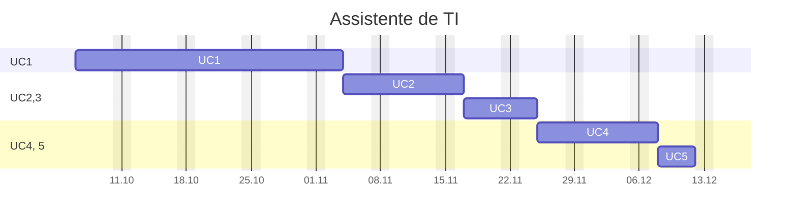

---
{"dg-publish":true,"permalink":"/assistente-de-ti/","title":"Assistente de TI","metatags":{"description":"Curso Assistente de tecnologias da informação"},"tags":["Aulas","Assistente-de-TI","Senac","curso"],"noteIcon":"default","updated":"2025-10-06T10:58:48.679-03:00"}
---

## Curso Assistente de TI

> [!info]- Identificação do curso
> 
>  Título do Curso: Assistente de tecnologias da informação  
> Eixo tecnológico: Informação e Comunicação Segmento: Tecnologia da Informação  
> Carga horária: 200 horas
> Período: 06/10/2025 à 18/12/2025

> [!example]- Unidades Curriculares
> 
> |  📅 Unidades Curriculares                                                               | Carga horária |
> | ----------------------------------------------------------------------------------- | ------------- |
> | UC1: Operar sistemas operacionais cliente, aplicativos de escritório e periféricos. | 72            |
> | UC2: Instalar e configurar componentes de hardware                                  | 36            |
> | UC3: Instalar e configurar sistemas operacionais cliente, softwares e periféricos   | 36            |
> | UC4: Configurar e operar rede local de computadores.                                | 36            |
> | UC 5: Projeto Integrador - Assistente de Tecnologias da Informação                  | 20            |

## UC1 - Operador de computadores

> [!success]- 🖥️ Habilidades
> 1. Gerencia arquivos conforme recursos do sistema operacional cliente.
> 2. Utiliza ferramentas de pesquisa, agenda e mensagens de acordo com os serviços de internet.
> 3. Elabora e edita textos e apresentações eletrônicas, conforme recursos dos aplicativos de escritório.
> 4. Elabora e edita dados numéricos e gráficos de acordo com os recursos do editor de planilhas eletrônicas.
> 5. Armazena e compartilha dados de acordo com os requisitos da solução.

### Cronograma da UC1

>[!done] Cronograma da Unidade Curricular 1 (clique aqui)
>
>>[!note] Aula em 06/10
>> - 🎓 [Abertura do curso](https://docs.google.com/presentation/d/12myN-OpLqppVuXahxOGlCTRJcd84ftr_/edit?usp=sharing&ouid=106055613390581376281&rtpof=true&sd=true)
>> - ✨ [Aula 1 - Apresentação](https://drive.google.com/file/d/1-6RPU-erktgeD7HxvyWlQguM4dIXTYuH/view?usp=sharing)
>>>[!todo] 🖥️ Atividade: 
>>> - Criar um relatório sobre:
>>>   - A versão do Sistema Operacional e do Office;
>>>   - A quantidade de memória e armazenamento do Desktop;
>>>   - Enviar por E-mail.
>
>>[!note]- Aula em 07/10
>> - [[Tecnico/Assistente-de-TI/Estacao-de-trabalho\|Estação de Trabalho em Tecnologia da Informação]]
>>>[!todo] 🖥️ Atividade: 
>>> - Digitação com acentuação na página 53 da [📑Apostila][apostila]
>

[apostila]: https://drive.google.com/file/d/1HNT1is949xITALuJXT1dwaLCbYexrIGT/view?usp=sharing
[powerpoint]: https://bibliotecadigitalsenac.com.br/#/content/uid/d37df569-17d8-ee11-85fa-00224821b803/detail

> [!important]- 📚Material didático
> 
> - [📑Apostila Informática Básica - Intensivo Windows.pdf - Google Drive][apostila]
> - [❓Central de ajuda da Microsoft](https://support.microsoft.com/pt-br/all-products) | [📶 Treinamento](https://support.microsoft.com/pt-br/training) | [🎓 Learn](https://learn.microsoft.com/pt-br/training/)
> - [➕ Create - Modelos gratuitos para mídia social, documentos e designs](https://create.microsoft.com/pt-br)
> - [🌐Conectividade de redes - Biblioteca digital](https://bibliotecadigitalsenac.com.br/?from=busca%3FcontentInfo%3D2932%26term%3Dredes#/legacy/epub/2932)
> - [📶INFRAESTRUTURA DE REDES | Jocile](https://jocile.github.io/aulas/categories/infraestrutura-de-redes/)
>>>[!todo] [Biblioteca Digital SENAC](https://bibliotecadigitalsenac.com.br): 
>>> - [💻 Windows 10](https://bibliotecadigitalsenac.com.br/#/content/uid/0d8d48a0-17d8-ee11-85fa-00224821b803/detail) 
>>> - [📄 Word](https://bibliotecadigitalsenac.com.br/#/content/uid/168d48a0-17d8-ee11-85fa-00224821b803/detail) | [📄 atividades Word](https://www.editorasenacsp.com.br/informatica/word2019/atividades.zip)
>>> - [📈 Excel](https://bibliotecadigitalsenac.com.br/#/content/uid/144fc6f8-16d8-ee11-85fa-00224821b803/detail) | [📄 atividades Excel](https://www.editorasenacsp.com.br/informatica/excel2019/planilhas.zip)
>>> - [📸Power Point][powerpoint] | [📄 atividades PowerPoint](https://www.editorasenacsp.com.br/informatica/powerpoint2019/atividades.zip)

[apostila]: https://drive.google.com/file/d/1HNT1is949xITALuJXT1dwaLCbYexrIGT/view?usp=sharing
[powerpoint]: https://bibliotecadigitalsenac.com.br/#/content/uid/d37df569-17d8-ee11-85fa-00224821b803/detail
