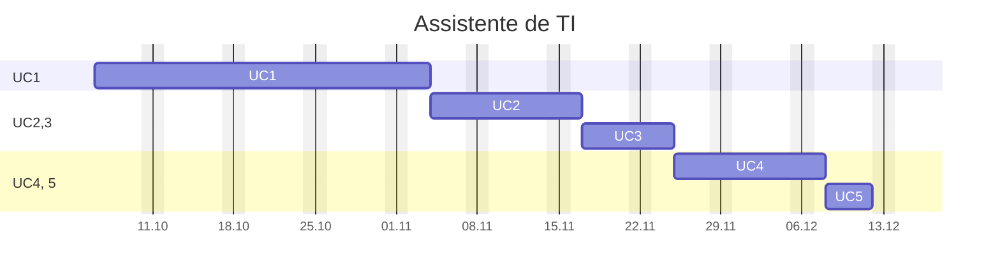

---
{"dg-publish":true,"permalink":"/assistente-de-ti/","title":"Assistente de TI","metatags":{"description":"Curso Assistente de tecnologias da informação"},"tags":["Aulas","Assistente-de-TI","Senac","curso"],"noteIcon":"default","updated":"2025-10-06T10:58:48.679-03:00"}
---

## Curso Assistente de TI

> [!info]- Identificação do curso
> 
>  Título do Curso: Assistente de tecnologias da informação  
> Eixo tecnológico: Informação e Comunicação Segmento: Tecnologia da Informação  
> Carga horária: 200 horas
> Período: 06/10/2025 à 18/12/2025

> [!example]- Unidades Curriculares
> 
> |  📅 Unidades Curriculares                                                               | Carga horária |
> | ----------------------------------------------------------------------------------- | ------------- |
> | UC1: Operar sistemas operacionais cliente, aplicativos de escritório e periféricos. | 72            |
> | UC2: Instalar e configurar componentes de hardware                                  | 36            |
> | UC3: Instalar e configurar sistemas operacionais cliente, softwares e periféricos   | 36            |
> | UC4: Configurar e operar rede local de computadores.                                | 36            |
> | UC 5: Projeto Integrador - Assistente de Tecnologias da Informação                  | 20            |

## UC1 - Operador de computadores

> [!success]- 🖥️ Habilidades
> 1. Gerencia arquivos conforme recursos do sistema operacional cliente.
> 2. Utiliza ferramentas de pesquisa, agenda e mensagens de acordo com os serviços de internet.
> 3. Elabora e edita textos e apresentações eletrônicas, conforme recursos dos aplicativos de escritório.
> 4. Elabora e edita dados numéricos e gráficos de acordo com os recursos do editor de planilhas eletrônicas.
> 5. Armazena e compartilha dados de acordo com os requisitos da solução.

### Cronograma da UC1

>[!done] Cronograma da Unidade Curricular 1
>
>>[!note]- Aula 1.1 - introdução ao Windows
>>  - [x] Aula 1.1 - 2025.10.06 - Windows -  Introdução
>> - 🎓 [Abertura do curso](https://docs.google.com/presentation/d/12myN-OpLqppVuXahxOGlCTRJcd84ftr_/edit?usp=sharing&ouid=106055613390581376281&rtpof=true&sd=true)
>> - ✨ [Aula 1 - Apresentação](https://drive.google.com/file/d/1-6RPU-erktgeD7HxvyWlQguM4dIXTYuH/view?usp=sharing)
>>>[!todo] 🖥️ Atividade: 
>>> - Criar um relatório sobre:
>>>  - A versão do Sistema Operacional e do Office;
>>> - Digitação com acentuação na página 53 da [📑Apostila][apostila]
>
>>[!note]- Aula 1.2 - conhecendo a área de trabalho
>>  - [x] Aula 1.2 - 2025.10.07 - Windows - Conhecendo a área de trabalho
>> - [História e Evolução dos Computadores](https://www.todamateria.com.br/historia-e-evolucao-dos-computadores/)
>>>[!todo] 🖥️ Atividade: 
>>>  - A quantidade de memória e armazenamento do Desktop;
>>> - Organização de ícones e arquivos na Área de Trabalho, na páginas 29 a 35 da [📑Apostila][apostila]
>>> - Criando desenhos no Paint e Paint 3d conforme pg. 57 da [📑Apostila][apostila];
>
>>[!note]- Aula 1.3 - configurando as telas do Windows
>>  - [x] Aula 1.3 - 2025.10.08 - Windows - Configuração das telas
>> - [[Tecnico/Assistente-de-TI/Estacao-de-trabalho\|Estação de Trabalho em Tecnologia da Informação]]
>> - [Personalizar a IU do dispositivo Windows](https://learn.microsoft.com/pt-br/windows-hardware/customize/)
>>  - acesso e tela de bloqueio;
>>  - organização de arquivos;
>>   - opções de energia;
>>>[!todo] 🖥️ Atividades:
>>> - Organização de arquivos e pastas, na páginas 29 a 35 da [📑Apostila][apostila]
>>> - Configurar o desligamento automático para 30 minutos;
>>> - Mudar a imagem das telas de bloqueio e desktop do Windows;
>>> - Identificar como instalar e modificar temas do Windows;
>>> - Criar arquivos ocultos e [como deixar uma pasta invisível](https://dti.unilab.edu.br/blog/2014/08/13/como-deixar-uma-pasta-invisivel/)
>
>>[!note]- Aula 1.4 - organizando arquivos e pastas, ferramentas do Sistema
>>  - [x] Aula 1.4 - 2025.10.09 - Windows - ferramentas, arquivos e pastas
>>   - [[Tecnico/Assistente-de-TI/Guia do Windows\|Guia do Windows]]
>>   - [[Tecnico/Assistente-de-TI/5 segredos do Windows\|5 segredos do Windows]]
>>   - Configurando o menu Iniciar, organizando atalhos em pastas;
>>   - interface e manuseio de janelas, área de trabalho,
>>   - manipulação de arquivos e pastas,
>>   - recurso de área de transferência, seleção, copiar, recortar e colar;
>>   - painel de controle.
>>>[!todo] 🖥️ Atividade:
>>> - Mudar a imagem de sua conta de usuário do Windows;
>>> - Selecionando textos conforme pg. 56 da [📑Apostila][apostila];
>
>>[!note]- Aula 1.5 - programas acessórios do Windows
>>  - [x] Aula 1.5 - 2025.10.10 - Windows - programas acessórios
>>   - Conhecendo os acessórios do Windows: bloco de notas, calculadora Paint e Wordpad, digitação com acentos e atalhos de teclado
>>   - acessórios do SO: bloco de notas, [[Tecnico/Assistente-de-TI/Calculadora do Windows\|Calculadora do Windows]], WordPad;
>>   - [Explorar as ferramentas de suporte e diagnóstico](https://learn.microsoft.com/pt-br/training/modules/explore-support-diagnostic-tools/?source=recommendations)
>>   - [Sysinternals - Sysinternals \| Microsoft Learn](https://learn.microsoft.com/pt-br/sysinternals/)
>>>[!todo] 🖥️ Atividade:
>>> - Criando textos e formatando no WordPad;
>>> - Criando desenhos no Paint e Paint 3d conforme pg. 57 da [📑Apostila][apostila];
>
>>[!note]- Aula 1.6 - Word - elementos, formatação e parágrafos
>>  - [x] Aula 1.6 - 2025.10.13 - Editor de texto [Word](https://support.microsoft.com/pt-br/word): área de trabalho;
>>   - [📑Apostila][apostila] a partir da pg. 73: Processador de Textos Word: Elementos da tela; Manipulação com arquivo de texto; Recursos de seleção de texto; 
>>>[!todo] 🖥️ Atividade:
>>> - Conhecendo a interface do Word: Criando texto sobre o Blu-Ray contendo formatação e parágrafos;
>>> - Conhecendo estilos de texto no Word Criando os textos Iracema e o poema Cecília;
>
>>[!note]- Aula 1.7 - Word - formatação de textos (fonte e parágrafo), ortografia e gramática.
>>  - [x] Aula 1.7 - 2025.10.14 - Editor de texto [Word](https://support.microsoft.com/pt-br/word): área de trabalho;
>>   - Editor de texto [Word](https://support.microsoft.com/pt-br/word): formatação de textos (fonte e parágrafo), 
>>   - [📑Apostila][apostila] a partir da pg. 83: Processador de Textos Word: Manipulação com arquivo de texto e formatação e estilos de fonte e parágrafos; Copiar, recortar e colar texto; estilos de texto, reverter texto, histórico de desfaz e refaz ações;
>>>[!todo] 🖥️ Atividade:
>>> - Criando um portifólio no [Google Sites](https://sites.google.com/new/).
>>   - Compartilhamento de arquivos no [Drive](https://drive.google.com/) e [Google Sites](https://sites.google.com/view/informaticasenac/assistente-de-ti-2024)
>>> - Conhecendo estilos de texto no Word Criando os textos Responsabilidade Social e Teoria da música;
>
>>[!note]- Aula 1.8 - Word - ortografia e gramática, correção, tabulação, cabeçalho
>>  - [x] Aula 1.8 - 2025.10.15- [📑Apostila][apostila] a partir da pg. 88: Processador de Textos Word: ortografia e gramática, layout de visualização
>>>[!todo] 🖥️ Atividade:
>>> - No Word Criando os textos Teoria da música, Menu com tabulação, Sumário manual.
>>> - No Word Criando o texto Soneto de Fidelidade, sumários e capas em trabalho.
>
>>[!note]- Aula 1.9 - Word - elementos, marcadores, símbolos e ilustrações, design de bordas e imagens
>>  - [x] Aula 1.9 - 2025.10.16 - Word - [📑Apostila][apostila] a partir da pg. 97: Processador de Textos Word: cabeçalho e rodapé, objetos e imagens, bordas de parágrafo e de páginas, design de documentos.
>>>[!todo] 🖥️ Atividades:
>>>  - [📑Apostila][apostila] a partir da pg. 118: Boletim escolar, recibo comercial, textos formatados e cardápio.
>>> - No Word Criando os certificados e papel de carta estilizados.
>>> - No Word Criando os textos com símbolos e  organizando imagens no texto "Samba de Noel Rosa".
>>> - Criando Infografo;
>
>>[!note]- Aula 1.10 - [📑Apostila][apostila] Processador de Textos Word:  inserindo símbolos, figuras, tabelas e objetos.
>> - [x]  Aula 1.10 - 2025.10.17 - Word - elementos da página, cabeçalho e rodapé, tabelas e listas.
>>   - [📑Apostila][apostila] a partir da pg. 105: Processador de Textos Word: Operações com figuras, símbolos e ilustrações; Inserir e formatar Tabelas; Revisor ortográfico; Configuração de página e de impressão; tabelas e listas, impressão. formatação de textos (fonte e parágrafo), ortografia e gramática, cabeçalho e rodapé, objetos e imagens, tabelas e listas, impressão.
>>   - [Atualizações do Windows 11 25H2](https://www.youtube.com/watch?v=QCHn_1WDSX0)
>>>[!todo] 🖥️ Atividades:
>>> - Criando a tabela boletim;
>>> - Criando o relatório de vendas com tabulação;
>>> - Criando o recibo comercial.
>
>>[!note]- Aula 1.11 - Introdução a planilhas com o Excel
>> - [x]  Aula 1.11 - 2025.10.20 - [📑Apostila][apostila] a partir da pg. 121, editor de planilhas Excel: 
>>    - Conceito de Planilha eletrônica;
>>    - Principais elementos do espaço de trabalho (Pasta, planilha, célula, barras, menus);
>>    - Navegação; Edição de dados nas células;
>>    - Seleção de célula, intervalo(s), coluna(s), linha(s), toda planilha;
>>
>>>[!todo] 🖥️ Atividades no Excel:
>>> - Criando e formatando a planilha de orçamento doméstico.
>>> - Criando a planilha Feira do mês com cálculos de total.
>
>>[!note]- Aula 1.12 - Operações aritméticas com Excel:
>> - [x]  Aula 1.12 - 2025.10.21 - [📑Apostila][apostila] a partir da pg. 137, Editor de planilhas Excel:
>> - Operações com colunas e linhas;
>> - Operações com planilhas: copiar, selecionar, mover, ocultar, múltiplas seleções;
>>>[!todo] 🖥️ Atividades no Excel:
>>> - Criando e formatando a planilha de cálculos percentuais.
>>> - Adicionando funções à planilha de cálculos percentuais.
>
>>[!note]- Aula 1,13 - Funções com Excel:
>> - [x]  Aula 1.13 - 2025.10.22 - [📑Apostila][apostila] a partir da pg. 141, Editor de planilhas Excel:
>> - Operações com funções aritméticas: soma, máximo, mínimo, média,`procv`, `proch`;
>> - Formatação condicional para destacar informações com cores.
>>>[!todo] 🖥️ Atividades no Excel:
>>> - Criando a planilha de boletim escolar com formatação condicional, adicionando funções e destacando notas vermelha.
>>> - Adicionando funções de cálculos de média e resultados com condicionais à planilha de boletim escolar pg. 169.
>>> - Pesquisa dinâmica de nomes, notas e resultados no boletim.
>
>>[!note]- Aula 1.14 - Segurança e proteção em planilhas no Excel:
>> - [x]  Aula 1.14 - 2025.10.23  - [📑Apostila][apostila] a partir da pg. 143, Editor de planilhas Excel:
>> - Configuração de proteção: proteger células específicas, planilhas e arquivos.
>> - [Matrícula de cursos Online - DIO](https://dio.me/sign-up?ref=XXNHOX4TYB) - [Curso Santander Excel com inteligencia artificial 2º semestre](https://web.dio.me/track/santander-excel-com-inteligencia-artificial-2-semestre)
>> - Validação de dados: garantir entrada de dados a partir de uma lista determinada.
>>>[!todo] 🖥️ Atividades no Excel:
>>> - Criando um formulário para seleção de emprego com células protegidas e validação de dados.
>
>>[!note]- Aula 1.15 - Gráficos em planilhas do Excel:
>> - [x]  Aula 1.15 - 2025.10.24 - [📑Apostila][apostila] a partir da pg. 155, Editor de planilhas Excel:
>> - Configuração de páginas e impressão.
>> - Configurando o cabeçalho e rodapé.
>> - Criação e formatação de Gráficos;
>> - Classificação personalizada de dados;
>> - Referência absoluta e relativa.
>>>[!todo] 🖥️ Atividades no Excel:
>>> - Adicionando gráficos à planilha de boletim escolar (pg. 156).
>>> - Criando planilhas com gráficos: PIB Brasil, Pesquisa Eleitoral (pg. 161).
>>> - Classificando a planilha de funcionários por empresa, departamento e cargo (pg. 163).
>>> - Criando uma planilha de tabuada aritmética (pg. 168).
>
>>[!note] Aula 1.16 - Excel: Automações com macros e tabela dinâmica
>> - [x]  Aula 1.16 - 2025.10.27 - [📑Apostila][apostila] a partir da pg. 169, Editor de planilhas Excel:
>> - Automações com macros
>> - Segmentação de dados e tabelas dinâmicas.
>>>[!todo] 🖥️ Atividades no Excel:
>>> - Criando planilhas com funções condicionais: cálculo de salário pelo INSS (pg. 170).
>>> - Criando planilhas com cotação de preços com cálculo de preço médio, máximo e mínimo (pg. 172).
>>> - Criando planilha com reajuste percentual usando referência absoluta (pg. 173).
>>> - Criando planilha com cálculo de índice de massa corpórea usando referência absoluta (pg. 174).

[apostila]: https://drive.google.com/file/d/1HNT1is949xITALuJXT1dwaLCbYexrIGT/view?usp=sharing
[powerpoint]: https://bibliotecadigitalsenac.com.br/#/content/uid/d37df569-17d8-ee11-85fa-00224821b803/detail

> [!important]- 📚Material didático
> 
> - [📑Apostila Informática Básica - Intensivo Windows.pdf - Google Drive][apostila]
> - [❓Central de ajuda da Microsoft](https://support.microsoft.com/pt-br/all-products) | [📶 Treinamento](https://support.microsoft.com/pt-br/training) | [🎓 Learn](https://learn.microsoft.com/pt-br/training/)
> - [➕ Create - Modelos gratuitos para mídia social, documentos e designs](https://create.microsoft.com/pt-br)
> - [🌐Conectividade de redes - Biblioteca digital](https://bibliotecadigitalsenac.com.br/?from=busca%3FcontentInfo%3D2932%26term%3Dredes#/legacy/epub/2932)
> - [📶INFRAESTRUTURA DE REDES | Jocile](https://jocile.github.io/aulas/categories/infraestrutura-de-redes/)
>>>[!todo] [Biblioteca Digital SENAC](https://bibliotecadigitalsenac.com.br): 
>>> - [💻 Windows 10](https://bibliotecadigitalsenac.com.br/#/content/uid/0d8d48a0-17d8-ee11-85fa-00224821b803/detail) 
>>> - [📄 Word](https://bibliotecadigitalsenac.com.br/#/content/uid/168d48a0-17d8-ee11-85fa-00224821b803/detail) | [📄 atividades Word](https://www.editorasenacsp.com.br/informatica/word2019/atividades.zip)
>>> - [📈 Excel](https://bibliotecadigitalsenac.com.br/#/content/uid/144fc6f8-16d8-ee11-85fa-00224821b803/detail) | [📄 atividades Excel](https://www.editorasenacsp.com.br/informatica/excel2019/planilhas.zip)
>>> - [📸Power Point][powerpoint] | [📄 atividades PowerPoint](https://www.editorasenacsp.com.br/informatica/powerpoint2019/atividades.zip)

[apostila]: https://drive.google.com/file/d/1HNT1is949xITALuJXT1dwaLCbYexrIGT/view?usp=sharing
[powerpoint]: https://bibliotecadigitalsenac.com.br/#/content/uid/d37df569-17d8-ee11-85fa-00224821b803/detail
