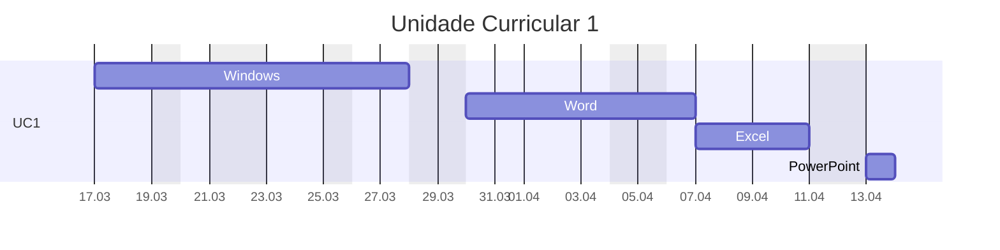

---
{"dg-publish":true,"permalink":"/assistente-de-ti/","title":"Assistente de TI","metatags":{"description":"Curso Assistente de tecnologias da informação"},"tags":["Aulas","Assistente-de-TI","Senac","curso"],"updated":"2025-04-08T10:00:41.288-03:00"}
---

## Curso Assistente de TI

> [!info]- Identificação do curso
> 
>  Título do Curso: Assistente de tecnologias da informação  
> Eixo tecnológico: Informação e Comunicação Segmento: Tecnologia da Informação  
> Carga horária: 200 horas
> Período: 17/03/2025 à 30/05/2025

> [!example]- Unidades Curriculares
> 
> |  📅 Unidades Curriculares                                                               | Carga horária |
> | ----------------------------------------------------------------------------------- | ------------- |
> | UC1: Operar sistemas operacionais cliente, aplicativos de escritório e periféricos. | 72            |
> | UC2: Instalar e configurar componentes de hardware                                  | 36            |
> | UC3: Instalar e configurar sistemas operacionais cliente, softwares e periféricos   | 36            |
> | UC4: Configurar e operar rede local de computadores.                                | 36            |
> | UC 5: Projeto Integrador - Assistente de Tecnologias da Informação                  | 20            |

## UC1 - Operador de computadores

> [!success]- 🖥️ Habilidades
> 1. Gerencia arquivos conforme recursos do sistema operacional cliente.
> 2. Utiliza ferramentas de pesquisa, agenda e mensagens de acordo com os serviços de internet.
> 3. Elabora e edita textos e apresentações eletrônicas, conforme recursos dos aplicativos de escritório.
> 4. Elabora e edita dados numéricos e gráficos de acordo com os recursos do editor de planilhas eletrônicas.
> 5. Armazena e compartilha dados de acordo com os requisitos da solução.

## Cronograma

>[!done] Cronograma da Unidade Curricular 1 - Operador
>
>>[!note]- Aula em 17/03
>> - 🎓 [Abertura do curso](https://docs.google.com/presentation/d/12myN-OpLqppVuXahxOGlCTRJcd84ftr_/edit?usp=sharing&ouid=106055613390581376281&rtpof=true&sd=true)
>> - ✨ [Aula 1 - Apresentação](https://drive.google.com/file/d/1-6RPU-erktgeD7HxvyWlQguM4dIXTYuH/view?usp=sharing)
>>>[!todo] 🖥️ Atividade: 
>>> - Criar um relatório sobre:
>>>   - A versão do Sistema Operacional e do Office;
>>>   - A quantidade de memória e armazenamento do Desktop;
>>>   - Enviar por E-mail.
>
>>[!note]- Aula em 18/03
>> - [[Assistente-de-TI/Estacao-de-trabalho\|Estação de Trabalho em Tecnologia da Informação]]
>>>[!todo] 🖥️ Atividade: 
>>> - Digitação com acentuação na página 53 da [📑Apostila][apostila]
>
>>[!attention] 19/03: FERIADO: DIA DE SÃO JOSÉ
>
>>[!note]- Aula em 20/03
>> - [História e Evolução dos Computadores](https://www.todamateria.com.br/historia-e-evolucao-dos-computadores/)
>> - Configuração do Windows:
>>   - acesso e tela de bloqueio;
>>   - organização de ícones no menu Iniciar e área de trabalho;
>>   - organização de arquivos;
>>>[!todo] 🖥️ Atividades:
>>> - Organização de ícones e arquivos no menu Iniciar e na Área de Trabalho, na páginas 29 a 35 da [📑Apostila][apostila]
>>> - Criar arquivos ocultos e [como deixar uma pasta invisível](https://dti.unilab.edu.br/blog/2014/08/13/como-deixar-uma-pasta-invisivel/)
>
>>[!note]- Aula em 21/03
>> - Conhecendo Formulários on-line:
>>   - [Formulários Google: criação de formulários on-line para empresas](https://workspace.google.com/intl/pt-BR/lp/forms/?utm_source=google)
>> - Configuração de interface de telas da área de trabalho do Windows, seguindo o roteiro a partir da página 36 da [📑Apostila][apostila]:
>>>[!todo] 🖥️ Atividades:
>>> - Criar um Formulário on-line de pesquisa de satisfação;
>>> - Mudar a imagem das telas de bloqueio e desktop do Windows;
>>> - Identificar como instalar e modificar temas do Windows;
>
>>[!note]- Aula em 24/03
>>   - interface e manuseio de janelas, área de trabalho,
>>   - opções de energia;
>>   - manipulação de arquivos e pastas,
>>   - recurso de área de transferência,
>>   - painel de controle.
>>>[!todo] 🖥️ Atividade:
>>> - Configurar o desligamento automático para 30 minutos;
>>> - Mudar a imagem de sua conta de usuário do Windows;
>>> - Selecionando textos conforme pg. 56 da [📑Apostila][apostila];
>
>>[!attention] 25/03: FERIADO: Carta Magna
>
>>[!note]- Aula em 26/03
>>   - Conhecendo os acessórios do Windows: bloco de notas, calculadora Paint e Wordpad, digitação com acentos e atalhos de teclado
>>   - acessórios do SO: bloco de notas, [[Assistente-de-TI/Calculadora do Windows\|Calculadora do Windows]], WordPad;
>>>[!todo] 🖥️ Atividade:
>>> - Criando textos e formatando no WordPad;
>>> - Criando desenhos no Paint e Paint 3d conforme pg. 57 da [📑Apostila][apostila];
>
>>[!note]- Aula em 27/03
>>   - Editor de texto [Word](https://support.microsoft.com/pt-br/word): área de trabalho;
>>   - [📑Apostila][apostila] a partir da pg. 73: Processador de Textos Word: Elementos da tela; Manipulação com arquivo de texto; Recursos de seleção de texto; 
>>>[!todo] 🖥️ Atividade:
>>> - Conhecendo a interface do Word: Criando texto sobre o Blu-Ray contendo formatação e parágrafos;
>>> - Conhecendo estilos de texto no Word Criando o texto Iracema;
>
>>[!note]- Aula em 28/03
>>   - [Microsoft Forms](https://forms.office.com/Pages/DesignPageV2.aspx)
>>   - Editor de texto [Word](https://support.microsoft.com/pt-br/word): formatação de textos (fonte e parágrafo), ortografia e gramática.
>>   - [📑Apostila][apostila] a partir da pg. 83: Processador de Textos Word: Manipulação com arquivo de texto e formatação e estilos de fonte e parágrafos; Copiar, recortar e colar texto; Ferramenta Zoom; estilos de texto. 
>>>[!todo] 🖥️ Atividade:
>>> - Criar um Formulário on-line de pesquisa de satisfação;
>>> - Conhecendo estilos de texto no Word Criando os textos Iracema e o poema Cecília;
>
>>[!note]- Aula em 31/03
>>   - [📑Apostila][apostila] a partir da pg. 88: Processador de Textos Word: Manipulação com arquivo de texto e formatação e estilos de fonte e parágrafos; Copiar, recortar e colar texto; Ferramenta Zoom; reverter texto, histórico de desfaz e refaz ações;
>>   - Vídeos: [Resumo do filme: Piratas da Informática](https://www.youtube.com/watch?v=XhKvZPwrlGI) , [reunião de Bill Gates na IBM](https://www.youtube.com/watch?v=Zj3f7vfwBoY) , [Steve Jobs descobre o mouse](https://www.youtube.com/watch?v=0Rvn71r_Oic)
>>>[!todo] 🖥️ Atividade:
>>> - Conhecendo estilos de texto no Word Criando os textos Responsabilidade Social e Teoria da música;
>
>>[!note]- Aula em 01/04
>>   - [📑Apostila][apostila] a partir da pg. 92: Processador de Textos Word:  Correção ortográfica, tabulações,  cabeçalho e rodapé, objetos e imagens.
>>>[!todo] 🖥️ Atividades:
>>> - No Word Criando os textos Teoria da música, Menu com tabulação, Sumário manual.
>
>>[!note]- Aula em 02/04
>>   - [📑Apostila][apostila] a partir da pg. 99: Processador de Textos Word:  bordas de parágrafo e de páginas, designe de documentos.
>>   - Compartilhamento de arquivos no Drive e [Google Sites](https://sites.google.com/view/informaticasenac/assistente-de-ti-2024)
>>>[!todo] 🖥️ Atividades:
>>> - No Word Criando os certificados e papel de carta estilizados.
>>> - Criando um portifólio no [Google Sites](https://sites.google.com/new/).
>
>>[!note]- Aula em 03/04
>>   - [📑Apostila][apostila] a partir da pg. 106: Processador de Textos Word:  cabeçalho e rodapé, símbolos, objetos e imagens.
>>>[!todo] 🖥️ Atividades:
>>> - No Word Criando os textos com símbolos e  organizando imagens no texto "Samba de Noel Rosa".
>
>>[!note]- Aula em 04/04
>>   - [📑Apostila][apostila] a partir da pg. 118: Processador de Textos Word:  atividade avaliativa.
>>>[!todo] 🖥️ Atividades no Word:
>>> - Criando a tabela boletim;
>>> - Criando Infografo;
>>> - Criando o relatório de vendas com tabulação;
>>> - Criando o recibo comercial.
>
>>[!note]- Aula em 07/04
>>   - [📑Apostila][apostila] a partir da pg. 121, editor de planilhas Excel: 
>>     - Conceito de Planilha eletrônica;
>>     - Principais elementos do espaço de trabalho (Pasta, planilha, célula, barras, menus);
>>     - Navegação; Edição de dados nas células;
>>     - Seleção de célula, intervalo(s), coluna(s), linha(s), toda planilha;
>>>[!todo] 🖥️ Atividades no Excel:
>>> - Criando e formatando a planilha de orçamento doméstico.
>>> - Criando a planilha Feira do mês com cálculos de total.
>
>>[!note] Aula em 08/04
>>   - [📑Apostila][apostila] a partir da pg. 137, Editor de planilhas Excel:
>>     - Operações com colunas e linhas;
>>>[!todo] 🖥️ Atividades no Excel:
>>> - Criando e formatando a planilha de cálculos percentuais.
>>> - Criando a planilha de boletim escolar com formatação condicional.

> [!important]- 📚Material didático
> 
> - [📑Apostila Informática Básica - Intensivo Windows.pdf - Google Drive][apostila]
> - [❓Central de ajuda da Microsoft](https://support.microsoft.com/pt-br/all-products) | [📶 Treinamento](https://support.microsoft.com/pt-br/training) | [🎓 Learn](https://learn.microsoft.com/pt-br/training/)
> - [➕ Create - Modelos gratuitos para mídia social, documentos e designs](https://create.microsoft.com/pt-br)
> - [🌐Conectividade de redes - Biblioteca digital](https://bibliotecadigitalsenac.com.br/?from=busca%3FcontentInfo%3D2932%26term%3Dredes#/legacy/epub/2932)
> - [📶INFRAESTRUTURA DE REDES | Jocile](https://jocile.github.io/aulas/categories/infraestrutura-de-redes/)
>>>[!todo] [Biblioteca Digital SENAC](https://bibliotecadigitalsenac.com.br): 
>>> - [💻 Windows 10](https://bibliotecadigitalsenac.com.br/#/?contentInfo=2795) 
>>> - [📄 Word](https://bibliotecadigitalsenac.com.br/#/?contentInfo=2309) | [📄 atividades Word](https://www.editorasenacsp.com.br/informatica/word2019/atividades.zip)
>>> - [📈 Excel](https://bibliotecadigitalsenac.com.br/#/busca?contentInfo=3130&term=excel) | [📄 atividades Excel](https://www.editorasenacsp.com.br/informatica/excel2019/planilhas.zip)
>>> - [📸Power Point](https://bibliotecadigitalsenac.com.br/?from=busca%3FcontentInfo%3D2304%26term%3Dpowerpoint&page=12&section=0#/legacy/2304) | [📄 atividades PowerPoint](https://www.editorasenacsp.com.br/informatica/powerpoint2019/atividades.zip)

<a class="markdown-embed-link" href="/vagas/#vagas-em-ti-na-cidade-de-sobral-ce" aria-label="Open link"><svg xmlns="http://www.w3.org/2000/svg" width="24" height="24" viewBox="0 0 24 24" fill="none" stroke="currentColor" stroke-width="2" stroke-linecap="round" stroke-linejoin="round" class="svg-icon lucide-link"><path d="M10 13a5 5 0 0 0 7.54.54l3-3a5 5 0 0 0-7.07-7.07l-1.72 1.71"></path><path d="M14 11a5 5 0 0 0-7.54-.54l-3 3a5 5 0 0 0 7.07 7.07l1.71-1.71"></path></svg></a>

## Vagas em TI na cidade de Sobral - CE

[Oportunidades PluralMed @grupopluralmed](https://www.instagram.com/grupopluralmed/)

[apostila]: https://drive.google.com/file/d/1HNT1is949xITALuJXT1dwaLCbYexrIGT/view?usp=sharing
