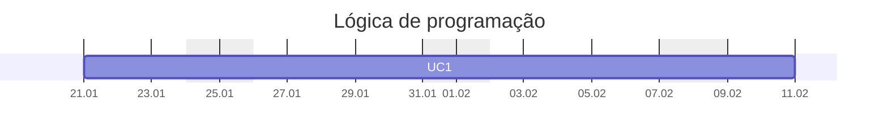

---
{"dg-publish":true,"permalink":"/aulas-de-logica/","title":"Lógica","metatags":{"description":"Curso Lógica de Programação"},"noteIcon":"default","updated":"2026-01-22T07:24:45.950-03:00"}
---

#Lógica #Aulas #Senac

## Curso Lógica de Programação

> [!info]- Identificação do curso
> 
> Título do Curso: Lógica de programação  
> Eixo tecnológico: Informação e Comunicação
> Segmento: Tecnologia da Informação
> Unidade Curricular: algoritmos estruturados em lógica de programação
> Carga horária: 60 horas
> Período: 21/01/2026 à 10/02/2026

> [!success]- 🖥️ Habilidades
> 1. Resolver problemas lógicos e aritméticos.
> 2. Construir expressões lógicas e aritméticas.
> 3. Interpretar textos técnicos.

> [!success]- 🖥️ Conhecimentos
> - Lógica de programação: conceitos.
> - Algoritmo: tipos primitivos, constantes, variáveis, expressões aritméticas, expressões lógicas, comando de atribuição, comandos de entrada e saída, utilização de variáveis literais, operadores e expressões literais.
> - Estruturas de controle: estrutura sequencial, estruturas de seleção, estruturas de repetição, encadeamento de estruturas condicionais, criação de códigos com tomada de decisão, laços infinitos, contadores, looping infinito, contadores finitos, execução de ordem crescente ou decrescente, criação e manipulação de vetores com comandos de repetição.
> - Vetor e matriz: ordenação de vetores, métodos de pesquisa (binário e sequencial), conceito e manipulação de matriz, conceito de registro, gravação de informações em registro, utilização de arquivos indexados, manipulação de tabelas.
> - Testes: conceito de testes de mesa, “debugadores” e sua evolução nas várias linguagens, técnicas de identificação de erros, a importância da qualidade do código programado.
> - Paradigmas de programação: programação estruturada, modularização de sistemas, funções e seu retorno, utilização de procedimentos, parâmetros, conceito de programação OO.

>[!done] Cronograma das aulas
>
>>[!note]- Aula 1 - introdução a lógica
>> - [x] Aula 1 - 2026.01.21 -  Introdução e conceitos, algoritmos, variáveis, expressões
>> - [[Formacao/Logica/logica de programacao\|Conhecendo a Lógica de programação]]
>> - [[Formacao/Formacao em Logica\|Formação em Lógica]]
>> - [[Tecnico/Programador/Lógica/Introdução aos algoritmos\|Introdução aos algoritmos]]
>> - [[Tecnico/Programador/Lógica/Aprendendo Lógica com blocos\|Aprendendo Lógica com blocos]]: [Code.org](https://studio.code.org/courses/express-2021/units/1), [Blockly](https://blockly.games/?lang=pt-br), [Scratch](https://scratch.mit.edu/)
>> - [Variáveis e constantes - Google Slides](https://docs.google.com/presentation/d/19obsTYpucf1e19y6CGrdZi4Ml6RfLVnRiSC7rXiFRpE/edit?usp=sharing)
>> - [Editor online de Python](https://www.online-python.com/)
>> - [[Formacao/Python/Python com Colab\|Python com Colab]]
>>>[!todo] 🖥️ Atividades:
>>> - Resolver desafios simples de lógica usando blocos:  [Code.org](https://studio.code.org/hoc/1)
>>> - Criar um algoritmo com entrada de nome e idade e mostrar a saída: [Meu primeiro programa no Google Colab](https://colab.research.google.com/drive/129p3MJB4ypp0pPzJd6dnwCflU285HT-Z?usp=sharing)
>
>>[!note] Aula 2 - Expressões aritméticas e condicionais
>> - [x] Aula 2 - 2026.01.22 - expressões aritméticas e expressões lógicas
>> - [Operadores aritméticos.pptx - Google Slides](https://docs.google.com/presentation/d/1XGp5aqvnrOSbwe-yUxUHtL8Dp7YjbXpZ/)
>> - [Operadores de comparação.pptx - Google Slides](https://docs.google.com/presentation/d/1dny1GNkpgzqRRxmSRsxMSUK5Ph1JKmHZ/)
>> - [Operadores de atribuição.pptx - Google Slides](https://docs.google.com/presentation/d/1DJma1qAlQuRRXvGvw1V8zI21U9NualXW/)
>> - [Operadores lógicos.pptx - Google Slides](https://docs.google.com/presentation/d/1axYf3Xdq7XrC4YHZxop-xMHsl5PXs2w_/)
>> - [Estruturas condicionais.pptx - Google Slides](https://docs.google.com/presentation/d/19r7ajj8mXjV8PmGHDdh23HbURkSwSlEo/)
>>>[!todo] 🖥️ Atividades:
>>> - [[Tecnico/Programador/Lógica/Exercícios de Lógica condicional\|Exercícios de Lógica condicional]]

## Referências

#programador/algoritmos 

#programador/algoritmos 

## 📚 Livros de introdução a programação

- [biblioteca digital senac - Lógica de programação - Gley Fabiano](https://bibliotecadigitalsenac.com.br/?from=busca%3FcontentInfo%3D1306%26term%3Dlogica#/legacy/epub/1306)
- https://bibliotecadigitalsenac.com.br/?from=busca%3FcontentInfo%3D1306%26term%3Dlogica#/legacy/epub/1306
- [Desenvolvimento de sistemas Allen Oberleitner](https://jocile.notion.site/Desenvolvimento-de-sistemas-Allen-Oberleitner-7f43c99c571d43ecafd026cda967461e)
- [Lógica de programação Gley Fabiano 1 cap.](https://jocile.notion.site/L-gica-de-programa-o-Gley-Fabiano-Cardoso-Xavier-1dbcc1c64e45402d9f130d07fd2914dd)

## Vídeos

- [\[Python\] 1 - Introdução ao Google Colab - YouTube](https://www.youtube.com/watch?v=K3lbWR_yg38) - [exemplo-aula1.ipynb - Colab](https://colab.research.google.com/drive/1clTJAeYlnQ5CQwDztVvpUtuKVTwM1NSF?usp=sharing)

