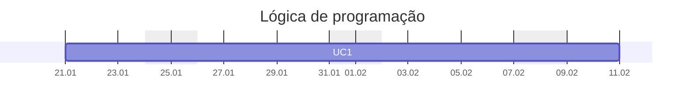

---
{"dg-publish":true,"permalink":"/aulas-de-logica/","title":"Lógica","metatags":{"description":"Curso Lógica de Programação"},"noteIcon":"default","updated":"2026-02-02T09:20:50.417-03:00"}
---

#Lógica #Aulas #Senac

## Curso Lógica de Programação

> [!info]- Identificação do curso
> 
> Título do Curso: Lógica de programação  
> Eixo tecnológico: Informação e Comunicação
> Segmento: Tecnologia da Informação
> Unidade Curricular: algoritmos estruturados em lógica de programação
> Carga horária: 60 horas (15 aulas)
> Período: 21/01/2026 à 10/02/2026

> [!success]- 🖥️ Habilidades
> 1. Resolver problemas lógicos e aritméticos.
> 2. Construir expressões lógicas e aritméticas.
> 3. Interpretar textos técnicos.

> [!success]- 🖥️ Conhecimentos
> - Lógica de programação: conceitos.
> - Algoritmo: tipos primitivos, constantes, variáveis, expressões aritméticas, expressões lógicas, comando de atribuição, comandos de entrada e saída, utilização de variáveis literais, operadores e expressões literais.
> - Estruturas de controle: estrutura sequencial, estruturas de seleção, estruturas de repetição, encadeamento de estruturas condicionais, criação de códigos com tomada de decisão, laços infinitos, contadores, looping infinito, contadores finitos, execução de ordem crescente ou decrescente, criação e manipulação de vetores com comandos de repetição.
> - Vetor e matriz: ordenação de vetores, métodos de pesquisa (binário e sequencial), conceito e manipulação de matriz, conceito de registro, gravação de informações em registro, utilização de arquivos indexados, manipulação de tabelas.
> - Testes: conceito de testes de mesa, “debugadores” e sua evolução nas várias linguagens, técnicas de identificação de erros, a importância da qualidade do código programado.
> - Paradigmas de programação: programação estruturada, modularização de sistemas, funções e seu retorno, utilização de procedimentos, parâmetros, conceito de programação OO.

>[!done] Cronograma das aulas
>
>>[!note]- Aula 1 - introdução a lógica
>> - [x] Aula 1 - 2026.01.21 -  Introdução e conceitos, algoritmos, variáveis, expressões
>> - [[Formacao/Logica/logica de programacao\|Conhecendo a Lógica de programação]]
>> - [[Formacao/Formacao em Logica\|Formação em Lógica]]
>> - [[Tecnico/Programador/Lógica/Introdução aos algoritmos\|Introdução aos algoritmos]]
>> - [[Tecnico/Programador/Lógica/Aprendendo Lógica com blocos\|Aprendendo Lógica com blocos]]: [Code.org](https://studio.code.org/courses/express-2021/units/1), [Blockly](https://blockly.games/?lang=pt-br), [Scratch](https://scratch.mit.edu/)
>> - [Variáveis e constantes - Google Slides](https://docs.google.com/presentation/d/19obsTYpucf1e19y6CGrdZi4Ml6RfLVnRiSC7rXiFRpE/edit?usp=sharing)
>> - [Editor online de Python](https://www.online-python.com/)
>> - [[Formacao/Python/Python com Colab\|Python com Colab]]
>>>[!todo] 🖥️ Atividades:
>>> - Resolver desafios simples de lógica usando blocos:  [Code.org](https://studio.code.org/hoc/1)
>>> - Criar um algoritmo com entrada de nome e idade e mostrar a saída: [Meu primeiro programa no Google Colab](https://colab.research.google.com/drive/129p3MJB4ypp0pPzJd6dnwCflU285HT-Z?usp=sharing)
>
>>[!note]- Aula 2 - Expressões aritméticas e lógicas
>> - [x] Aula 2 - 2026.01.22 - expressões aritméticas e expressões lógicas
>> - [Operadores aritméticos.pptx - Google Slides](https://docs.google.com/presentation/d/1XGp5aqvnrOSbwe-yUxUHtL8Dp7YjbXpZ/)
>> - [Operadores de comparação.pptx - Google Slides](https://docs.google.com/presentation/d/1dny1GNkpgzqRRxmSRsxMSUK5Ph1JKmHZ/)
>>>[!todo] 🖥️ Atividades:
>>> - [[Tecnico/Programador/Lógica/Exercícios de Lógica condicional\|Exercícios de Lógica condicional]]
>>> - [[Tecnico/Programador/Lógica/Segundo Algoritmo\|Segundo Algoritmo]]
>
>>[!note]- Aula 3 - Expressões aritméticas e condicionais
>> - [x] Aula 3 - 2026.01.23 - exercícios aritméticos e condicionais
>> - [Operadores de atribuição.pptx - Google Slides](https://docs.google.com/presentation/d/1DJma1qAlQuRRXvGvw1V8zI21U9NualXW/)
>> - [Operadores lógicos.pptx - Google Slides](https://docs.google.com/presentation/d/1axYf3Xdq7XrC4YHZxop-xMHsl5PXs2w_/)
>> - [Estruturas condicionais.pptx - Google Slides](https://docs.google.com/presentation/d/19r7ajj8mXjV8PmGHDdh23HbURkSwSlEo/)
>>>[!todo] 🖥️ Atividades:
>>> - [[Tecnico/Programador/Lógica/Exercícios de Lógica condicional\|Exercícios de Lógica condicional]] - [Solução no Colab](https://colab.research.google.com/drive/1LHpQpi4ta0ljOJKXZX3uwsN4QmjPtBhG?usp=sharing)
>>> - [Exercicios.ipynb - Colab](https://colab.research.google.com/drive/1LHpQpi4ta0ljOJKXZX3uwsN4QmjPtBhG?usp=sharing)
>
>>[!note]- Aula 4 - Conjuntos de dados - listas
>> - [x] Aula 4 - 2026.01.26 - Conjunto de dados - listas
>> - [01 - Listas.pptx - Google Slides](https://docs.google.com/presentation/d/1I4ruiC5KZnOiYZMoRgQcTf8z1eGCQ8YF/edit?usp=sharing&ouid=106055613390581376281&rtpof=true&sd=true)
>> - [Proposicoes.ipynb - Colab](https://colab.research.google.com/drive/1aY0VipUg6mtrDrOaSUqeWik-XAEM96B4?usp=sharing)
>> - [A HISTÓRIA NÃO CONTADA DO DESASTRE DO ARIANE 5 - YouTube](https://www.youtube.com/watch?v=fybymNqbzLg)
>>>[!todo] 🖥️ Atividades:
>>> - [Google Colab](https://colab.research.google.com/drive/1wjYNQ9bD5Cy_jg86NfWxKe9w5qi3J3Ag?usp=sharing)
>>> - Criar um algoritmo para receber várias notas e calcular a média, e mostrar o resultado com aprovado se a média for maior ou igual a 7.
>
>>[!note]- Aula 5 - Conjuntos de dados - listas
>> - [x] Aula 5 - 2026.01.27 - Conjunto de dados - listas
>> - [01 - Listas.pptx - Google Slides](https://docs.google.com/presentation/d/1I4ruiC5KZnOiYZMoRgQcTf8z1eGCQ8YF/edit?usp=sharing&ouid=106055613390581376281&rtpof=true&sd=true)
>>>[!todo] 🖥️ Atividades:
>>> - Criar um algoritmo para receber várias notas e calcular a média, e mostrar o resultado com aprovado se a média for maior ou igual a 7.
>>> - [Exercicio-com-listas.ipynb - Colab](https://colab.research.google.com/drive/1wXAxvaW1j8mBbUfY_2qzzIGC1qmu9XnD?usp=sharing)
>
>>[!note]- Aula 6 - Conjuntos de dados - tuplas
>> - [x] Aula 6 - 2026.01.28 - Conjunto de dados -tuplas
>> - [02 - Tuplas.pptx - Google Slides](https://docs.google.com/presentation/d/1_eJMXBocRLqn4yq8-qtUvdcyIjJXZEMa/edit?usp=sharing&ouid=106055613390581376281&rtpof=true&sd=true)
>> - [03 - Conjuntos.pptx - Google Slides](https://docs.google.com/presentation/d/1sXaLZgmji3O8Nk4kSW-KLct8p6QRGBbE/edit?usp=sharing&ouid=106055613390581376281&rtpof=true&sd=true)
>>>[!todo] 🖥️ Atividades:
>>> - [[Tecnico/Programador/Lógica/Exercícios de Lógica aritmética\|Exercícios de Lógica aritmética]]
>>> - [Resolução no Google Colab](https://colab.research.google.com/drive/1UfD8tLOFLZp3ITW_qrpN1bw-2tLN0VRh?usp=sharing)
>
>>[!note]- Aula 7 - Conjuntos de dados - dicionários
>> - [x] Aula 7  - 2026.01.29 - Conjunto de dados -dicionários
>> - [04 - Dicionários.pptx - Google Slides](https://docs.google.com/presentation/d/11GeGam4hs0jVmSGYtxWukAjpJ-GpKE6O/edit?usp=sharing&ouid=106055613390581376281&rtpof=true&sd=true)
>> - [17 - Estruturas de repetição.pptx - Google Slides](https://docs.google.com/presentation/d/1LoNm2TPTwqRpCORjKMJCCzs91XJvk2W_/edit?usp=sharing&ouid=106055613390581376281&rtpof=true&sd=true)
>>>[!todo] 🖥️ Atividades:
>>> - [[Tecnico/Programador/Lógica/Exercícios de Lógica aritmética\|Exercícios de Lógica aritmética]]
>>> - [Repetições no Google Colab](https://colab.research.google.com/drive/1-6obBB916QdUx_dWtabamSpiJNTwkOSx?usp=sharing)
>
>>[!note]- Aula 8 - Resolução de exercícios com repetições e listas
>> - [x] Aula 8  - 2026.01.30 - Resolução de exercícios com repetições e listas
>> - [[Tecnico/Programador/Lógica/listas-em-python\|listas-em-python]]
>> - [[Tecnico/Programador/Lógica/repeticoes-em-python\|repeticoes-em-python]]
>>>[!todo] 🖥️ Atividades:
>>> - [Exercicios-de-logica-aula8.ipynb - Colab](https://colab.research.google.com/drive/1P-1BqChybzxH8EdZtamNFK-MEqtIOVHt?usp=sharing)
>
>>[!note] Aula 9 - Estruturando a lógica com funções
>> - [x] Aula 9  - 2026.02.02 - Estruturando a lógica com funções
>> - [05 - Funções.pptx - Google Slides](https://docs.google.com/presentation/d/13AW3U70G0OVsvloO0oFTN5n22KxRG7v9/edit?usp=sharing&ouid=106055613390581376281&rtpof=true&sd=true)
>> - [[Formacao/Python/Estruturas/Diagrama de estruturas de dados com Python\|Diagrama de estruturas de dados com Python]]
>> - [[Tecnico/Programador/Lógica/Condicionais-em-python\|Condicionais-em-python]]
>>>[!todo] 🖥️ Atividades:
>>> - [Resolvendo exercícios com funções](https://colab.research.google.com/drive/1kAqEGXCAv6-9kgBkrwm_jY7WzGtE7Sec?usp=sharing)

## Referências

#programador/algoritmos 

- [Notebooklm sobre lógica de programação](https://notebooklm.google.com/notebook/00c232a8-9dbb-4743-9b69-780f6a265a04)
- [Editor online: Colab](https://colab.research.google.com/)
- [Referência de Python - Colab](https://colab.research.google.com/drive/1yOku8bEy4inNYFBLGK88ciiOWNG1Yage?usp=sharing)
- [Referências da linguagem Python](https://www.w3schools.com/python/python_variables.asp)
