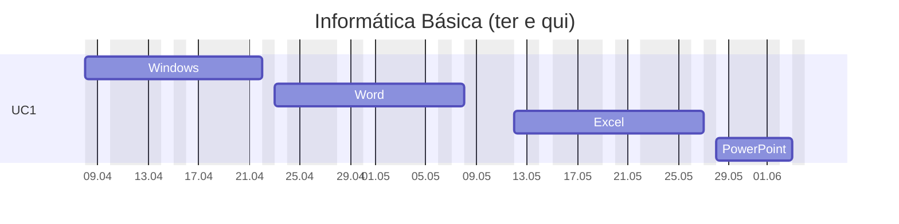

---
{"dg-publish":true,"permalink":"/informatica-basica/","title":"Informática básica","metatags":{"description":"Curso Informática básica"},"tags":["Aulas","Informatica-basica","Senac","curso"],"noteIcon":"1","updated":"2025-04-29T15:27:06.559-03:00"}
---

## Curso Informática básica

> [!info]- Identificação do curso
> 
> |     |     |
> | ---: | --- |
> | Título do Curso:| Informática Básica  
> | Eixo tecnológico:| Informação e Comunicação
> | Segmento:| Tecnologia da Informação  
> | Carga horária:| 66 horas em 17 aulas
> | Período:| 08/04/25 a 10/06/25
> | Horário:| as terças e quintas das 18:30 às 21:30
> | Unidade Curricular:| Operar sistemas operacionais cliente, aplicativos de escritório e periféricos.
> | Link:| [INFORMÁTICA BÁSICA - SOBRAL - MANHÃ - 2025.12.59 - Cursos Senac Ceará](https://cursos.ce.senac.br/produto/informatica-basica-sobral-manha-2025-12-59/)

> [!success]- 🖥️ Habilidades
> 1. Gerencia arquivos conforme recursos do sistema operacional cliente.
> 2. Utiliza ferramentas de pesquisa, agenda e mensagens de acordo com os serviços de internet.
> 3. Elabora e edita textos e apresentações eletrônicas, conforme recursos dos aplicativos de escritório.
> 4. Elabora e edita dados numéricos e gráficos de acordo com os recursos do editor de planilhas eletrônicas.
> 5. Armazena e compartilha dados de acordo com os requisitos da solução.

## Cronograma da Unidade Curricular

>[!done]- Cronograma das aulas (clique aqui)
>
>>[!note]- Aula em 08/04 (clique aqui)
>> - [HISTORIA : A EVOLUÇÃO DOS COMPUTADORES](https://docs.google.com/presentation/d/1MXW5D73CtuZMqP8obVX5tBnPm_1mUksb/edit?slide=id.p1#slide=id.p1)
>> - [HISTORIA : A EVOLUÇÃO DOS COMPUTADORES - YouTube](https://www.youtube.com/watch?v=mFdUqqwzbVs)
>> - [História e Evolução dos Computadores](https://www.todamateria.com.br/historia-e-evolucao-dos-computadores/)
>>>[!todo] 🖥️ Atividades: 
>>> - Acesso e tela de bloqueio;
>>> - Digitação com acentuação na página 53 da [📑Apostila][apostila]
>
>>[!note]- Aula em 10/04 (clique aqui)
>> - [Partes do computador](https://docs.google.com/presentation/d/1Ohfb9t_ZR_qWBVGtOg3tQJ28Y4mGXufM/edit?usp=sharing&ouid=106055613390581376281&rtpof=true&sd=true)
>> - [[Assistente-de-TI/Estacao-de-trabalho\|Estação de Trabalho em Tecnologia da Informação]]
>> - [📑Apostila][apostila] página 61 explorando arquivos e pastas no Windows.
>>>[!todo] 🖥️ Atividades: 
>>> - Criar pasta com seu nome para salvar as atividades conforme a página 64 da [📑Apostila][apostila],
>>> - Copiar e mover arquivos para a pasta criada;
>
>>[!note]- Aula em 15/04
>> - Configuração de interface de telas da área de trabalho do Windows, seguindo o roteiro a partir da página 36 da [📑Apostila][apostila]:
>> - Mudar a imagem das telas de bloqueio e desktop do Windows;
>> - Identificar como instalar e modificar temas do Windows;
>> - Conhecendo os acessórios do Windows: bloco de notas, [[Assistente-de-TI/Calculadora do Windows\|Calculadora do Windows]], Paint e Wordpad, digitação com acentos e atalhos de teclado;
>>>[!todo] 🖥️ Atividade:
>>> - Criando textos e formatando no WordPad;
>>> - Criando desenhos no Paint e Paint 3d conforme pg. 57 da [📑Apostila][apostila];
>
>>[!note]- Aula em 22/04
>>   - Conhecendo os acessórios do Windows: Criando textos e formatando no WordPad;
>>   - interface e manuseio de janelas, área de trabalho,
>>   - recurso de área de transferência,
>>>[!todo] 🖥️ Atividade:
>>> - Selecionando textos, copiando e colando textos e imagens entre aplicativos, conforme pg. 56 da [📑Apostila][apostila];
>
>>[!note] Aula em 24/03
>>   - Editor de texto [Word](https://support.microsoft.com/pt-br/word): área de trabalho;
>>   - [📑Apostila][apostila] a partir da pg. 73: Processador de Textos Word: Elementos da tela; Manipulação com arquivo de texto; Recursos de seleção de texto; 
>>>[!todo] 🖥️ Atividade:
>>> - Conhecendo a interface do Word: Criando texto sobre o Blu-Ray contendo formatação e parágrafos;
>>> - Conhecendo estilos de texto no Word Criando o texto Iracema;

>[!todo] Última atualização
>>[!note] Aula em 29/03
>>   - [📑Apostila][apostila] a partir da pg. 83: Processador de Textos Word: Manipulação com arquivo de texto e formatação e estilos de fonte e parágrafos; Copiar, recortar e colar texto; Ferramenta Zoom; estilos de texto. 
>>>[!todo] 🖥️ Atividade:
>>> - Conhecendo estilos de texto no Word Criando os textos Iracema e o poema Cecília;
>>> - Conhecendo estilos de texto no Word Criando os textos Responsabilidade Social e Teoria da música;

> [!important]- 📚Material didático
> 
> - [📑Apostila Informática Básica - Intensivo Windows.pdf - Google Drive][apostila]
> - [❓Central de ajuda da Microsoft](https://support.microsoft.com/pt-br/all-products) | [📶 Treinamento](https://support.microsoft.com/pt-br/training) | [🎓 Learn](https://learn.microsoft.com/pt-br/training/)
> - [➕ Create - Modelos gratuitos para mídia social, documentos e designs](https://create.microsoft.com/pt-br)
>>>[!todo] [Biblioteca Digital SENAC](https://bibliotecadigitalsenac.com.br): 
>>> - [💻 Windows 10](https://bibliotecadigitalsenac.com.br/#/?contentInfo=2795) 
>>> - [📄 Word](https://bibliotecadigitalsenac.com.br/#/?contentInfo=2309) | [📄 atividades Word](https://www.editorasenacsp.com.br/informatica/word2019/atividades.zip)
>>> - [📈 Excel](https://bibliotecadigitalsenac.com.br/#/busca?contentInfo=3130&term=excel) | [📄 atividades Excel](https://www.editorasenacsp.com.br/informatica/excel2019/planilhas.zip)
>>> - [📸Power Point](https://bibliotecadigitalsenac.com.br/?from=busca%3FcontentInfo%3D2304%26term%3Dpowerpoint&page=12&section=0#/legacy/2304) | [📄 atividades PowerPoint](https://www.editorasenacsp.com.br/informatica/powerpoint2019/atividades.zip)

[apostila]: https://drive.google.com/file/d/1HNT1is949xITALuJXT1dwaLCbYexrIGT/view?usp=sharing
