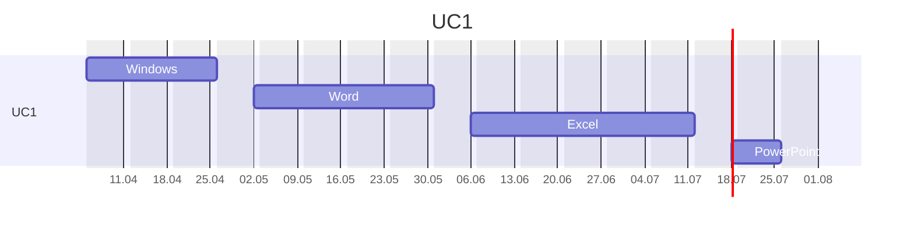

---
{"dg-publish":true,"permalink":"/informatica-basica/","title":"Informática básica","metatags":{"description":"Curso Informática básica"},"tags":["Aulas","Informatica-basica","Senac","curso"],"updated":"2025-04-05T00:00:50.114-03:00"}
---

## Curso Informática básica

> [!info] Identificação do curso
> 
> |     |     |
> | ---: | --- |
> | Título do Curso:| Informática Básica  
> | Eixo tecnológico:| Informação e Comunicação
> | Segmento:| Tecnologia da Informação  
> | Carga horária:| 66 horas em 17 aulas
> | Período:| 05/04/25 a 26/07/25
> | Horário:| aos sábados  das 08:00 às 11:30
> | Unidade Curricular:| Operar sistemas operacionais cliente, aplicativos de escritório e periféricos.
> | Link:| [INFORMÁTICA BÁSICA - SOBRAL - MANHÃ - 2025.12.60 - Cursos Senac Ceará](https://cursos.ce.senac.br/produto/informatica-basica-sobral-manha-2025-12-60/)

## UC1 - Operador de computadores

> [!success]- 🖥️ Habilidades
> 1. Gerencia arquivos conforme recursos do sistema operacional cliente.
> 2. Utiliza ferramentas de pesquisa, agenda e mensagens de acordo com os serviços de internet.
> 3. Elabora e edita textos e apresentações eletrônicas, conforme recursos dos aplicativos de escritório.
> 4. Elabora e edita dados numéricos e gráficos de acordo com os recursos do editor de planilhas eletrônicas.
> 5. Armazena e compartilha dados de acordo com os requisitos da solução.

> [!check] Progresso das aulas
>
>>[!note] UC1: Início em 05/04 <progress value="1" max="17"></progress> 1 de 17 Aulas;

>[!done] Cronograma da Unidade Curricular 1 - Operador
>
>>[!note] Aula em 05/04
>> - 🎓 [Abertura do curso](https://docs.google.com/presentation/d/12myN-OpLqppVuXahxOGlCTRJcd84ftr_/edit?usp=sharing&ouid=106055613390581376281&rtpof=true&sd=true)
>> - ✨ [Aula 1 - Apresentação](https://drive.google.com/file/d/1-6RPU-erktgeD7HxvyWlQguM4dIXTYuH/view?usp=sharing)
>> - [HISTORIA : A EVOLUÇÃO DOS COMPUTADORES - YouTube](https://www.youtube.com/watch?v=mFdUqqwzbVs)
>> - [História e Evolução dos Computadores](https://www.todamateria.com.br/historia-e-evolucao-dos-computadores/)
>> - [[Assistente-de-TI/Estacao-de-trabalho\|Estação de Trabalho em Tecnologia da Informação]]
>>>[!todo] 🖥️ Atividade: 
>>> - Criar um relatório sobre:
>>>   - A versão do Sistema Operacional e do Office;
>>>   - A quantidade de memória e armazenamento do Desktop;
>>>   - Enviar por E-mail.

> [!important] 📚Material didático
> 
> - [📑Apostila Informática Básica - Intensivo Windows.pdf - Google Drive][apostila]
> - [❓Central de ajuda da Microsoft](https://support.microsoft.com/pt-br/all-products) | [📶 Treinamento](https://support.microsoft.com/pt-br/training) | [🎓 Learn](https://learn.microsoft.com/pt-br/training/)
> - [➕ Create - Modelos gratuitos para mídia social, documentos e designs](https://create.microsoft.com/pt-br)
> - [🌐Conectividade de redes - Biblioteca digital](https://bibliotecadigitalsenac.com.br/?from=busca%3FcontentInfo%3D2932%26term%3Dredes#/legacy/epub/2932)
> - [📶INFRAESTRUTURA DE REDES | Jocile](https://jocile.github.io/aulas/categories/infraestrutura-de-redes/)
>>>[!todo] [Biblioteca Digital SENAC](https://bibliotecadigitalsenac.com.br): 
>>> - [💻 Windows 10](https://bibliotecadigitalsenac.com.br/#/?contentInfo=2795) 
>>> - [📄 Word](https://bibliotecadigitalsenac.com.br/#/?contentInfo=2309) | [📄 atividades Word](https://www.editorasenacsp.com.br/informatica/word2019/atividades.zip)
>>> - [📈 Excel](https://bibliotecadigitalsenac.com.br/#/busca?contentInfo=3130&term=excel) | [📄 atividades Excel](https://www.editorasenacsp.com.br/informatica/excel2019/planilhas.zip)
>>> - [📸Power Point](https://bibliotecadigitalsenac.com.br/?from=busca%3FcontentInfo%3D2304%26term%3Dpowerpoint&page=12&section=0#/legacy/2304) | [📄 atividades PowerPoint](https://www.editorasenacsp.com.br/informatica/powerpoint2019/atividades.zip)

[apostila]: https://drive.google.com/file/d/1HNT1is949xITALuJXT1dwaLCbYexrIGT/view?usp=sharing
