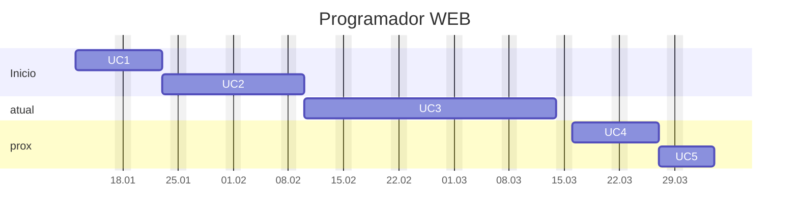

---
{"dg-publish":true,"permalink":"/programador-web-2026/","title":"Programador-WEB","metatags":{"description":"Profissional que trabalha no desenvolvimento de sites e diversos sistemas WEB"},"noteIcon":"default","updated":"2026-02-03T13:32:10.002-03:00"}
---

#mapa #Senac #web #Webdesign #web-developer 

# Curso programador Web

## Sobre o curso

> [!info]- Identificação do curso
> 
> Título do Curso:: Programador Web  
> Eixo tecnológico:: Informação e Comunicação
> Segmento:: Tecnologia da Informação  
> Carga horária:: 240 horas em 60 aulas
> Período:: 14/01/26 a 14/04/26
> Horário:: Segunda a Sexta das 13:30 às 17:00
> Unidades Curriculares:: 5
> Link:: [Senac PSG - Programador Web](https://psg.ce.senac.br/oportunidade/programador-web-2/)
> **Status**:: em andamento 
> **Horas aula**:: 36:00, 48:00, 96:00, 36:00, 24:00

>[!note]- Justificativa
>No Brasil, como em todo o mundo, a internet tornou-se não só uma forma de comunicação, mas uma poderosa ferramenta de comércio nos mais diferentes ramos, mostrando-se necessária cada dia mais. Nesse novo cenário de comunicação e negócios, a demanda por profissionais com expertise na criação de sites é crescente em comparação ao crescimento e influência da rede".
>
> No Brasil, o uso da internet tem crescido vertiginosamente, alcançando, aproximadamente, 126 milhões de usuários regulares da rede[^1] Esta ação impacta diretamente no volume de consumo favorecido pela internet. De acordo com levantamento de uma empresa de inteligência de mercado focada em e-commerce (Compre&Confie)[^2], o varejo digital brasileiro faturou R$14,1 bilhões no período do Natal de 2019, cifra e representa uma variação positiva de 29,9% no comparativo com o ano anterior.
>
> O Programador _web_, neste contexto, é um profissional muito requisitado, que exerce funções sob a influência da internet, atendendo à demanda crescente e inovadora oriunda do comércio eletrônico, aplicativos, redes sociais etc. É necessário a esse profissional o conhecimento de linguagens de programação web, tanto de _back-end_ como de  _front-end_ e de integração com banco de dados, exercendo funções que se assemelham às desempenhadas pelos profissionais _web developer_ ou desenvolvedor _web_, justificando assim a oferta dessa qualificação.

>[!check]- **Objetivo geral**
> Formar profissionais com competências para atuar e intervir em seu campo de trabalho, com foco em resultados.

>[!success]- Perfil profissional de conclusão 
> - O Programador Web estrutura em *front-end* e desenvolve em *back-end*, publicando aplicações web. Para isto, elabora projetos e testes ao longo do desenvolvimento e permite o acesso a banco de dados por meio de linguagens de programação, seguindo padrões internacionais.
> - Esse profissional trabalha no desenvolvimento de *sites* institucionais, *blogs*, fóruns, lojas virtuais e diversos sistemas e aplicações voltados para o ambiente de internet e intranet, conforme políticas de segurança da informação e com respeito à propriedade intelectual.
>- Pode atuar em serviços autônomos, temporários ou contrato efetivo em organizações públicas e privadas nos mais diversos setores.
> - A ocupação está situada no eixo tecnológico Informação e Comunicação, cuja natureza é “comunicar” e pertence ao segmento Informática.

>[!tip]- Competências que compõem o perfil do Programador *web*
>
> - Elaborar projetos de aplicações para *web*.
> - Estruturar aplicações *front-end* para *web*.
> - Desenvolver aplicações *back-end* para *web*.
> - Publicar aplicações *web*.

[^1]: G1. **Uso da internet no Brasil cresce, e 70% da população está conectada**. Economia. Tecnologia. 28 de ago. 2019. Disponível em: <https://g1.globo.com/economia/tecnologia/noticia/2019/08/28/uso-da-internet-no-brasil-cresce-e-70percent-da-populacao-esta-conectada.ghtml>. Acesso em: 11 de fev. 2020. [↑](#footnote-ref-2)
[^2]: MERCADO&CONSUMO. **E-commerce brasileiro fatura R$ 14,1 bilhões em compras de natal**. 1 de jan. 2020. Disponível em: <http://www.mercadoeconsumo.com.br/2020/01/01/e-commerce-brasileiro-fatura-r141-bilhoes-em-compras-de-natal/>. Acesso em: 11 de fev. 2020. [↑](#footnote-ref-3)

## Organização curricular de Programador WEB

> [!example]- Unidades Curriculares
> 
> | **Unidades Curriculares**                        | **Carga horária** | Aulas |
> | ------------------------------------------------ | :---------------: | :---: |
> | UC1: Elaborar projetos de aplicações para web    | 36 horas          | 9     |
> | UC2: Estruturar aplicações *front-end* para web | 48 horas          | 12    |
> | UC3: Desenvolver aplicações *back-end* para web | 96 horas          | 24    |
> | UC4: Publicar aplicações web                      | 36 horas          | 9     |
> | UC5: Projeto Integrador Programador Web         | 24 horas          | 6     |
> | **Carga horária total**                          | **240 horas**     | 60    |

## Cronograma de aulas

> [!success]- 🖥️ Habilidades da UC2
> - Organizar conteúdo visual e textual para *web*. 
>
>>[!check]
>> 1. Manipula imagens, layouts e animações otimizadas para *website* de acordo com os princípios de comunicação visual, normas e tendências de mercado. 
>> 2. Utiliza linguagem de marcação de conteúdo e estilo, de acordo com as normas e padrões tecnológicos. 
>> 3. Testa padrões de acessibilidade e usabilidade do *website* de acordo com as normas

>[!done] Cronograma das aulas da UC2
>
>>[!note]- Aula 2.1 - Estrutura base HTML5
>> - [x] Aula 2.1 - 2026-01-26 - Introdução e [[Formacao/Webdesign/Estrutura HTML5\|Estrutura HTML5]] e suas tags básicas;
>> 
>>>[!todo] 🖥️ Atividade:
>>> - Criando a primeira página HTML com tags básicas.
>
>>[!note]- Aula 2.2 - Formulários em HTML
>> - [x] Aula 2.2 - 2026-01-27 - [[Formacao/Webdesign/Formulários\|Formulários]], tabelas, listas
>>
>>>[!todo] 🖥️ Atividade:
>>> - Criar uma página de formulário.
>>> - Criar um repositório do projeto e salvar os arquivos no [GitHub][github]
>
>>[!note]- Aula 2.3 - Estilizando uma página
>> - [x] Aula 2.3 - 2026-01-28 - Bordas, espaçamentos e estilos com HTML
>> - [[Formacao/Webdesign/CSS/Perfil com HTML e CSS\|Perfil com HTML e CSS]]
>>
>>>[!todo] 🖥️ Atividade:
>>> - Criar uma página inicial estilizada com CSS (cap. 1 e 2) - [programadorweb2026/livro][livrohtml] - [Visualizar](https://jocile.github.io/programadorweb2026/livro/cap2.html)
>
>>[!note]- Aula 2.4 - Estilos Box Model com CSS3
>> - [x] Aula 2.4 - 2026-01-29 - Estilos Box Model com CSS3
>> - [[Formacao/Webdesign/CSS/Unidades de medida do css\|Unidades de medida do css]]
>> - [[Formacao/Webdesign/Proposta de site\|Proposta de site]]
>> - [CSS Box Model](https://www.w3schools.com/css/css_boxmodel.asp)
>>>[!todo] 🖥️ Atividade:
>>> - Refatorando a página inicial estilizada com CSS (cap. 3 e 4) - [programadorweb2026/livro][livrohtml] - [Visualizar](https://jocile.github.io/programadorweb2026/livro/cap4.html)
>>> - [Estudos HTML5 e CSS3 - Kauan](https://kauanallyson.github.io/livro-html-css/)
>
>>[!note]- Aula 2.5 - Estilos avançados com CSS3
>> - [x] Aula 2.5 - 2026-01-30 - Estilos avançados com CSS3 - pseudo elementos
>> - [[Formacao/Webdesign/Novidades do html5\|Novidades do html5]]
>> - [[Formacao/Webdesign/Proposta de site2\|Proposta de site2]]
>> - [CSS Box Model](https://www.w3schools.com/css/css_boxmodel.asp)
>>>[!todo] 🖥️ Atividade:
>>> - Refatorando a página inicial estilizada com CSS (cap. 5 e 6) - [programadorweb2026/livro][livrohtml]
>>> - [Estudos HTML5 e CSS3 - Kauan](https://kauanallyson.github.io/livro-html-css/)
>
>>[!note]- Aula 2.6 - Estilos avançados com CSS3
>> - [x] Aula 2.2 - 2026-02-02 - Estilos avançados com CSS3 - display, position e float
>> - [[Formacao/Webdesign/CSS/Display com css\|Display com css]]
>> - [[Formacao/Webdesign/CSS/Posicionando elementos com CSS\|Posicionando elementos com CSS]]
>> - [CSS The display Property](https://www.w3schools.com/css/css_display_visibility.asp)
>>>[!todo] 🖥️ Atividade:
>>> - Refatorando a página inicial estilizada com CSS (cap. 6) - [programadorweb2026/livro][livrohtml]
>
>>[!note] Aula 2.7 - Introdução ao JavaScript
>> - [x] Aula 2.7 - 2026-02-03 - Introdução ao JavaScript
>> - [JavaScript Introduction](https://www.w3schools.com/js/js_intro.asp)
>> - [[Formacao/JavaScript/Manipulando elementos com JavaScript\|Manipulando elementos com JavaScript]]
>>>[!todo] 🖥️ Atividade:
>>> - [[Formacao/Webdesign/Exercicio JavaSript cap6\|Exercicio JavaSript cap6]] - [programadorweb2026/livro][livrohtml]

## Referências

- [📚 HTML Tutorial - W3 Schools](https://www.w3schools.com/html/default.asp)
- [📁 github.com/jocile/programadorweb2026: Exercícios do curso de Programador Web do Senac 2026](https://github.com/jocile/programadorweb2026/)
- [📁 github.com/jocile/webdesigner](https://github.com/jocile/webdesigner)
- [Ebook de HTML5 e CSS3](https://drive.google.com/file/d/1m_uftVZ1YHoABiwQhPw1_L3i5kpDI1yD/view?usp=sharing)
- [[Formacao/Formacao em Webdesign\|Formacao em Webdesign]]
- [[Formacao/Webdesign/editores HTML online\|editores HTML online]]

[[Principal\|Principal]]

[github]: https://github.com/
[livrohtml]: https://github.com/jocile/programadorweb2026/tree/main/livro
[figma]: https://www.figma.com/pt-br/
