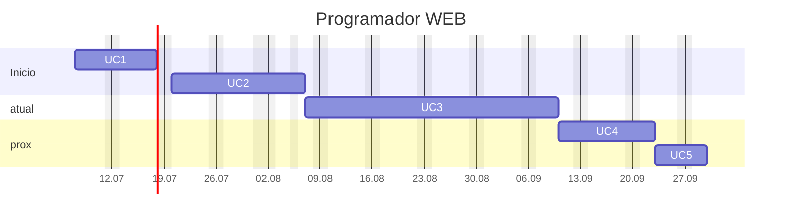

---
{"dg-publish":true,"permalink":"/programador-web/","title":"Programador-WEB","metatags":{"description":"Profissional que trabalha no desenvolvimento de sites e diversos sistemas WEB"},"noteIcon":"default","updated":"2025-09-11T09:29:26.201-03:00"}
---

#mapa #Senac #web #Webdesign #web-developer 

# Curso programador Web

## Sobre o curso

> [!info]- Identificação do curso
> 
> Título do Curso:: Programador Web  
> Eixo tecnológico:: Informação e Comunicação
> Segmento:: Tecnologia da Informação  
> Carga horária:: 240 horas em 60 aulas
> Período:: 07/07/25 a 26/09/25
> Horário:: Segunda a Sexta das 07:30 às 11:00
> Unidades Curriculares:: 5
> Link:: [Senac PSG - Programador Web](https://psg.ce.senac.br/oportunidade/programador-web-2/)
> **Status**:: em andamento 
> **Horas aula**:: 36:00, 48:00, 96:00, 36:00, 24:00

>[!note]- Justificativa
>No Brasil, como em todo o mundo, a internet tornou-se não só uma forma de comunicação, mas uma poderosa ferramenta de comércio nos mais diferentes ramos, mostrando-se necessária cada dia mais. Nesse novo cenário de comunicação e negócios, a demanda por profissionais com expertise na criação de sites é crescente em comparação ao crescimento e influência da rede".
>
> No Brasil, o uso da internet tem crescido vertiginosamente, alcançando, aproximadamente, 126 milhões de usuários regulares da rede[^1] Esta ação impacta diretamente no volume de consumo favorecido pela internet. De acordo com levantamento de uma empresa de inteligência de mercado focada em e-commerce (Compre&Confie)[^2], o varejo digital brasileiro faturou R$14,1 bilhões no período do Natal de 2019, cifra e representa uma variação positiva de 29,9% no comparativo com o ano anterior.
>
> O Programador _web_, neste contexto, é um profissional muito requisitado, que exerce funções sob a influência da internet, atendendo à demanda crescente e inovadora oriunda do comércio eletrônico, aplicativos, redes sociais etc. É necessário a esse profissional o conhecimento de linguagens de programação web, tanto de _back-end_ como de  _front-end_ e de integração com banco de dados, exercendo funções que se assemelham às desempenhadas pelos profissionais _web developer_ ou desenvolvedor _web_, justificando assim a oferta dessa qualificação.

>[!check]- **Objetivo geral**
> Formar profissionais com competências para atuar e intervir em seu campo de trabalho, com foco em resultados.

>[!success]- Perfil profissional de conclusão 
> - O Programador Web estrutura em *front-end* e desenvolve em *back-end*, publicando aplicações web. Para isto, elabora projetos e testes ao longo do desenvolvimento e permite o acesso a banco de dados por meio de linguagens de programação, seguindo padrões internacionais.
> - Esse profissional trabalha no desenvolvimento de *sites* institucionais, *blogs*, fóruns, lojas virtuais e diversos sistemas e aplicações voltados para o ambiente de internet e intranet, conforme políticas de segurança da informação e com respeito à propriedade intelectual.
>- Pode atuar em serviços autônomos, temporários ou contrato efetivo em organizações públicas e privadas nos mais diversos setores.
> - A ocupação está situada no eixo tecnológico Informação e Comunicação, cuja natureza é “comunicar” e pertence ao segmento Informática.

>[!tip]- Competências que compõem o perfil do Programador *web*
>
> - Elaborar projetos de aplicações para *web*.
> - Estruturar aplicações *front-end* para *web*.
> - Desenvolver aplicações *back-end* para *web*.
> - Publicar aplicações *web*.

[^1]: G1. **Uso da internet no Brasil cresce, e 70% da população está conectada**. Economia. Tecnologia. 28 de ago. 2019. Disponível em: <https://g1.globo.com/economia/tecnologia/noticia/2019/08/28/uso-da-internet-no-brasil-cresce-e-70percent-da-populacao-esta-conectada.ghtml>. Acesso em: 11 de fev. 2020. [↑](#footnote-ref-2)
[^2]: MERCADO&CONSUMO. **E-commerce brasileiro fatura R$ 14,1 bilhões em compras de natal**. 1 de jan. 2020. Disponível em: <http://www.mercadoeconsumo.com.br/2020/01/01/e-commerce-brasileiro-fatura-r141-bilhoes-em-compras-de-natal/>. Acesso em: 11 de fev. 2020. [↑](#footnote-ref-3)

## Organização curricular de Programador WEB

> [!example]- Unidades Curriculares
> 
> | **Unidades Curriculares**                        | **Carga horária** | Aulas |
> | ------------------------------------------------ | :---------------: | :---: |
> | UC1: Elaborar projetos de aplicações para web    | 36 horas          | 9     |
> | UC2: Estruturar aplicações *front-end* para web | 48 horas          | 12    |
> | UC3: Desenvolver aplicações *back-end* para web | 96 horas          | 24    |
> | UC4: Publicar aplicações web                      | 36 horas          | 9     |
> | UC5: Projeto Integrador Programador Web         | 24 horas          | 6     |
> | **Carga horária total**                          | **240 horas**     | 60    |

## UC1 - Elaborar projetos de aplicações para web

> [!success]- 🖥️ Habilidades da UC1
> - Interpretar *briefing* para projetos de *websites*. 
> - Identificar requisitos técnicos para projetos de *websites*. 
> - Pesquisar domínio disponível e serviços de hospedagem para *websites*. 
> - Organizar arquivos e atividades por etapas do projeto. 
> - Estruturar arquitetura dos elementos de conteúdo de *websites*.
>
>>[!check] 
>> 1. Define os objetivos do projeto, de acordo com as necessidades do cliente e público-alvo. 
>> 2. Elabora proposta de trabalho de acordo com arquitetura da informação da aplicação web e das estratégias tecnológicas. 
>> 3. Elabora protótipo para web sites de acordo com o *briefing*. 
>> 4. Redige o projeto da aplicação web de acordo com a proposta e protótipo.

>[!done]- Cronograma das aulas da UC1
>
>>[!note]- Aula 1.1
>> - [x] Aula 1.1 - 2025-07-07 - Boas-vindas e apresentação da ementa do curso
>> - Conceito, estrutura e finalidades de um [[Formacao/UX design/Briefing\|Briefing]]
>> - Apresentação da plataforma [[Tecnico/Ferramentas/git/Git-GitHub\|Git-GitHub]]
>>>[!todo] 🖥️ Atividade:
>>> - Criando um currículo online e publicando no [GitHub][github]
>
>>[!note]- Aula 1.2
>> - [x] Aula 1.2 - 2025-07-08 - [[Formacao/UX design/Analise do Briefing\|Analise do Briefing]]
>> - Editando documentação [[Formacao/Webdesign/markdown\|markdown]]
>>>[!todo] 🖥️ Atividade:
>>> - Criar a estrutura inicial do briefing em um repositório do [GitHub][github].
>
>>[!note]- Aula 1.3
>> - [x] Aula 1.3 - 2025-07-09 - Conceitos e estrutura de [[Formacao/UX design/layout\|layout]], [[Formacao/UX design/wireframe\|wireframe]]
>> - Definição das equipes e projetos iniciais.
>>>[!todo] 🖥️ Atividade:
>>> - Criar o Briefing para o projeto de Aplicativo WEB para Petshop e para uma Barbearia no [GitHub][github].
>
>>[!note]- Aula 1.4
>> - [x] Aula 1.4 - 2025-07-10 - Conceitos e estrutura de [[Formacao/UX design/layout\|layout]], [[Formacao/UX design/wireframe\|wireframe]], [[Formacao/UX design/mockup\|mockup]], [[Formacao/UX design/MoodBoard\|MoodBoard]], [[Formacao/UX design/prototipo\|prototipo]]
>>
>>>[!todo] 🖥️ Atividade:
>>> - Criar a estrutura inicial do layout com [[Formacao/UX design/wireframe\|wireframe]] de um sistema, usando o [Figma][figma] ou [Excalidraw](https://excalidraw.com/) ou [Draw.io](https://app.diagrams.net/), e salvar no repositório do [GitHub][github].
>>> - Exemplos de sites: 
>>> 	- [Confraria da Barba - A Barbearia do Homem Moderno](https://www.confrariadabarba.com.br/), 
>>> 	- [Pet Shop da Petz: tudo que seu pet precisa](https://www.petz.com.br/)
>
>>[!note]- Aula 1.5
>> - [x] Aula 1.5 - 2025-07-11 - Visita técnica a Biblioteca
>> - Conhecendo a [Biblioteca Digital Senac](https://bibliotecadigitalsenac.com.br/) e a [Plataforma Cachola](https://cachola.senac.br/)
>
>>[!note]- Aula 1.6
>> - [x] Aula 1.6 - 2025-07-14 - Designe de Interface de Usuário de [[Formacao/UX design/layout\|layout]], [[Formacao/UX design/wireframe\|wireframe]] com o [Figma: The Collaborative Interface Design Tool][figma]
>> - [Modelo do Figma de aplicativo de catálogo de produtos](https://www.figma.com/design/1n0aifcfatWv9ozp16XCrq/DSCatalog-Bootcamp?node-id=0-1&t=8ZwtYaRebXzwrolS-1)
>> - [Modelo do Figma - Digital Agency Website](https://www.figma.com/community/file/1058842196634115002)
>>>[!todo] 🖥️ Atividade:
>>> - Criar a estrutura inicial do layout com [[Formacao/UX design/wireframe\|wireframe]] de um sistema, usando o [Figma](https://www.figma.com/pt-br/) e salvar no repositório do [GitHub][github].
>>> - Exemplos de sites: 
>>> 	- [Tela básica de aplicativo no Figma](https://www.figma.com/design/hpQuzpGHq2MmrI87xnfMoT/DSMovie1?node-id=0-1&t=28CnLRgmCZJluSm1-1)
>>> 	- [Confraria da Barba - A Barbearia do Homem Moderno](https://www.confrariadabarba.com.br/), 
>>> 	- [Pet Shop da Petz: tudo que seu pet precisa](https://www.petz.com.br/)
>
>>[!note]- Aula 1.7
>> - [x] Aula 1.7 - 2025-07-15 - Introdução ao [[Formacao/UX design/mockup\|mockup]] e ao [[Formacao/UX design/prototipo\|protótipo]]
>> - Mercado de trabalho do Designer
>> - Plataformas de criação de protótipos:  [Figma][figma, [Glide](https://www.glideapps.com/), [Bubble](https://bubble.io/how-to-build)
>>>[!todo] 🖥️ Atividade:
>>> - iniciar o protótipo do site.
>
>>[!note]- Aula 1.8
>> - [x] Aula 1.8 - 2025-07-16 - Análise de [[Formacao/UX design/requisitos\|requisitos]];
>> - Como criar uma [[Formacao/UX design/proposta comercial\|proposta comercial]].
>>>[!todo] 🖥️ Atividade:
>>> - Criação de uma análise de [[Formacao/UX design/requisitos\|requisitos]] a partir dos [Modelos gratuitos de requisitos de projetos](https://pt.smartsheet.com/content/project-requirements-templates)
>>> - Criação de proposta comercial usando o modelo: [laboratorio-de-software - GitHub](https://github.com/jocile/laboratorio-de-software/tree/master/fase1) ou [Modelo de Proposta Comercial no Canva - João Cortez - A4](https://www.canva.com/design/DAEe7HM_Qg4/rN_nZ5aYb4JPoCFiNIpKTA/edit)
>
>>[!note]- Aula 1.9
>> - [x] Aula 1.9 - 2025-07-17 - Avaliação final da UC e apresentação das atividades

[github]: https://github.com/
[figma]: https://www.figma.com/pt-br/

## UC2 - Estruturar aplicações front-end para web

> [!success]- 🖥️ Habilidades da UC2
> - Organizar conteúdo visual e textual para *web*. 
>
>>[!check]
>> 1. Manipula imagens, layouts e animações otimizadas para *website* de acordo com os princípios de comunicação visual, normas e tendências de mercado. 
>> 2. Utiliza linguagem de marcação de conteúdo e estilo, de acordo com as normas e padrões tecnológicos. 
>> 3. Testa padrões de acessibilidade e usabilidade do *website* de acordo com as normas

>[!done]- Cronograma das aulas da UC2
>
>>[!note]- Aula 2.1
>> - [x] Aula 2.1 - 2025-07-18 - Introdução e [[Formacao/Webdesign/Estrutura HTML5\|Estrutura HTML5]] e suas tags básicas;
>> - [Ebook Programador WEB cap. 1][ebook-programador]
>>>[!todo] 🖥️ Atividade:
>>> Criando a primeira página HTML com tags básicas no Bloco de Notas.
>
>>[!note]- Aula 2.2
>> - [x] Aula 2.2 - 2025-07-21 - Frames, tabelas, listas
>> - [Ebook Programador WEB cap. 1][ebook-programador]
>>>[!todo] 🖥️ Atividade:
>>> - Criar uma página de controle acadêmico conforme o cap. 1 do livro.
>
>>[!note]- Aula 2.3
>> - [x] Aula 2.3 - 2025-07-22 - tags de imagens, links e formulários com HTML
>> - [Ebook Programador WEB cap. 1 - HTML][ebook-programador]
>>>[!todo] 🖥️ Atividade:
>>> - Criar um repositório do projeto controle acadêmico e salvar os arquivos no [GitHub][github]
>>> - Criar um [formulário de cadastro de alunos do projeto acadêmico][formCadAlunos].
>
>>[!note]- Aula 2.4
>> - [x] Aula 2.4 - 2025-07-23 - [[Formacao/Webdesign/Formulários\|Formulários]] HTML 
>> - e seus atributos: `fieldset, placeholder, option, required`, etc.
>>>[!todo] 🖥️ Atividade:
>>> - Criar e salvar no [GitHub][github] uma página “Sobre mim” com os seguintes elementos:
>>> - Título da página.
>>> - Um cabeçalho principal com seu nome.
>>> - Um parágrafo contando sobre você.
>>> - Um link para um site que você gosta.
>>> - Uma imagem (pode ser de banco de imagens).
>>> - Rodapé com seus contatos fictícios
>
>>[!note]- Aula 2.5
>> - [x] Aula 2.5 - 2025-07-24 - [[Formacao/Webdesign/Estruturando seu HTML\|Estruturando seu HTML]] e [[Formacao/Webdesign/Estrutura HTML5\|HTML5 semântico]]; Introdução ao [[Formacao/Webdesign/CSS/CSS\|CSS]], propriedades, identificadores e classes;
>> - [Ebook Programador WEB cap. 2 - CSS][ebook-programador]
>> - Introdução a ambientes virtuais com o [Gather](https://app.gather.town/app)
>> - [[Formacao/Webdesign/CSS/Editor de cores css\|Editor de cores css]], [[Formacao/Webdesign/CSS/Estilizando Cores com css\|Estilizando Cores com css]]
>>>[!todo] 🖥️ Atividade:
>>> Estilizar e salvar no [GitHub][github] a página “Sobre mim” conforme o modelo de [[Formacao/Webdesign/CSS/Perfil com HTML e CSS\|Perfil com HTML e CSS]].
>
>>[!note]- Aula 2.6
>> - [x] Aula 2.6 - 2025-07-25 - Estilizando páginas com [[Formacao/Webdesign/CSS/CSS\|CSS]] [Box Model](https://www.w3schools.com/css/css_boxmodel.asp), [[Formacao/Webdesign/CSS/Flexbox\|Flexbox]],
>> - [Media Queries](https://www.w3schools.com/css/css3_mediaqueries.asp). 
>>>[!todo] 🖥️ Atividade:
>>> - Estilizar as páginas do projeto acadêmico.
>
>>[!note]- Aula 2.7
>> - [x] Aula 2.7 - 2025-07-28 - Validando formulários com  [CSS Pseudo-classes](https://www.w3schools.com/css/css_pseudo_classes.asp), estilizando com [[Formacao/Webdesign/CSS/Grid layout\|Grid layout]];
>> - Utilizando [Emmets](https://code.visualstudio.com/docs/languages/emmet) (abreviações) para edição de código.
>>>[!todo] 🖥️ Atividade:
>>> - Atualizar o Emmet `!` para criar um arquivo HTML5 inicial usando [[Tecnico/Ferramentas/Vscode/VScode html com pt-br\|VScode html com pt-br]].
>>> - Estilizar e salvar no [GitHub][github] o [formulário de cadastro de alunos do projeto acadêmico][formCadAlunos] com [Pseudo Classes](https://jocile.github.io/webdesigner/formacao-css/3-Refinando-estilos-css/pseudo-classes-form.html).
>
>>[!note]- Aula 2.8
>> - [x] Aula 2.8 - 2025-07-29 - Validação de [[Formacao/Webdesign/Formulários\|Formulários]] com [Pseudo Classes](https://jocile.github.io/webdesigner/formacao-css/3-Refinando-estilos-css/pseudo-classes-form.html) CSS
>> - [Pseudo Elementos](https://jocile.github.io/webdesigner/formacao-css/3-Refinando-estilos-css/Pseudo-elementos.html) CSS
>>>[!todo] 🖥️ Atividade:
>>> - Validar e salvar no [GitHub][github] o [formulário de cadastro de alunos do projeto acadêmico][formCadAlunos] com Pseudo classes e Pseudo elementos.
>
>>[!note]- Aula 2.9
>> - [x] Aula 2.9 - 2025-07-30 -  [Validação de formulários com JavaScript](https://www.w3schools.com/js/js_validation.asp)
>> - [[Formacao/Logica/logica de programacao\|Introdução a Lógica de Programação usando JavaScript]]
>> - [Introdução ao JavaScript](https://www.w3schools.com/js/js_intro.asp)
>>>[!todo] 🖥️ Atividade:
>>> - Validar e salvar no [GitHub][github] o [formulário de cadastro de alunos do projeto acadêmico][formCadAlunos] com JavaScript.
>
>>[!attention] AULAS DOS DIAS 31/07 E 01/08 ADIADAS
>
>>[!note]- Aula 2.10
>> - [x] Aula 2.10 - 2025-08-04 -  Variáveis, tipos de dados, condicionais, laços e arrays com JavaScript
>> - [Ebook Programador WEB cap. 3 - JavaScript][ebook-programador]
>>>[!todo] 🖥️ Atividade:
>>> - Criar um [formulário](https://jocile.github.io/controle-academico/calculoMedia.html) para calcular a média de 3 notas com JavaScript.
>
>>[!note]- Aula 2.11
>> - [x] Aula 2.11 - 2025-08-06 - Programação orientada a eventos com JavaScript
>> - [Ebook Programador WEB cap. 3 - Funções com JavaScript][ebook-programador]
>> - [Eventos e DOM](https://www.w3schools.com/js/js_htmldom_events.asp)
>>>[!todo] 🖥️ Atividade:
>>> - Criar formulários com funções respondendo a eventos, para justificar faltas e calcular médias, no Sistema Acadêmico de exemplo do livro.
>
>>[!note]- Aula 2.12
>> - [x] Aula 2.12 - 2025-08-07 - Design orientado a semântica, estilo, usabilidade e funcionalidade.
>> - Introdução ao [[Formacao/Webdesign/Bootstrap\|Bootstrap]]
>> - [Ebook Fundamentos das linguagens web (HTML e CSS) - Editora Senac][ebook-html-css]
>>>[!todo] 🖥️ Atividade:
>>> - Criar um sistema básico de front-end para um PetShop seguindo o exemplo dos cap. 1 ao 5 do [Ebook Fundamentos das linguagens web][ebook-html-css].

[ebook-programador]: https://bibliotecadigitalsenac.com.br/#/content/uid/dfc3ed6f-17d8-ee11-85fa-00224821b803/detail
[ebook-html-css]: https://bibliotecadigitalsenac.com.br/#/content/uid/e009d4fe-16d8-ee11-85fa-00224821b803/detail
[github]: https://github.com/
[formCadAlunos]: https://jocile.github.io/controle-academico/

## UC3 - Desenvolver aplicações *back-end* para *web.*

> [!success]- 🖥️ Habilidades da UC3
> - Registrar e organizar as informações e códigos da aplicação web. 
> - Testar aplicação web. 
> - Utilizar termos técnicos nas rotinas de trabalho. 
> - Aplicar os comandos da linguagem SQL.
>
>>[!check]
>> 1. Estrutura algoritmos, com base na lógica computacional e nos requisitos funcionais descritos no projeto. 
>> 2. Configura o ambiente de desenvolvimento conforme as funcionalidades e características do projeto. 
>> 3. Cria estruturas de código utilizando linguagem de programação para *back-end*, de acordo com os requisitos do projeto de software. 
>> 4. Desenvolve tratamento de requisições POST e GET do *front-end*, de acordo com a linguagem de programação *back-end*. 
>> 5. Implementa *session* e *cookies* da aplicação *web*, de acordo com a linguagem de programação *back-end*. 
>> 6. Integra banco de dados, de acordo com a aplicação web e requisitos do projeto de software.

>[!done]- Cronograma das aulas da UC3
>
>>[!note]- Aula 3.1
>> - [x] Aula 3.1 - 2025-08-08 - Introdução a lógica de programação com JavaScript, entrada e saída de dados, variáveis.
>> - [Ebook Programador WEB cap. 3][ebook-programador]
>> - [Introdução ao JavaScript - W3Schools][w3-js]
>>>[!todo] 🖥️ Atividade:
>>> Criar um formulário para entrada de notas e mostrar a saída da média e se foi aprovado .
>
>>[!note]- Aula 3.2
>> - [x] Aula 3.2 - 2025-08-11 - Manipulação de textos, imagens, ocultar e mostrar elementos com JavaScript.
>> - [Ebook Programador WEB cap. 3][ebook-programador]
>> - [Manipulação de elementos com JavaScript - W3Schools][w3-js]
>>>[!todo] 🖥️ Atividade:
>>> Criar páginas inserindo texto, imagens, e ocultando elementos com JavaScript.
>
>>[!note]- Aula 3.3
>> - [x] Aula 3.3 - 2025-08-12 - Funções de resposta a eventos com JavaScript.
>> - [Ebook Programador WEB cap. 3][ebook-programador]
>> - [Funções em JavaScript - W3Schools](https://www.w3schools.com/js/js_functions.asp)
>>>[!todo] 🖥️ Atividade:
>>> Criar uma páginas com botão e a função respondendo ao clicar que mostre:
>>> - a data.
>>> - um texto.
>>> - o resultado da média.
>
>>[!note]- Aula 3.4
>> - [x] Aula 3.4 - 2025-08-13 - Condicionais com JavaScript
>> - [Ebook Programador WEB cap. 3][ebook-programador]
>> - [Condicionais e loops com JavaScript - W3Schools](https://www.w3schools.com/js/js_if_else.asp)
>> - [[Formacao/JavaScript/Manipulando elementos com JavaScript\|Manipulando elementos com JavaScript]]
>>>[!todo] 🖥️ Atividade:
>>> Criar um [formulário](https://jocile.github.io/aulas/posts/expressoes-condicionais/#exemplo-de-situa%C3%A7%C3%A3o-do-aluno-em-pascal) que receba as notas do aluno e a presença, faça validação das entradas evitando entradas negativas e calcule e mostre  a situação do aluno, se aprovado ou reprovado.
>
>>[!note]- Aula 3.5
>> - [x] Aula 3.5 - 2025-08-14 - Condicionais e repetições com JavaScript
>> - [Listas com JavaScript Arrays - W3Schools](https://www.w3schools.com/js/js_arrays.asp)
>> - [Repetições com JavaScript](https://www.w3schools.com/js/js_loop_for.asp)
>> - [Percorrendo listas com JavaScript For In](https://www.w3schools.com/js/js_loop_forin.asp)
>> - [[Formacao/JavaScript/Condicionais com JavaScript\|Condicionais com JavaScript]]
>> - [Expressões condicionais - Jocile](https://jocile.github.io/aulas/posts/expressoes-condicionais/)
>>>[!todo] 🖥️ Atividade:
>>> - Criar um script que receba a hora e mostre bom dia, boa tarde ou boa noite.
>>> - Criar um script que receba a altura e mostre o peso ideal.
>
>>[!note]- Aula 3.6
>> - [x] Aula 3.6 - 2025-08-15 -Validação de dados com formulários e variáveis em JavaScript.
>> - [Ebook Programador WEB cap. 3][ebook-programador]
>>>[!todo] 🖥️ Atividade:
>>> Criar um [formulário](https://jocile.github.io/aulas/posts/expressoes-condicionais/#exemplo-de-situa%C3%A7%C3%A3o-do-aluno-em-pascal) de cadastro de usuário, que receba o nome e a senha, faça validação das entradas evitando entrada vazia e conferindo a senha.
>
>>[!note]- Aula 3.7
>> - [x] Aula 3.7 - 2025-08-18 - Introdução a programação com PHP, entrada e saída de dados.
>> - [Ebook Programador WEB cap. 4][ebook-programador]
>> - [Introdução ao PHP -W3Schools](https://www.w3schools.com/php/php_intro.asp)
>> - [Instalando o pacote XAMPP](https://www.apachefriends.org/pt_br/index.html)
>> - [[Formacao/PHP/Exemplos em PHP\|Exemplos em PHP]]
>>>[!todo] 🖥️ Atividade:
>>> Criar um programa em PHP, que receba variáveis, faça operações e mostre a saída dos dados.
>
>>[!note]- Aula 3.8
>> - [x] Aula 3.8 - 2025-08-19 - Estruturas de controle com PHP, entrada e saída de dados com formulários e variáveis.
>> - [Ebook Programador WEB cap. 4][ebook-programador]
>> - [Introdução ao PHP -W3Schools](https://www.w3schools.com/php/php_intro.asp)
>> - [[Formacao/PHP/Exemplos em PHP\|Exemplos em PHP]]
>>>[!todo] 🖥️ Atividade:
>>> Criar um [formulário][formCadAlunos] de cadastro de curso, que receba o nome do aluno e o curso, faça validação das entradas evitando irregulares e mostre a saída dos dados na página.
>
>>[!note]- Aula 3.9
>> - [x] Aula 3.9 - 2025-08-20 - Processando dados de formulários e operações aritméticas com PHP.
>> - [Ebook Programador WEB cap. 4][ebook-programador]
>> - [PHP Form Validation - W3Schools](https://www.w3schools.com/php/php_form_validation.asp)
>> - [Estilos de formulários com Bootstrap](https://www.w3schools.com/bootstrap5/bootstrap_forms.php)
>> - [Exercicios em PHP][phpExercicios]
>>>[!todo] 🖥️ Atividade:
>>> Criar um [formulário PHP][contAcadPHP] de cadastro de curso, que receba o nome do aluno e o curso, faça validação das entradas evitando irregulares e mostre a saída dos dados na página.
>>> Criar um [formulário PHP][contAcadPHP] que receba o nome do aluno, 2 notas, faça validação das entradas evitando notas negativas ou maiores que 10, e mostre a saída dos dados na própria página com a soma, média e resultado se aprovado com média maior ou igual a 7.
>
>>[!note]- Aula 3.10
>> - [x] Aula 3.10 - 2025-08-21 - Estruturas de controle e de [[Formacao/PHP/Repeticao com PHP\|Repeticao com PHP]] .
>> - [Ebook Programador WEB cap. 4][ebook-programador]
>> - [If, else, loops com PHP - W3Schools](https://www.w3schools.com/php/php_if_else.asp)
>> - [Algoritmos de exercícios de Expressões condicionais](https://jocile.github.io/aulas/posts/expressoes-condicionais/)
>> - [Exercícios em PHP][phpExercicios]
>>>[!todo] 🖥️ Atividade:
>>> Criar um [formulário PHP][contAcadPHP] de cadastro de curso, com a opção de escolha de curso, e mostre na saída o turno de acordo com a escolha feita.
>
>>[!note]- Aula 3.11
>> - [x] Aula 3.11 - 2025-08-22 - Persistência de dados com PHP, acessando e salvando arquivos.
>> - [Ebook Programador WEB cap. 4][ebook-programador]
>> - [Incluindo arquivos usando PHP include e require](https://www.w3schools.com/php/php_includes.asp)
>> - [Salvando e lendo arquivos com PHP](https://www.w3schools.com/php/php_file_open.asp)
>> - [Formado de dados em JSON com PHP](https://www.w3schools.com/php/php_json.asp)
>> - [Exercícios em PHP][phpExercicios]
>>>[!todo] 🖥️ Atividade:
>>> Editar o [formulário PHP][contAcadPHP] de cadastro de alunos, salvar a lista criada em formato JSON em um arquivo txt.
>
>>[!note]- Aula 3.12
>> - [x] Aula 3.12 - 2025-08-25 - Listas e repetições com PHP.
>> - [[Formacao/PHP/Repeticao com PHP\|Repeticao com PHP]]
>> - [PHP Arrays](https://www.w3schools.com/php/php_arrays.asp)
>> - [PHP: Arrays - Manual](https://www.php.net/manual/pt_BR/language.types.array.php)
>>>[!todo] 🖥️ Atividades:
>>> [[Formacao/PHP/Exercicios com listas\|Exercicios com listas]] 
>>> [Cadastrando alunos em uma lista e salvando em um arquivo](https://github.com/jocile/php-exercicios/blob/main/lista.php).
>
>>[!note]- Aula 3.13
>> - [x] Aula 3.13 - 2025-08-26 - Introdução ao banco de dados MySQL [[Formacao/PHP/POO com PHP\|POO com PHP]].
>> - [Ebook Programador WEB cap. 5][ebook-programador]
>> - [PHP: MySQL Database](https://www.w3schools.com/php/php_mysql_intro.asp)
>> - [PHP: MySQL - Manual](https://www.php.net/manual/pt_BR/set.mysqlinfo.php)
>>>[!todo] 🖥️ Atividades:
>>> [Criar um Banco de Dados](https://github.com/jocile/controle-academico/blob/main/php/criarBD.php) `sis_academico` com PTP e MySQL, seguindo o exemplo do livro.
>>> [Criar uma tabela para cadastro de alunos com PHP e MYSQL](https://github.com/jocile/controle-academico/blob/main/backend/criarTabela.php).
>
>>[!note]- Aula 3.14
>> - [x] Aula 3.14 - 2025-08-27 - Criando um CRUD com banco de dados MySQL, criando o Banco de Dados e as tabelas.
>> - [Ebook Programador WEB cap. 5][ebook-programador]
>> - [PHP MySQL Insert Data](https://www.w3schools.com/php/php_mysql_insert.asp)
>>>[!todo] 🖥️ Atividades:
>>> [Cadastrando alunos e cursos com PHP e salvando em Banco de Dados MySQL](https://github.com/jocile/controle-academico/blob/main/backend/criarBD_completo.php);
>
>>[!note]- Aula 3.15
>> - [x] Aula 3.15 - 2025-08-28 - Criando um CRUD com banco de dados MySQL, inserindo e visualizando dados na tabela.
>> - [Ebook Programador WEB cap. 5][ebook-programador]
>> - [PHP MySQL Insert Data](https://www.w3schools.com/php/php_mysql_insert.asp)
>>>[!todo] 🖥️ Atividades:
>>> Criar arquivo separado para conexão no Banco de Dados, inserir e visualizar dados de cadastro de alunos e cursos do Sistema Acadêmico, seguindo o exemplo do livro;
>
>>[!note]- Aula 3.16
>> - [x] Aula 3.16 - 2025-08-29 - Criando um CRUD com banco de dados MySQL, atualizando e deletando dados na tabela.
>> - [Ebook Programador WEB cap. 5][ebook-programador]
>>>[!todo] 🖥️ Atividades:
>>> Criar arquivo separado para conexão no Banco de Dados, atualizar e deletar dados de cadastro de alunos e cursos do Sistema Acadêmico, seguindo o exemplo do livro;
>
>>[!note]- Aula 3.17
>> - [x] Aula 3.17 - 2025-09-01 - Exercícios com funções em PHP.
>> - [[Formacao/PHP/Metodos com PHP\|Metodos com PHP]]
>> - [[Formacao/PHP/Data e hora com PHP\|Data e hora com PHP]]
>> - [Funções com PHP - W3Schools](https://www.w3schools.com/php/php_functions.asp)
>> - [Funções - Manual PHP](https://www.php.net/manual/pt_BR/language.functions.php)
>>>[!todo] 🖥️ Atividades:
>>> [[Formacao/PHP/Exercicios com funcoes em PHP\|Exercicios com funcoes em PHP]]
>
>>[!note]- Aula 3.18
>> - [x] Aula 3.18 - 2025-09-02 - Validações para o CRUD com banco de dados MySQL.
>> - [Ebook Programador WEB cap. 5][ebook-programador]
>> - [PHP Arrays - W3Schools](https://www.w3schools.com/php/php_arrays.asp)
>> - [PHP: Arrays - Manual](https://www.php.net/manual/pt_BR/book.array.php)
>>>[!todo] 🖥️ Atividades:
>>> Criar lista recebendo o cadastro de alunos e cursos por formulário, mostrar em uma tabela com botões para inserir, visualizar, editar e deletar os dados salvos no banco de dados.
>
>>[!note]- Aula 3.19
>> - [x] Aula 3.19 - 2025-09-03 - Criando um sistema acadêmico com PHP e MySQL.
>> - [Ebook Programador WEB cap. 6][ebook-programador]
>>>[!todo] 🖥️ Atividades:
>>> Criar o cadastro completo de alunos seguindo o exemplo do cap. 6 do livro, e salvar no [GitHub][contAcadPHP].
>
>>[!note]- Aula 3.20
>> - [x] Aula 3.20 - 2025-09-04 - Aplicando estilos  no sistema acadêmico com [[Formacao/Webdesign/Bootstrap\|Bootstrap]].
>> - [Ebook Programador WEB cap. 6][ebook-programador]
>> - [Formulários com Bootstrap5](https://www.w3schools.com/bootstrap5/bootstrap_form_input_group.php)
>>>[!todo] 🖥️ Atividades:
>>> Criar os cadastros de professores, cursos, matrículas, disciplinas e turmas seguindo o exemplo do cap. 6 do livro, e salvar no [GitHub][contAcadPHP].
>
>>[!note]- Aula 3.21
>> - [x] Aula 3.21 - 2025-09-05 - programação Orientada a Objetos [[Formacao/PHP/POO com PHP\|POO com PHP]].
>> - [[Formacao/PHP/Data e hora com PHP\|Data e hora com PHP]] / [[Formacao/PHP/Metodos com PHP\|Metodos com PHP]]
>> - [PHP OOP Intro](https://www.w3schools.com/php/php_oop_what_is.asp)
>> - [PHP: Classes e Objetos - Manual](https://www.php.net/manual/pt_BR/language.oop5.php)
>>>[!todo] 🖥️ Atividades:
>>> [[Formacao/PHP/Cadastrando alunos com PHP\|Cadastrando alunos com PHP]]
>>> [[Formacao/PHP/Cadastrando nome e curso com PHP\|Cadastrando nome e curso com PHP]]
>
>>[!note]- Aula 3.22
>> - [x] Aula 3.22 - 2025-09-08 - Resolução de exercícios com formulários e relatórios em PHP.
>>>[!todo] 🖥️ Atividades:
>>> Cadastro de professores e cursos com formulário seguindo o [cap. 6 do livro][ebook-programador], registro em banco de dados do Sistema Acadêmico, e salvar no [GitHub][contAcadPHP].
>
>>[!note]- Aula 3.23
>> - [x] Aula 3.23 - 2025-09-09 - Frameworks com PHP, introdução ao WordPress e seus principais plugins.
>> - [Como instalar WordPress no computador (localhost)](https://www.hostgator.com.br/blog/como-instalar-wordpress-no-computador-localhost/)
>> - [Ferramenta de blog, plataforma de publicação e CMS – WordPress.org Brasil](https://br.wordpress.org/)
>> - [Elementor Website Builder – Mais do que apenas um construtor de páginas – Plugin do WordPress](https://br.wordpress.org/plugins/elementor/)
>> - [WooCommerce – Plugin do WordPress](https://br.wordpress.org/plugins/woocommerce/)
>> - [Forminator Forms – Contact Form, Payment Form & Custom Form Builder – Plugin do WordPress](https://br.wordpress.org/plugins/forminator/)
>> - [Custom Post Type UI – Plugin do WordPress](https://br.wordpress.org/plugins/custom-post-type-ui/)
>>>[!todo] 🖥️ Atividades:
>>> Instalar e configurar uma loja virtual com WordPress e WooCommerce.
>
>>[!note]- Aula 3.24
>> - [x] Aula 3.24 - 2025-09-10 - Frameworks com PHP, introdução ao Laravel.
>> - [Docs Brasil - Laravel](https://laravel.docsbrasil.dev/)
>>>[!todo] 🖥️ Atividades:
>>> Instalar e configurar o cadastro de alunos com Laravel usando o Xampp.

[ebook-programador]: https://bibliotecadigitalsenac.com.br/#/content/uid/dfc3ed6f-17d8-ee11-85fa-00224821b803/detail
[formCadAlunos]: https://jocile.github.io/controle-academico/
[contAcadPHP]: https://github.com/jocile/controle-academico/tree/main
[phpExercicios]: https://github.com/jocile/php-exercicios
[w3-js]: https://www.w3schools.com/js/js_intro.asp

## UC4 - Publicar aplicações web.*

> [!success]- 🖥️ Habilidades da UC4
> - Hospedar *websites*. 
> - Identificar e corrigir erros no *website*. 
> - Realizar backups de *websites*.
>
>>[!check]
>> 1. Define serviço de hospedagem de acordo com os objetivos do projeto. 
>> 2. Formata e exporta arquivos do projeto local para servidor web, de acordo com as tecnologias disponíveis. 
>> 3. Verifica compatibilidade e performance do *website*, de acordo com as normas e exigências do mercado.

>[!done] Cronograma das aulas da UC4
>
>>[!note] Aula 4.1
>> - [x] Aula 4.01 - 2025-09-11 - Introdução aos Servidores de hospedagem.
>> - [8 Hospedagem PHP Gratuitos para o Brasil 2025](https://www.bitcatcha.com/br/melhor-hospedagem-de-site/php-gratuita/)
>>>[!todo] 🖥️ Atividade:
>>> - Configurar um servidor de hospedagem online em [Free Web Hosting with PHP and MySQL - InfinityFree](https://www.infinityfree.com/)
>>> - Copiar o Sistema Acadêmico usando o painel de controle e o gerenciador de arquivos, exemplo: [sis.page.gd/academico/](https://sis.page.gd/academico/).

## UC5 - Projeto Integrador Programador *web.*

> [!success]- 🖥️ Habilidades da UC5
> - articulação das competências do curso, com foco no desenvolvimento do perfil profissional de conclusão; 
> - criação de estratégias para a solução de um problema ou de uma fonte geradora de problemas relacionada à prática profissional; 
> - desenvolvimento de atividades em grupos realizadas pelos alunos, de maneira autônoma e responsável;
>
>>[!check]
>> - **Proposta 1: Aplicação web multiplataforma com padrões de acessibilidade**
>> - **Proposta 2: Desenvolvimento de site para promover a visibilidade de um portfólio de produtos e serviços**

>[!done] Cronograma das aulas da UC5
>
>>[!note]- Aula 5.1
>> - [x] Aula 5.01 - 2025-08-05 - Front-end do projeto integrador.

## Referências

- [Ebook Projetos em UX Designe - Editora Senac](https://bibliotecadigitalsenac.com.br/#/content/uid/c4ced701-627f-ef11-8473-000d3a15d325/detail)
- [Ebook Fundamentos das linguagens web (HTML e CSS) - Editora Senac](https://bibliotecadigitalsenac.com.br/#/content/uid/e009d4fe-16d8-ee11-85fa-00224821b803/detail)
- [Ebook Algoritmos e programação - Editora Senac](https://bibliotecadigitalsenac.com.br/#/content/uid/aac9b699-16d8-ee11-85fa-00224821b803/detail)
- [Ebook Programador WEB - Editora Senac][ebook-programador]
- [📚 HTML Tutorial - W3 Schools](https://www.w3schools.com/html/default.asp)
- [📁github.com/jocile/webdesigner](https://github.com/jocile/webdesigner)
- [[Formacao/Formacao em Webdesign\|Formacao em Webdesign]]
- [[Formacao/Webdesign/editores HTML online\|editores HTML online]]

[[Principal\|Principal]]

[ebook-programador]: https://bibliotecadigitalsenac.com.br/#/content/uid/dfc3ed6f-17d8-ee11-85fa-00224821b803/detail
[github]: https://github.com/
[figma]: https://www.figma.com/pt-br/
