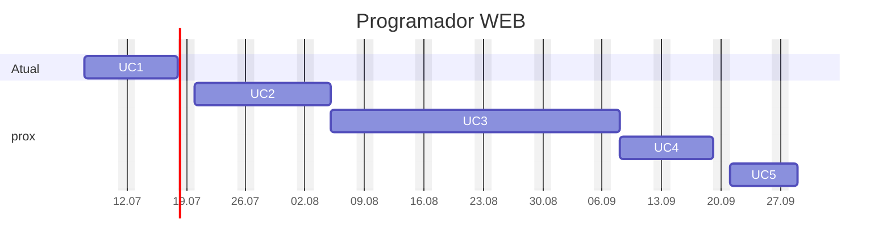

---
{"dg-publish":true,"permalink":"/programador-web/","title":"Programador-WEB","metatags":{"description":"Profissional que trabalha no desenvolvimento de sites e diversos sistemas WEB"},"noteIcon":"default","updated":"2025-07-07T21:47:58.424-03:00"}
---

#mapa #Senac #web #Webdesign #web-developer 

# Curso programador Web

## Sobre o curso

> [!info]- Identificação do curso
> 
> |     |     |
> | ---: | --- |
> | Título do Curso:| Programador Web  
> | Eixo tecnológico:| Informação e Comunicação
> | Segmento:| Tecnologia da Informação  
> | Carga horária:| 240 horas em 60 aulas
> | Período:| 07/07/25 a 26/09/25
> | Horário:| Segunda a Sexta das 07:30 às 11:00
> | Unidades Curriculares:| 5
> | Link:| [Senac PSG - Programador Web](https://psg.ce.senac.br/oportunidade/programador-web-2/)

>[!note]- Justificativa
>No Brasil, como em todo o mundo, a internet tornou-se não só uma forma de comunicação, mas uma poderosa ferramenta de comércio nos mais diferentes ramos, mostrando-se necessária cada dia mais. Nesse novo cenário de comunicação e negócios, a demanda por profissionais com expertise na criação de sites é crescente em comparação ao crescimento e influência da rede".
>
> No Brasil, o uso da internet tem crescido vertiginosamente, alcançando, aproximadamente, 126 milhões de usuários regulares da rede[^1] Esta ação impacta diretamente no volume de consumo favorecido pela internet. De acordo com levantamento de uma empresa de inteligência de mercado focada em e-commerce (Compre&Confie)[^2], o varejo digital brasileiro faturou R$14,1 bilhões no período do Natal de 2019, cifra e representa uma variação positiva de 29,9% no comparativo com o ano anterior.
>
> O Programador _web_, neste contexto, é um profissional muito requisitado, que exerce funções sob a influência da internet, atendendo à demanda crescente e inovadora oriunda do comércio eletrônico, aplicativos, redes sociais etc. É necessário a esse profissional o conhecimento de linguagens de programação web, tanto de _back-end_ como de  _front-end_ e de integração com banco de dados, exercendo funções que se assemelham às desempenhadas pelos profissionais _web developer_ ou desenvolvedor _web_, justificando assim a oferta dessa qualificação.

>[!check]- **Objetivo geral**
> Formar profissionais com competências para atuar e intervir em seu campo de trabalho, com foco em resultados.

>[!success]- Perfil profissional de conclusão 
> - O Programador Web estrutura em *front-end* e desenvolve em *back-end*, publicando aplicações web. Para isto, elabora projetos e testes ao longo do desenvolvimento e permite o acesso a banco de dados por meio de linguagens de programação, seguindo padrões internacionais.
> - Esse profissional trabalha no desenvolvimento de *sites* institucionais, *blogs*, fóruns, lojas virtuais e diversos sistemas e aplicações voltados para o ambiente de internet e intranet, conforme políticas de segurança da informação e com respeito à propriedade intelectual.
>- Pode atuar em serviços autônomos, temporários ou contrato efetivo em organizações públicas e privadas nos mais diversos setores.
> - A ocupação está situada no eixo tecnológico Informação e Comunicação, cuja natureza é “comunicar” e pertence ao segmento Informática.

>[!tip]- Competências que compõem o perfil do Programador *web*
>
> - Elaborar projetos de aplicações para *web*.
> - Estruturar aplicações *front-end* para *web*.
> - Desenvolver aplicações *back-end* para *web*.
> - Publicar aplicações *web*.

## Organização curricular

> [!example] Unidades Curriculares
> 
> | **Unidades Curriculares**                        | **Carga horária** | Aulas |
> | ------------------------------------------------ | :---------------: | :---: |
> | UC1: Elaborar projetos de aplicações para web    | 36 horas          | 9     |
> | UC2: Estruturar aplicações *front-end* para web | 48 horas          | 12    |
> | UC3: Desenvolver aplicações *back-end* para web | 96 horas          | 24    |
> | UC4: Publicar aplicações web                      | 36 horas          | 9     |
> | UC5: Projeto Integrador Programador Web         | 24 horas          | 6     |
> | **Carga horária total**                          | **240 horas**     | 60    |

## UC1 - Elaborar projetos de aplicações para web

> [!success]- 🖥️ Habilidades da UC1
> - Interpretar *briefing* para projetos de *websites*. 
> - Identificar requisitos técnicos para projetos de *websites*. 
> - Pesquisar domínio disponível e serviços de hospedagem para *websites*. 
> - Organizar arquivos e atividades por etapas do projeto. 
> - Estruturar arquitetura dos elementos de conteúdo de *websites*.
>
>>[!check] 
>> 1. Define os objetivos do projeto, de acordo com as necessidades do cliente e público-alvo. 
>> 2. Elabora proposta de trabalho de acordo com arquitetura da informação da aplicação web e das estratégias tecnológicas. 
>> 3. Elabora protótipo para web sites de acordo com o *briefing*. 
>> 4. Redige o projeto da aplicação web de acordo com a proposta e protótipo.

>[!done] Cronograma das aulas
>
>>[!note] Aula 1
>> - Boas-vindas e apresentação da ementa do curso
>> - Conceito, estrutura e finalidades de um [[Formacao/Webdesign/Briefing\|Briefing]]
>> - Apresentação da plataforma [[Tecnico/Ferramentas/git/Git-GitHub\|Git-GitHub]]
>>>[!todo] 🖥️ Atividade:
>>> - Criando um currículo online e publicando no [GitHub](https://github.com/).
>
>>[!note] Aula 2
>> - [[Formacao/Webdesign/Analise do Briefing\|Analise do Briefing]]
>> - Editando documentação [[Formacao/Webdesign/markdown\|markdown]]
>>>[!todo] 🖥️ Atividade:
>>> - Criar a estrutura inicial do briefing em um repositório do [GitHub](https://github.com/).

## UC2 - Estruturar aplicações *front-end* para web

> [!success]- 🖥️ Habilidades da UC2
> - Organizar conteúdo visual e textual para *web*. 
>
>>[!check]
>> 1. Manipula imagens, layouts e animações otimizadas para *website* de acordo com os princípios de comunicação visual, normas e tendências de mercado. 
>> 2. Utiliza linguagem de marcação de conteúdo e estilo, de acordo com as normas e padrões tecnológicos. 
>> 3. Testa padrões de acessibilidade e usabilidade do *website* de acordo com as normas

## UC3 - Desenvolver aplicações *back-end* para *web.*

> [!success]- 🖥️ Habilidades da UC3
> - Registrar e organizar as informações e códigos da aplicação web. 
> - Testar aplicação web. 
> - Utilizar termos técnicos nas rotinas de trabalho. 
> - Aplicar os comandos da linguagem SQL.
>
>>[!check]
>> 1. Estrutura algoritmos, com base na lógica computacional e nos requisitos funcionais descritos no projeto. 
>> 2. Configura o ambiente de desenvolvimento conforme as funcionalidades e características do projeto. 
>> 3. Cria estruturas de código utilizando linguagem de programação para *back-end*, de acordo com os requisitos do projeto de software. 
>> 4. Desenvolve tratamento de requisições POST e GET do *front-end*, de acordo com a linguagem de programação *back-end*. 
>> 5. Implementa *session* e *cookies* da aplicação *web*, de acordo com a linguagem de programação *back-end*. 
>> 6. Integra banco de dados, de acordo com a aplicação web e requisitos do projeto de software.

## UC4 - Publicar aplicações web

> [!success]- 🖥️ Habilidades da UC4
> - Hospedar *websites*. 
> - Identificar e corrigir erros no *website*. 
> - Realizar backups de *websites*.
>
>>[!check]
>> 1. Define serviço de hospedagem de acordo com os objetivos do projeto. 
>> 2. Formata e exporta arquivos do projeto local para servidor web, de acordo com as tecnologias disponíveis. 
>> 3. Verifica compatibilidade e performance do *website*, de acordo com as normas e exigências do mercado.

## UC5 - Projeto Integrador Programador *web.*

> [!success]- 🖥️ Habilidades da UC5
> - articulação das competências do curso, com foco no desenvolvimento do perfil profissional de conclusão; 
> - criação de estratégias para a solução de um problema ou de uma fonte geradora de problemas relacionada à prática profissional; 
> - desenvolvimento de atividades em grupos realizadas pelos alunos, de maneira autônoma e responsável;
>
>>[!check]
>> - **Proposta 1: Aplicação web multiplataforma com padrões de acessibilidade**
>> - **Proposta 2: Desenvolvimento de site para promover a visibilidade de um portfólio de produtos e serviços**

## Referências

- [Ebook Programador WEB - Editora Senac](https://bibliotecadigitalsenac.com.br/#/content/uid/dfc3ed6f-17d8-ee11-85fa-00224821b803/detail)
- [Ebook Projetos em UX Designe - Editora Senac](https://bibliotecadigitalsenac.com.br/#/content/uid/c4ced701-627f-ef11-8473-000d3a15d325/detail)

[[Principal\|Principal]]

[^1]: G1. **Uso da internet no Brasil cresce, e 70% da população está conectada**. Economia. Tecnologia. 28 de ago. 2019. Disponível em: <https://g1.globo.com/economia/tecnologia/noticia/2019/08/28/uso-da-internet-no-brasil-cresce-e-70percent-da-populacao-esta-conectada.ghtml>. Acesso em: 11 de fev. 2020. [↑](#footnote-ref-2)
[^2]: MERCADO&CONSUMO. **E-commerce brasileiro fatura R$ 14,1 bilhões em compras de natal**. 1 de jan. 2020. Disponível em: <http://www.mercadoeconsumo.com.br/2020/01/01/e-commerce-brasileiro-fatura-r141-bilhoes-em-compras-de-natal/>. Acesso em: 11 de fev. 2020. [↑](#footnote-ref-3)
