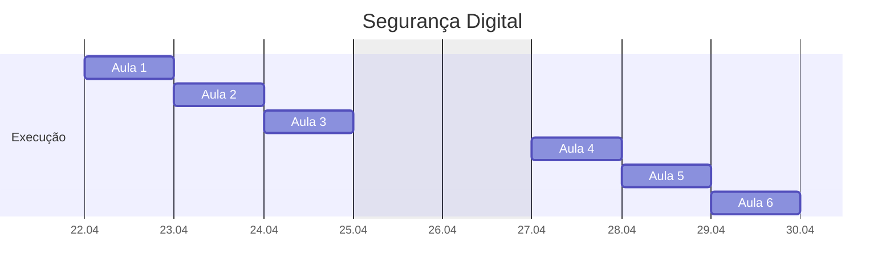

---
{"dg-publish":true,"permalink":"/seguranca-digital-2026/","title":"Segurança-Digital","metatags":{"description":"Curso de aperfeiçoamento focado em práticas de cibersegurança e proteção de dados no dia a dia."},"noteIcon":"default","updated":"2026-04-23T08:21:31.693-03:00","dg-note-properties":{"class":"mapa","title":"Segurança-Digital"}}
---

#mapa #Senac #segurança-digital #cibersegurança #tecnologia

# Curso Segurança Digital

## Sobre o curso

Proporcionar compreensão prática dos princípios fundamentais de segurança cibernética e capacitar os estudantes a identificar e lidar com ameaças no ambiente digital para proteger dados sensíveis.

### 1. Identificação do Curso

- **Título do Curso:** Segurança Digital
- **Eixo Tecnológico:** Informação e Comunicação
- **Segmento:** Tecnologia da Informação
- **Tipo de Curso:** Aperfeiçoamento
- **Carga Horária:** 24 horas
- **Código DN:** 286.228

---

## Organização curricular de Segurança Digital

> [!example] Unidades Curriculares
> 
> | **Unidades Curriculares**                        | **Carga horária** | Aulas |
> | ------------------------------------------------ | :---------------: | :---: |
> | UC1: Segurança Digital                           | 24 horas          | 6     |
> | **Carga horária total**                          | **24 horas**      | 6     |

## Cronograma de aulas

> [!success]- 🖥️ Habilidades da UC1
> - Identifica potenciais ameaças adotando medidas preventivas para evitar possíveis ataques.
>
> > [!check]
> > 1. Identifica potenciais ameaças.
> > 2. Analisa incidentes de segurança.
> > 3. Adota medidas preventivas contra ataques.

> [!done] Cronograma das aulas da UC1
>
> > [!note]- Aula 1 - Mapa do Tesouro – Meus Dados e a LGPD
> > - [x] Aula 1 - Fundamentos da segurança e noções de privacidade.
> > - [[10-Projeto Aulas de Segurança digital/AULA SEGURANÇA DA INFORMAÇÃO\|AULA SEGURANÇA DA INFORMAÇÃO]]
> > 
> > > [!todo] 🖥️ Atividade:
> > > - **Situação de Aprendizagem:** "Onde deixo minhas pegadas?" - mapeamento de dados pessoais.
> > > - **World Café:** Rodas de conversa sobre privacidade e LGPD.
> > > - Conhecendo o computado: Tela de bloqueio, área de trabalho.
> > > - Desenvolvendo interação usando o mouse: [ Code.org](https://studio.code.org/courses/pre-express-2025/units/1?redirect_warning=true), [Aula Puzzle: jogo educativo](https://www.escolagames.com.br/jogos/aula-puzzle)
>
> > [!note]- Aula 2 - Laboratório de Detetives – Caça ao Phishing
> > - [ ] Aula 2 - Identificação e prevenção de ataques comuns.
> > - [[10-Projeto Aulas de Segurança digital/Artigo - Segurança da Informação\|Artigo - Segurança da Informação]]
> >
> > > [!todo] 🖥️ Atividade:
> > > - **Situação de Aprendizagem:** "Esta mensagem é real?"
> > > - **Estudo de Caso:** Análise em pequenos grupos de SMS e e-mails falsos para identificar phishing e malware.
> > > - Desenvolvendo interação com o teclado: [Digitação online - AgileFingers](https://agilefingers.com/pt), [Exercício de digitação com letras](https://www.digitar-online.com/)
>
> > [!note]- Aula 3 - Oficina de Fortalezas – Senhas e Celulares
> > - [ ] Aula 3 - Práticas de segurança em dispositivos móveis e fortalecimento de senhas.
> >
> > > [!todo] 🖥️ Atividade:
> > > - **Situação de Aprendizagem:** "Minha senha é uma porta aberta ou uma muralha?"
> > > - **Gamificação:** Criação de "Ranking de Senhas Fortes" e configuração de 2FA (autenticação em duas etapas).
>
> > [!note]- Aula 4 - O Kit de Primeiros Socorros Digital
> > - [ ] Aula 4 - Ferramentas essenciais: antivírus, firewalls e backups.
> >
> > > [!todo] 🖥️ Atividade:
> > > - **Situação de Aprendizagem:** "E se o meu computador parar?"
> > > - **Prática Guiada:** Instalação de antivírus e realização de backup em nuvem ou pendrive.
>
> > [!note]- Aula 5 - Simulação de Navegação – Compras e Redes Sociais
> > - [ ] Aula 5 - Princípios de navegação segura e proteção em redes sociais.
> >
> > > [!todo] 🖥️ Atividade:
> > > - **Situação de Aprendizagem:** "Posso confiar neste site?"
> > > - **Role-Playing:** Simulação de compra online analisando cadeados, selos de segurança e reputação da loja.
>
> > [!note]- Aula 6 - Desafio Final – Consultores de Segurança
> > - [ ] Aula 6 - Políticas de segurança e consciência no ambiente de trabalho.
> >
> > > [!todo] 🖥️ Atividade:
> > > - **Situação de Aprendizagem:** "Ajudando um amigo" - resolver problema simulado.
> > > - **Projeto Integrador:** Criar um "Guia de Boas Práticas" (cartaz ou áudio de WhatsApp) para compartilhar com as famílias.

## Referências

- [[10-Projeto Aulas de Segurança digital/Artigo - Segurança da Informação\|Artigo - Segurança da Informação]]
- [[10-Projeto Aulas de Segurança digital/AULA SEGURANÇA DA INFORMAÇÃO\|AULA SEGURANÇA DA INFORMAÇÃO]]
- [[10-Projeto Aulas de Segurança digital/Planejamento de Segurança Digital 24 ha\|Planejamento de Segurança Digital 24 ha]]
- [[10-Projeto Aulas de Segurança digital/Segurança digital 24 ha\|Segurança digital 24 ha]]
- GRAÇA, R. B. *Segurança e privacidade na rede: o pugilato cibernético*. Brasília: Editora Senac DF, 2019.
